# Architecture & Project Structure

**Project:** Resource Manager
**Version:** 1.0
**Date:** 2026-05-29
**Status:** Planning Phase
**Related Documents:** [System Analysis & Design](./system-analysis-design.md) · [Database Schema](./database-schema.md)

---

## Table of Contents

1. [High-Level Architecture](#1-high-level-architecture)
2. [Technology Stack Decisions](#2-technology-stack-decisions)
3. [Backend Folder Structure](#3-backend-folder-structure)
4. [Frontend Folder Structure](#4-frontend-folder-structure)
5. [Design Patterns & Architectural Decisions](#5-design-patterns--architectural-decisions)
6. [Security Architecture](#6-security-architecture)
7. [Deployment Architecture](#7-deployment-architecture)

---

## 1. High-Level Architecture

### 1.1 System Architecture Overview

The Resource Manager is a **client-server application** with a clear separation between frontend and backend. The frontend is a React Native (Expo) application compiled for the web — it runs entirely in the browser. The backend is a RESTful API server built with Node.js and Express.js, backed by a MariaDB relational database. The two communicate exclusively over HTTP/HTTPS using JSON payloads.

This is **not** a native mobile app distributed through app stores. It is a **progressive web application** accessed via browsers on both desktop and mobile devices. The Expo for Web compilation pipeline produces a standard web bundle (HTML/CSS/JS) that is served as static files, while the Express API handles all server-side logic.

### 1.2 System Architecture Diagram

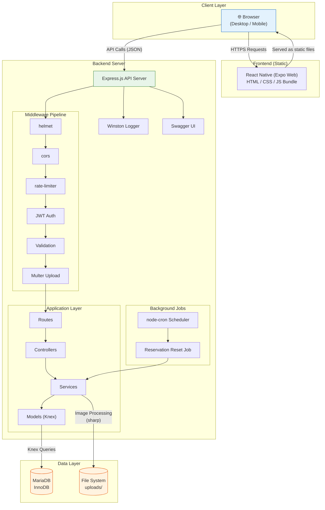

### 1.3 Request-Response Flow

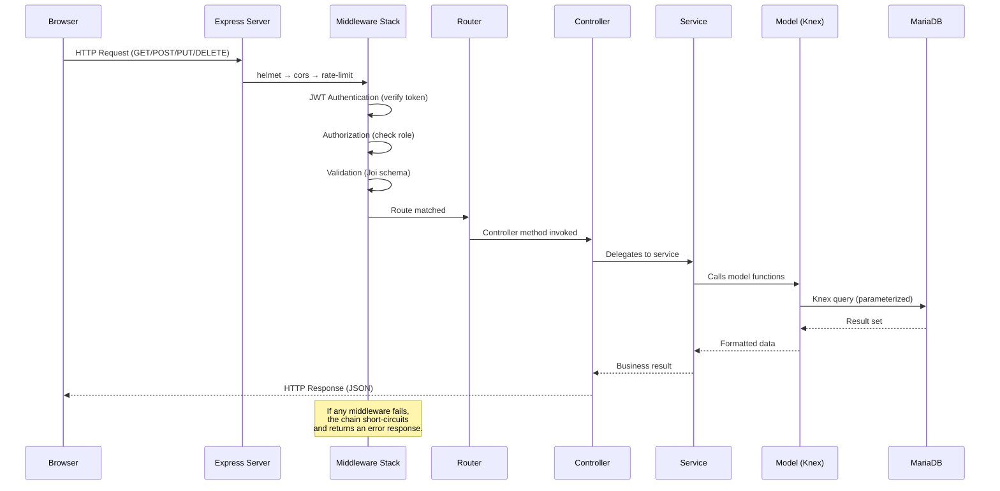

### 1.4 Deployment Architecture

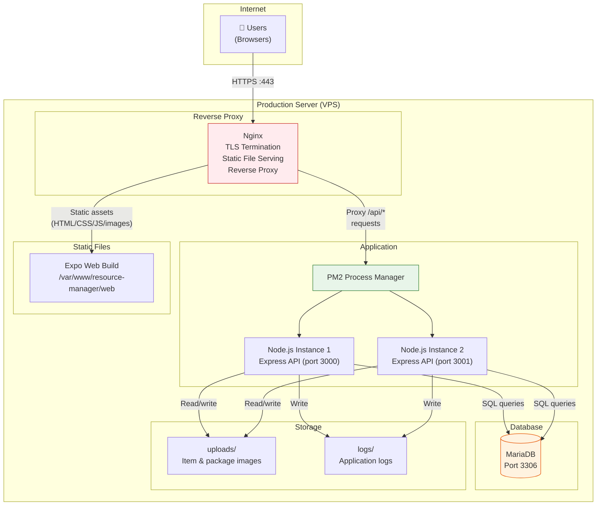

---

## 2. Technology Stack Decisions

### 2.1 Backend Stack

#### Runtime: Node.js (LTS)

| Attribute | Detail |
|---|---|
| **Version** | 20.x LTS (or latest LTS at time of development) |
| **Why** | Non-blocking I/O is ideal for an API server handling concurrent HTTP requests. JavaScript on both client and server reduces context-switching. Massive ecosystem via npm. LTS releases receive security patches for 30 months. |
| **Alternatives Considered** | **Python (Flask/Django):** Excellent, but Django's ORM is opinionated and Flask requires more assembly. The team is already fluent in JavaScript. **Go:** High performance but slower development velocity for CRUD apps. Overkill for this scale. **Deno/Bun:** Promising runtimes but ecosystem maturity and hosting support lag behind Node.js. |

#### Framework: Express.js

| Attribute | Detail |
|---|---|
| **Package** | `express` |
| **Version** | `^4.21.x` |
| **Why** | The most widely adopted Node.js web framework. Minimal, unopinionated — gives full control over middleware, routing, and error handling. Enormous ecosystem of compatible middleware. Battle-tested in production at every scale. Express 4 is stable; Express 5 is still in beta and not recommended for production yet. |
| **Alternatives Considered** | **Fastify:** ~2x faster request handling via schema-based serialization. Excellent, but smaller ecosystem and fewer developers are familiar with its plugin model. Would be a strong choice for a new greenfield project. **Koa:** Created by the Express team, uses async/await natively. Smaller community and fewer middleware packages. **NestJS:** Full-featured TypeScript framework with dependency injection, decorators, and modular architecture. Powerful but introduces significant complexity (TypeScript, decorators, module system) that is unnecessary for this project's scope. |

#### Database: MariaDB

| Attribute | Detail |
|---|---|
| **Version** | 10.11+ LTS |
| **Why** | Community fork of MySQL with full compatibility. InnoDB engine provides ACID transactions, row-level locking (critical for concurrent reservation operations), and foreign key constraints. Relational model fits this domain perfectly — structured entities with clear relationships. JSON column support for flexible fields (audit log details, app config values). Free and open source with strong community support. |
| **Alternatives Considered** | **PostgreSQL:** Superior in features (JSONB, array types, CTEs). Slightly more complex to operate. Would be an equally valid choice, but MariaDB's MySQL compatibility makes it more approachable for this team. **MySQL:** MariaDB is a drop-in replacement with better community governance and additional features. No reason to choose MySQL over MariaDB. **SQLite:** Single-file database, zero configuration. Excellent for prototyping but lacks concurrent write support needed for multi-user reservation systems. **MongoDB:** Document model is a poor fit for this heavily relational domain (users → entities → reservations → items). Would require manual join logic and sacrifice transactional guarantees. |

#### Query Builder: Knex.js

| Attribute | Detail |
|---|---|
| **Package** | `knex` |
| **Version** | `^3.1.x` |
| **Why** | Knex is a **query builder**, not a full ORM. This is a deliberate architectural choice. |

**Why Knex over Sequelize or TypeORM:**

| Criteria | Knex.js | Sequelize | TypeORM |
|---|---|---|---|
| **Philosophy** | Query builder — you write SQL-like code, Knex generates parameterized queries | Full ORM — models are JavaScript classes, Sequelize generates SQL behind the scenes | Full ORM (TypeScript-first) — decorators define entities, TypeORM manages the schema |
| **Control** | Full control over every query. Complex joins, subqueries, and CTEs are written explicitly. The developer knows exactly what SQL runs. | Abstracts SQL behind model methods (`.findAll()`, `.create()`). Complex queries require raw SQL fallback or awkward associations. | Similar to Sequelize but with TypeScript decorators. Repository pattern built in, but complex queries often require QueryBuilder (its own Knex-like layer). |
| **Learning curve** | Low — if you know SQL, you know Knex. Methods map 1:1 to SQL clauses. | Medium — must learn Sequelize's model definition DSL, association types, scopes, hooks, and eager/lazy loading rules. | High — requires TypeScript, decorators, the ActiveRecord or DataMapper pattern, and migration strategies. |
| **Migrations** | First-class migration system (`knex migrate:make`, `knex migrate:latest`). SQL-aware, reliable. | Has migrations but they are generated from model diffs. Can be brittle with complex schema changes. | Migrations auto-generated from entity definitions. Risky in production — changes may be destructive. |
| **Seeding** | Built-in seed system (`knex seed:make`, `knex seed:run`). | Has seeding but it's less mature. | Requires custom scripts or third-party tools. |
| **Performance** | Minimal overhead — generates SQL strings with parameter binding. | Significant overhead from model hydration, eager loading, and the association engine. | Moderate overhead from metadata reflection and entity management. |
| **Availability formula** | Easy: write the subquery + LEFT JOIN + CASE exactly as designed in the database schema doc. | Would require `sequelize.literal()` for the computed availability, mixing raw SQL into ORM code and defeating the purpose of the ORM. | Similar issue — complex computed fields require QueryBuilder, which is basically Knex. |
| **Transaction control** | Explicit `knex.transaction(trx => { ... })`. Clear, predictable. | `sequelize.transaction()` works but managed transactions with CLS (continuation-local storage) can introduce subtle bugs. | `EntityManager.transaction()` — works but complex with repository injection. |

**Bottom line:** This application's core operations (availability computation with subqueries, transactional reservations with `FOR UPDATE` locks, polymorphic audit logging) are inherently SQL-centric. A full ORM would fight us on these queries, forcing raw SQL fallbacks. Knex gives us the safety of parameterized queries and the convenience of JavaScript-based migrations without obscuring what the database actually does.

#### Authentication: JWT + bcrypt

| Attribute | Detail |
|---|---|
| **Packages** | `jsonwebtoken` (`^9.0.x`), `bcrypt` (`^5.1.x`) |
| **Why** | JWT (JSON Web Tokens) provide stateless authentication — the server does not need to store session data in memory. The access token contains the user's ID, role, and borrower entity ID, allowing the middleware to authorize requests without a database lookup on every request. `bcrypt` is the industry standard for password hashing — it is deliberately slow (adjustable cost factor) to resist brute-force attacks. |
| **Alternatives Considered** | **Passport.js:** Authentication middleware with strategy plugins. Adds abstraction over JWT handling but introduces complexity for what is a simple username/password + JWT flow. Unnecessary indirection for this project. **express-session + cookies:** Server-side sessions require a session store (Redis, database). Adds infrastructure complexity. JWTs are self-contained and work well with mobile/web clients. **Argon2:** Newer, potentially more secure password hashing algorithm. However, `bcrypt` is more widely supported, easier to install (no native build issues), and well-understood. Argon2 can be adopted later if needed. |

#### Validation: Joi

| Attribute | Detail |
|---|---|
| **Package** | `joi` |
| **Version** | `^17.13.x` |
| **Why chosen over express-validator** | |

| Criteria | Joi | express-validator |
|---|---|---|
| **Approach** | Schema-based — define a schema object, validate data against it | Chain-based — attach validation chains to route handlers |
| **Separation of concerns** | Schemas are standalone objects in dedicated files. They can be reused, composed, and tested independently. | Validations are tightly coupled to route definitions. Extracting them into reusable units requires extra effort. |
| **Complex validation** | Excellent support for nested objects, conditional fields (`.when()`), custom validators, and object-level validation. | Can handle complex validation but chains become verbose and harder to read. |
| **Error messages** | Produces structured error objects with path, type, and message. Easy to format into consistent API error responses. | Returns an array of errors. Formatting requires manual extraction. |
| **Schema reuse** | Schemas can be extended (`.append()`), forked (`.fork()`), and composed (`.concat()`). Create a base schema and extend it for create vs. update. | No built-in schema reuse mechanism. |
| **TypeScript support** | Not TypeScript-first, but has `@types/joi` and good inference. | express-validator has built-in TypeScript support. |

**Recommendation: Joi.** Its schema-as-data approach fits the layered architecture — validation schemas live in a dedicated `validations/` directory, completely decoupled from routes and controllers. A single `validate` middleware function applies any Joi schema to any route. This makes validation testable, composable, and maintainable.

```javascript
// Example: validations/inventory.validation.js
const Joi = require('joi');

const createItem = Joi.object({
  name: Joi.string().trim().min(1).max(200).required(),
  quantity: Joi.number().integer().min(0).allow(null).default(null),
  notes: Joi.string().max(5000).allow('', null),
  availability_status: Joi.string().valid('available', 'maintenance', 'retired').default('available'),
});

// Example: middleware usage
// router.post('/', validate(createItem), controller.create);
```

#### Image Upload: Multer + Sharp

| Attribute | Detail |
|---|---|
| **Packages** | `multer` (`^1.4.x`), `sharp` (`^0.33.x`) |
| **Why** | **Multer** is Express-native multipart/form-data handling middleware. It manages file uploads with configurable storage (disk or memory), file size limits, and MIME type filtering. **Sharp** is a high-performance image processing library built on libvips. It resizes, compresses, and converts images with minimal memory usage. Together, they form a pipeline: Multer receives the upload → Sharp processes it (resize, compress, generate thumbnail) → the processed images are saved to disk. |
| **Processing pipeline** | 1. Multer receives upload (memory storage, max 5 MB). 2. Validate MIME type (JPEG, PNG, WebP only). 3. Sharp resizes to max 1200×1200 for full image. 4. Sharp generates 300×300 thumbnail. 5. Both saved to `uploads/items/` or `uploads/packages/` with UUID filenames. 6. URL paths stored in database. |
| **Alternatives Considered** | **Formidable:** Full-featured parser but not Express-native. Requires more manual integration. **Busboy:** Low-level streaming parser. Multer is built on Busboy and provides a higher-level API. **Cloud storage (S3):** Overkill for this deployment model — the app runs on a single server. Local filesystem is simpler and avoids cloud dependencies. Can be added later if needed. |

#### Logging: Winston

| Attribute | Detail |
|---|---|
| **Package** | `winston` |
| **Version** | `^3.17.x` |
| **Why** | Structured logging with multiple transports (console, file, external services). Log levels (error, warn, info, debug) allow filtering by severity. JSON log format enables parsing by log aggregation tools. Daily log rotation via `winston-daily-rotate-file` prevents unbounded disk usage. |
| **Configuration** | Development: colorized console output at `debug` level. Production: JSON format to rotating files at `info` level. Error logs go to a separate `error.log` file. |
| **Alternatives Considered** | **Pino:** Faster than Winston (2-10x in benchmarks) due to its low-overhead JSON serialization. Excellent choice for high-throughput services. For this project's scale (~50 concurrent users), the performance difference is negligible, and Winston's more flexible transport system and wider adoption are advantages. **Morgan:** HTTP request logger, not a general-purpose logger. Used alongside Winston for request logging (piped to Winston). **Bunyan:** JSON-focused logger. Functional but less actively maintained than Winston or Pino. |

#### Scheduling: node-cron

| Attribute | Detail |
|---|---|
| **Package** | `node-cron` |
| **Version** | `^3.0.x` |
| **Why** | Lightweight in-process cron scheduler. Perfect for the weekly reservation reset job — it runs on a fixed schedule, executes a single database operation, and does not require external infrastructure. No Redis, no separate worker process, no message queue. The cron expression is derived from app configuration at startup and recalculated when configuration changes. |
| **Alternatives Considered** | **Bull / BullMQ:** Redis-backed job queue with retry logic, delayed jobs, and concurrency control. Powerful but requires Redis infrastructure. Overkill for a single periodic job. **Agenda:** MongoDB-backed scheduler. Wrong database. **System cron (crontab):** External to the application — harder to manage, deploy, and monitor. The job needs access to the application's database connection and configuration, which is easier in-process. |

#### Testing: Jest + Supertest

| Attribute | Detail |
|---|---|
| **Packages** | `jest` (`^29.x`), `supertest` (`^7.0.x`) |
| **Why** | **Jest** is the dominant JavaScript testing framework — zero-config setup, built-in mocking, code coverage, snapshot testing, and watch mode. **Supertest** provides fluent HTTP assertions for testing Express routes without starting a real server. Together, they cover unit tests (services, models), integration tests (API endpoints), and validation tests. |
| **Alternatives Considered** | **Mocha + Chai:** Classic combination. More flexible but requires assembling multiple libraries (test runner + assertion library + mocking library + coverage tool). Jest provides all of these out of the box. **Vitest:** Vite-native test runner. Faster for Vite projects but the backend does not use Vite. **AVA:** Concurrent test runner. Less mainstream, smaller community. |

#### Environment: dotenv

| Attribute | Detail |
|---|---|
| **Package** | `dotenv` |
| **Version** | `^16.4.x` |
| **Why** | Industry-standard approach for loading environment variables from a `.env` file. Keeps secrets (database credentials, JWT secret keys) out of source code. Simple, zero-config, universally understood. |

#### Security Middleware

| Package | Version | Purpose |
|---|---|---|
| `helmet` | `^8.0.x` | Sets HTTP security headers (Content-Security-Policy, X-Frame-Options, X-Content-Type-Options, etc.). One line of middleware, 11 protections. |
| `cors` | `^2.8.x` | Configures Cross-Origin Resource Sharing. In production, restricts API access to the frontend's origin only. Prevents unauthorized cross-origin requests. |
| `express-rate-limit` | `^7.4.x` | Rate-limits API requests. Applied globally (100 requests/15 min) and more aggressively on auth endpoints (10 requests/15 min per IP). Mitigates brute-force and DDoS attacks. |

#### API Documentation: Swagger/OpenAPI

| Attribute | Detail |
|---|---|
| **Packages** | `swagger-jsdoc` (`^6.2.x`), `swagger-ui-express` (`^5.0.x`) |
| **Why** | API documentation lives alongside the code as JSDoc comments. `swagger-jsdoc` extracts OpenAPI 3.0 specs from these comments. `swagger-ui-express` serves an interactive documentation UI at `/api-docs`. Developers and consumers can explore endpoints, view request/response schemas, and test calls directly from the browser. |
| **Alternatives Considered** | **Postman collections:** Great for manual testing but not self-updating. Documentation drifts from implementation. **Redoc:** Beautiful static documentation. Does not provide the interactive "try it" feature that Swagger UI offers. Could be used alongside swagger-jsdoc for a public-facing docs page. |

### 2.2 Frontend Stack

#### Framework: React Native with Expo

| Attribute | Detail |
|---|---|
| **Packages** | `expo` (`~52.x`), `react-native` (`0.76.x`), `react` (`^18.3.x`) |
| **Why** | Expo provides a managed workflow for React Native development with first-class web support. `expo for web` compiles React Native components to web-compatible HTML/CSS via `react-native-web`. This gives us a single codebase that produces a web app accessible from any browser — desktop or mobile. Since the app is **not** distributed through app stores, the web target is our primary (and only) platform. Expo's tooling (metro bundler, development server, web build pipeline) handles all the complexity. |
| **Why not plain React:** | React Native's component model (`View`, `Text`, `ScrollView`, `TouchableOpacity`) produces a more mobile-optimized UI even on the web. If the project ever needs a native mobile build (APK/IPA), the same codebase works. Starting with plain React would mean rewriting everything for mobile later. |
| **Alternatives Considered** | **Plain React (create-react-app / Vite):** Simpler for web-only. But precludes any future mobile deployment and loses React Native's mobile-optimized components. **Flutter:** Excellent cross-platform framework. Dart language is less familiar to the team. Web support exists but is less mature than React Native Web. **Ionic/Capacitor:** Web-first with native wrappers. Good but the React Native ecosystem is larger and the component quality is higher. |

#### Web Support: React Native Web

| Attribute | Detail |
|---|---|
| **Package** | `react-native-web` (bundled with Expo) |
| **Why** | Maps React Native components to DOM elements. `<View>` → `<div>`, `<Text>` → `<span>`, `<Image>` → ``. Handles StyleSheet translation to CSS. Expo's web build pipeline (`npx expo export --platform web`) produces a standard web bundle with optimized assets. |

#### Navigation: React Navigation v6+

| Attribute | Detail |
|---|---|
| **Packages** | `@react-navigation/native` (`^6.x`), `@react-navigation/stack` (`^6.x`), `@react-navigation/bottom-tabs` (`^6.x`) |
| **Why** | The standard navigation library for React Native. Version 6 provides a component-based API, TypeScript support, deep linking, and excellent web support. The bottom tab navigator provides mobile-style navigation (Dashboard, Inventory, Packages, Reservations, More). The stack navigator handles screen-to-screen transitions within each tab. On web, the stack navigator integrates with the browser's history API for back/forward navigation. |
| **Navigation Structure** | |

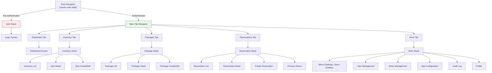

| Alternative | Why Not |
|---|---|
| **Expo Router (file-based routing)** | Newer, convention-over-configuration approach using file system routes. Works well for Expo projects but is less flexible for complex conditional navigation (auth guards, role-based tabs). React Navigation v6 is more mature and better documented for custom navigation flows. Expo Router can be adopted in a future version. |
| **React Router (web-only)** | Does not support React Native's native navigation primitives. Would work for web-only but would need to be replaced if native mobile is ever needed. |

#### State Management: Zustand + TanStack Query (React Query)

| Attribute | Detail |
|---|---|
| **Packages** | `zustand` (`^5.0.x`), `@tanstack/react-query` (`^5.x`) |
| **Why** | State management is split into two categories: **server state** (data fetched from the API) and **client state** (UI state, auth tokens, theme preferences). Using one tool for both leads to complexity. |

**Server State: TanStack Query (React Query)**

Manages all data fetching, caching, synchronization, and background refetching. Handles loading/error states, pagination, optimistic updates, and cache invalidation. Eliminates the need to manually store API responses in global state.

| Feature | Benefit |
|---|---|
| Automatic caching | Fetched data is cached by query key. Navigating back to a screen shows cached data instantly while refetching in the background. |
| Background refetching | Stale data is automatically refreshed when the user refocuses the window or reconnects to the network. |
| Mutation + invalidation | After creating/updating/deleting a resource, related queries are invalidated and automatically refetched. No manual state updates. |
| Loading/error states | `useQuery` returns `{ data, isLoading, isError, error }` — the component just renders based on these flags. |
| Pagination | Built-in support for paginated and infinite queries. |

**Client State: Zustand**

Manages non-server state: authentication tokens, current user info, theme preferences, sidebar/modal visibility, form drafts.

| Criteria | Zustand | Redux Toolkit | React Context |
|---|---|---|---|
| **Boilerplate** | Near zero. A store is a function call. No providers, reducers, actions, or dispatch. | Significantly reduced from classic Redux but still requires slices, reducers, and the store configuration. | Zero for simple cases. Becomes unwieldy with multiple contexts, memoization requirements, and provider nesting. |
| **Bundle size** | ~1 KB gzipped | ~11 KB gzipped (+ immer) | 0 KB (built-in) |
| **Performance** | Components subscribe to specific store slices. Only re-renders when the selected value changes. | Similar selective subscription via `useSelector`. | Every consumer re-renders when any value in the context changes, unless wrapped in `useMemo`/`React.memo`. Context is a dependency injection mechanism, not a state management solution. |
| **DevTools** | Optional Redux DevTools integration. | Excellent Redux DevTools integration. | No built-in devtools. |
| **Learning curve** | Minimal — it's just a hook that returns state. | Moderate — must understand the Redux mental model (actions, reducers, dispatch, selectors). | Low for basic use, high for complex state (provider composition, avoiding re-renders). |
| **Middleware** | Built-in middleware for persist, immer, devtools. | Built-in middleware via configureStore. | No middleware concept. |

**Why not Redux?** Redux is excellent for large teams and complex applications with many interacting state domains. For this project, the majority of state is server state (handled by React Query). The remaining client state (auth, theme, UI flags) is simple enough that Redux's ceremony provides no benefit. Zustand gives us a global store with zero boilerplate.

**Why not Context alone?** React Context triggers re-renders for all consumers when any value changes. For auth state that is read on every screen, this causes unnecessary re-renders across the entire app. Context is appropriate for static or rarely-changing values (theme), but not for dynamic state.

#### HTTP Client: Axios

| Attribute | Detail |
|---|---|
| **Package** | `axios` |
| **Version** | `^1.7.x` |
| **Why** | HTTP client with interceptor support. Request interceptors automatically attach the JWT access token to every API call. Response interceptors catch 401 errors and trigger a silent token refresh using the refresh token. If the refresh succeeds, the original request is retried automatically. If the refresh fails, the user is redirected to login. This interceptor pattern centralizes auth logic — individual API calls don't need to handle authentication. |
| **Alternatives Considered** | **fetch (built-in):** No interceptors. Would require wrapping every call in a custom function that handles auth headers and token refresh. More manual effort. **ky:** Modern fetch wrapper with hooks (beforeRequest, afterResponse). Smaller bundle but less mainstream than Axios. Would work but the team is already familiar with Axios. |

#### Forms: React Hook Form

| Attribute | Detail |
|---|---|
| **Package** | `react-hook-form` |
| **Version** | `^7.53.x` |
| **Why** | Uncontrolled form management with minimal re-renders. Unlike Formik, React Hook Form does not re-render the entire form on every keystroke — it uses refs under the hood. This matters for React Native, where unnecessary re-renders are more expensive than on the web. Built-in integration with Joi/Yup/Zod for schema validation. `useController` hook works seamlessly with React Native Paper's controlled components. |
| **Alternatives Considered** | **Formik:** Popular, well-documented. However, it re-renders the form on every field change by default. `<FastField>` mitigates this but adds complexity. React Hook Form is newer, faster, and has a smaller bundle. **Uncontrolled forms (manual):** Feasible for simple forms but becomes error-prone with complex validation, nested objects, and dynamic fields (e.g., package item composition). |

#### UI Components: React Native Paper

| Attribute | Detail |
|---|---|
| **Package** | `react-native-paper` |
| **Version** | `^5.12.x` |
| **Why** | Material Design 3 component library with **excellent web support**. This is the critical requirement — since the app is accessed via browsers, every component must render correctly on the web. React Native Paper's web compatibility is among the best in the React Native ecosystem. |

| Feature | Benefit for This Project |
|---|---|
| **Web support** | All components render correctly in the browser via react-native-web. No web-specific workarounds needed. |
| **Material Design 3** | Modern, professional appearance with consistent design language. Includes dynamic color theming. |
| **Theming system** | Built-in light/dark theme support via `<PaperProvider>`. Theme customization maps directly to the app's `app_config.theme_mode_default` and `app_config.theme_primary_color` settings. |
| **Component coverage** | Buttons, cards, dialogs, text inputs, FABs, menus, data tables, chips, badges, snackbars, app bars, drawers — covers all UI needs without custom components. |
| **Accessibility** | Components include proper ARIA roles, keyboard navigation, and screen reader support out of the box. |

| Alternative | Why Not |
|---|---|
| **NativeBase** | Formerly popular but underwent breaking rewrites (v2 → v3). Web support has had issues. Less stable. |
| **React Native Elements** | Good component library but less polished web support. No built-in theming system as comprehensive as Paper's. |
| **Tamagui** | Performance-focused, compiler-optimized. Promising but newer, smaller community, and steeper learning curve (its own styling system). |
| **Gluestack UI** | Successor to NativeBase. Too new, documentation still maturing. |
| **Custom components only** | Maximum control but massive effort to build, style, test, and make accessible. Not justified when Paper provides production-ready components. |

#### Image Picker: expo-image-picker

| Attribute | Detail |
|---|---|
| **Package** | `expo-image-picker` |
| **Version** | `~16.0.x` (matches Expo SDK) |
| **Why** | Expo's built-in image picking module. On mobile, opens the device camera or photo library. On web, opens a file input dialog. Handles permissions, image selection, and returns a local URI. Works identically across platforms — no platform-specific code needed. |

#### Secure Storage: expo-secure-store / localStorage

| Attribute | Detail |
|---|---|
| **Package** | `expo-secure-store` (`~14.0.x`) |
| **Why** | On mobile (if ever deployed natively), stores refresh tokens in the device's secure enclave (iOS Keychain / Android Keystore). On web, falls back to `localStorage`. The web fallback is acceptable because: (1) the app is not distributed through app stores, (2) XSS protection via CSP headers and React's built-in escaping mitigates `localStorage` risks, and (3) the refresh token has a limited lifetime and can be revoked server-side. |
| **Web strategy** | Refresh token stored in `localStorage` (encrypted with a static key for obfuscation, not true security). Access token stored in memory only (Zustand store) — never persisted. This limits the damage if `localStorage` is compromised: the attacker gets a refresh token that can be revoked, not an access token. |

#### Icons: @expo/vector-icons

| Attribute | Detail |
|---|---|
| **Package** | `@expo/vector-icons` |
| **Version** | `^14.0.x` |
| **Why** | Bundled with Expo, includes MaterialCommunityIcons (6000+ icons), Ionicons, FontAwesome, and more. Consistent with React Native Paper's icon requirements. Zero additional setup. |

#### Testing: Jest + React Native Testing Library

| Attribute | Detail |
|---|---|
| **Packages** | `jest` (`^29.x`), `@testing-library/react-native` (`^12.x`) |
| **Why** | Jest is configured by default in Expo projects. React Native Testing Library encourages testing components by their rendered output and user interactions, not implementation details. Tests are platform-agnostic — they verify behavior, not DOM structure. |

### 2.3 Full Dependency Summary

#### Backend (`server/package.json`)

| Package | Version | Category |
|---|---|---|
| `express` | `^4.21.x` | Framework |
| `knex` | `^3.1.x` | Query builder |
| `mysql2` | `^3.11.x` | MariaDB driver (Knex uses this) |
| `jsonwebtoken` | `^9.0.x` | JWT creation/verification |
| `bcrypt` | `^5.1.x` | Password hashing |
| `joi` | `^17.13.x` | Request validation |
| `multer` | `^1.4.x` | File upload handling |
| `sharp` | `^0.33.x` | Image processing |
| `winston` | `^3.17.x` | Logging |
| `winston-daily-rotate-file` | `^5.0.x` | Log rotation |
| `node-cron` | `^3.0.x` | Job scheduling |
| `dotenv` | `^16.4.x` | Environment variables |
| `helmet` | `^8.0.x` | Security headers |
| `cors` | `^2.8.x` | CORS middleware |
| `express-rate-limit` | `^7.4.x` | Rate limiting |
| `swagger-jsdoc` | `^6.2.x` | OpenAPI spec generation |
| `swagger-ui-express` | `^5.0.x` | Swagger UI serving |
| `uuid` | `^10.0.x` | UUID generation |
| `morgan` | `^1.10.x` | HTTP request logging |
| `compression` | `^1.7.x` | Response compression |

| Dev Package | Version | Category |
|---|---|---|
| `jest` | `^29.x` | Test runner |
| `supertest` | `^7.0.x` | HTTP testing |
| `nodemon` | `^3.1.x` | Development auto-restart |
| `eslint` | `^9.x` | Linting |
| `prettier` | `^3.3.x` | Code formatting |

#### Frontend (`client/package.json`)

| Package | Version | Category |
|---|---|---|
| `expo` | `~52.x` | Framework |
| `react` | `^18.3.x` | UI library |
| `react-native` | `0.76.x` | Mobile framework |
| `react-native-web` | `~0.19.x` | Web support |
| `react-dom` | `^18.3.x` | Web rendering |
| `@react-navigation/native` | `^6.x` | Navigation core |
| `@react-navigation/stack` | `^6.x` | Stack navigator |
| `@react-navigation/bottom-tabs` | `^6.x` | Tab navigator |
| `react-native-screens` | `~4.x` | Native screen optimization |
| `react-native-safe-area-context` | `~4.x` | Safe area insets |
| `zustand` | `^5.0.x` | Client state management |
| `@tanstack/react-query` | `^5.x` | Server state management |
| `axios` | `^1.7.x` | HTTP client |
| `react-hook-form` | `^7.53.x` | Form management |
| `react-native-paper` | `^5.12.x` | UI components |
| `react-native-vector-icons` | `^10.x` | Icon support |
| `expo-image-picker` | `~16.0.x` | Image selection |
| `expo-secure-store` | `~14.0.x` | Secure storage |
| `@expo/vector-icons` | `^14.0.x` | Icon sets |

| Dev Package | Version | Category |
|---|---|---|
| `jest` | `^29.x` | Test runner |
| `@testing-library/react-native` | `^12.x` | Component testing |
| `eslint` | `^9.x` | Linting |
| `prettier` | `^3.3.x` | Code formatting |

---

## 3. Backend Folder Structure

```
server/
├── src/
│   ├── config/
│   │   ├── database.js            # Knex instance creation and connection pool config
│   │   ├── auth.js                # JWT secrets, token expiration times, bcrypt salt rounds
│   │   ├── app.js                 # General app config (port, API prefix, pagination defaults)
│   │   ├── cors.js                # CORS options (allowed origins, methods, headers)
│   │   ├── upload.js              # Multer storage config, file size limits, MIME filters
│   │   └── swagger.js             # Swagger/OpenAPI spec options
│   │
│   ├── middleware/
│   │   ├── authenticate.js        # JWT token verification middleware
│   │   ├── authorize.js           # Role-based access control (admin/user check)
│   │   ├── validate.js            # Generic Joi validation middleware factory
│   │   ├── upload.js              # Multer middleware instances (single, array)
│   │   ├── errorHandler.js        # Global error handling middleware
│   │   ├── rateLimiter.js         # Rate limiting configs (global + auth-specific)
│   │   ├── requestLogger.js       # Morgan + Winston integration for HTTP logging
│   │   └── notFound.js            # 404 handler for undefined routes
│   │
│   ├── routes/
│   │   ├── index.js               # Route aggregator — mounts all route modules on /api/v1
│   │   ├── auth.routes.js         # POST /login, POST /refresh, POST /logout
│   │   ├── inventory.routes.js    # CRUD /inventory-items
│   │   ├── package.routes.js      # CRUD /packages, GET /packages/:id/items
│   │   ├── reservation.routes.js  # CRUD /reservations, POST /reservations/:id/return
│   │   ├── entity.routes.js       # CRUD /borrower-entities
│   │   ├── user.routes.js         # CRUD /users, PUT /users/:id/entity
│   │   ├── config.routes.js       # GET/PUT /config
│   │   ├── dashboard.routes.js    # GET /dashboard/stats, /dashboard/alerts
│   │   └── audit.routes.js        # GET /audit-log (admin only)
│   │
│   ├── controllers/
│   │   ├── auth.controller.js     # Handles login, refresh, logout requests
│   │   ├── inventory.controller.js # Handles inventory CRUD requests
│   │   ├── package.controller.js  # Handles package CRUD requests
│   │   ├── reservation.controller.js # Handles reservation CRUD + return requests
│   │   ├── entity.controller.js   # Handles borrower entity CRUD requests
│   │   ├── user.controller.js     # Handles user CRUD + entity assignment
│   │   ├── config.controller.js   # Handles app configuration get/update
│   │   ├── dashboard.controller.js # Handles dashboard statistics queries
│   │   └── audit.controller.js    # Handles audit log queries
│   │
│   ├── services/
│   │   ├── auth.service.js        # Authentication logic (login, token generation, refresh)
│   │   ├── inventory.service.js   # Inventory business logic (CRUD, availability, images)
│   │   ├── package.service.js     # Package business logic (CRUD, item composition)
│   │   ├── reservation.service.js # Reservation logic (create, return, reset, transactions)
│   │   ├── entity.service.js      # Borrower entity business logic
│   │   ├── user.service.js        # User management logic (CRUD, password hashing, assignment)
│   │   ├── config.service.js      # Configuration read/write logic
│   │   ├── dashboard.service.js   # Dashboard aggregation queries
│   │   ├── audit.service.js       # Audit log creation and querying
│   │   └── image.service.js       # Image processing pipeline (resize, thumbnail, save)
│   │
│   ├── models/
│   │   ├── user.model.js          # Knex queries for users table
│   │   ├── inventory.model.js     # Knex queries for inventory_items table + availability view
│   │   ├── package.model.js       # Knex queries for packages + package_items tables
│   │   ├── reservation.model.js   # Knex queries for reservations + reservation_items tables
│   │   ├── entity.model.js        # Knex queries for borrower_entities + user_borrower_entity
│   │   ├── config.model.js        # Knex queries for app_config table
│   │   ├── audit.model.js         # Knex queries for audit_log table
│   │   └── token.model.js         # Knex queries for refresh_tokens table
│   │
│   ├── validations/
│   │   ├── auth.validation.js     # Login schema (email, password)
│   │   ├── inventory.validation.js # Create/update item schemas
│   │   ├── package.validation.js  # Create/update package schemas (with nested items)
│   │   ├── reservation.validation.js # Create/update reservation schemas
│   │   ├── entity.validation.js   # Create/update entity schemas
│   │   ├── user.validation.js     # Create/update user schemas (password requirements)
│   │   ├── config.validation.js   # Configuration update schemas
│   │   └── common.validation.js   # Shared schemas (UUID, pagination, sort)
│   │
│   ├── utils/
│   │   ├── logger.js              # Winston logger instance (configured per environment)
│   │   ├── AppError.js            # Custom error class with HTTP status codes
│   │   ├── catchAsync.js          # Async error wrapper for controllers
│   │   ├── pagination.js          # Pagination helper (parse page/limit, generate metadata)
│   │   ├── response.js            # Standardized API response formatter
│   │   └── constants.js           # App-wide constants (roles, statuses, limits)
│   │
│   ├── jobs/
│   │   ├── index.js               # Job registry — initializes and schedules all cron jobs
│   │   └── reservationReset.js    # Weekly reservation reset job logic
│   │
│   └── app.js                     # Express app setup (middleware, routes, error handling)
│
├── migrations/
│   └── 20260529000000_baseline.js # Initial schema migration (all tables + views)
│
├── seeds/
│   ├── 01_app_config.js           # Default configuration values
│   ├── 02_admin_user.js           # Default admin account
│   ├── 03_sample_entities.js      # Sample borrower entities (dev/demo only)
│   ├── 04_sample_items.js         # Sample inventory items (dev/demo only)
│   └── 05_sample_packages.js      # Sample packages (dev/demo only)
│
├── uploads/
│   ├── items/                     # Inventory item images (full + thumbnails)
│   │   └── .gitkeep
│   └── packages/                  # Package images (full + thumbnails)
│       └── .gitkeep
│
├── logs/                          # Winston log output (gitignored)
│   └── .gitkeep
│
├── tests/
│   ├── setup.js                   # Jest global setup (test DB connection, cleanup)
│   ├── helpers/
│   │   ├── testDb.js              # Test database helpers (seed, teardown, transaction)
│   │   ├── auth.helper.js         # Generate test JWTs for authenticated requests
│   │   └── factory.js             # Test data factories (create users, items, etc.)
│   ├── unit/
│   │   ├── services/
│   │   │   ├── auth.service.test.js
│   │   │   ├── inventory.service.test.js
│   │   │   ├── reservation.service.test.js
│   │   │   └── ...
│   │   ├── utils/
│   │   │   ├── pagination.test.js
│   │   │   └── AppError.test.js
│   │   └── validations/
│   │       ├── inventory.validation.test.js
│   │       └── ...
│   └── integration/
│       ├── auth.test.js           # Login, refresh, logout flows
│       ├── inventory.test.js      # Inventory CRUD + availability
│       ├── reservation.test.js    # Reservation lifecycle + concurrency
│       ├── package.test.js        # Package CRUD + reservation expansion
│       └── ...
│
├── .env.example                   # Template for environment variables (committed)
├── .env                           # Actual env variables (gitignored)
├── .eslintrc.js                   # ESLint configuration
├── .prettierrc                    # Prettier configuration
├── .gitignore                     # Git ignore rules
├── knexfile.js                    # Knex config for all environments (dev, test, prod)
├── package.json                   # Dependencies and scripts
├── package-lock.json              # Dependency lock file
└── server.js                      # Entry point — imports app.js, starts HTTP server
```

### 3.1 Layer Responsibilities

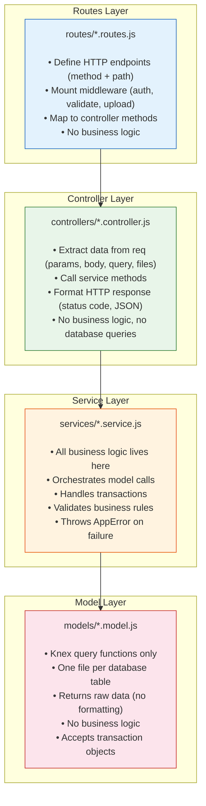

### 3.2 Key File Explanations

#### `server.js` — Entry Point

```javascript
// server.js — Application entry point
// Responsibilities:
// 1. Load environment variables (dotenv)
// 2. Import the configured Express app
// 3. Start the HTTP server on the configured port
// 4. Initialize scheduled jobs
// 5. Handle graceful shutdown (SIGTERM, SIGINT)
```

#### `src/app.js` — Express Application Setup

```javascript
// app.js — Express app configuration
// Responsibilities:
// 1. Create Express app instance
// 2. Apply global middleware in order:
//    - helmet (security headers)
//    - cors (cross-origin policy)
//    - compression (response compression)
//    - express.json (body parsing)
//    - express.urlencoded (form parsing)
//    - requestLogger (HTTP logging via Morgan → Winston)
//    - rateLimiter (global rate limit)
// 3. Serve static files from uploads/ directory
// 4. Mount API routes at /api/v1
// 5. Mount Swagger UI at /api-docs
// 6. Apply 404 not-found handler
// 7. Apply global error handler (must be last)
// 8. Export the app (for testing with Supertest)
```

#### `src/utils/AppError.js` — Custom Error Class

```javascript
// AppError.js — Operational error class
// Extends Error with:
// - statusCode (HTTP status: 400, 401, 403, 404, 409, 500)
// - status ('fail' for 4xx, 'error' for 5xx)
// - isOperational (true — distinguishes from programming errors)
//
// Usage: throw new AppError('Item not found', 404);
```

#### `src/utils/catchAsync.js` — Async Error Wrapper

```javascript
// catchAsync.js — Wraps async controller functions
// Catches rejected promises and forwards to the error handler.
// Without this, every async controller would need its own try-catch.
//
// Usage: router.get('/', catchAsync(controller.getAll));
```

#### `knexfile.js` — Database Configuration

```javascript
// knexfile.js — Knex configuration per environment
// Exports: { development, test, production }
// Each environment specifies:
// - client: 'mysql2'
// - connection: { host, port, user, password, database }
// - pool: { min, max }
// - migrations: { directory, tableName }
// - seeds: { directory }
```

---

## 4. Frontend Folder Structure

```
client/
├── src/
│   ├── api/
│   │   ├── client.js              # Axios instance with baseURL, interceptors (auth, refresh)
│   │   ├── auth.api.js            # login(), refresh(), logout()
│   │   ├── inventory.api.js       # getItems(), getItem(), createItem(), updateItem(), deleteItem()
│   │   ├── packages.api.js        # getPackages(), getPackage(), createPackage(), updatePackage()
│   │   ├── reservations.api.js    # getReservations(), createReservation(), processReturn()
│   │   ├── entities.api.js        # getEntities(), createEntity(), updateEntity(), deleteEntity()
│   │   ├── users.api.js           # getUsers(), createUser(), updateUser(), assignEntity()
│   │   ├── config.api.js          # getConfig(), updateConfig()
│   │   ├── dashboard.api.js       # getStats(), getAlerts()
│   │   └── audit.api.js           # getAuditLog()
│   │
│   ├── components/
│   │   ├── common/
│   │   │   ├── LoadingSpinner.js      # Full-screen or inline loading indicator
│   │   │   ├── ErrorMessage.js        # Styled error display with retry button
│   │   │   ├── EmptyState.js          # "No data" placeholder with icon and message
│   │   │   ├── ConfirmDialog.js       # Reusable confirmation modal (delete, reset, etc.)
│   │   │   ├── SearchBar.js           # Search input with debounced onChange
│   │   │   ├── FilterChips.js         # Horizontal scrollable filter chips
│   │   │   ├── PaginationControls.js  # Page number + prev/next buttons
│   │   │   ├── StatusBadge.js         # Colored badge for status values
│   │   │   ├── ImagePickerButton.js   # Wraps expo-image-picker with preview
│   │   │   ├── QuantitySelector.js    # +/- stepper for quantity input
│   │   │   └── FormField.js           # Wrapper: label + Paper TextInput + error message
│   │   │
│   │   ├── inventory/
│   │   │   ├── InventoryCard.js       # Item card (image, name, status, availability)
│   │   │   ├── InventoryList.js       # FlatList of InventoryCards with search/filter
│   │   │   ├── InventoryForm.js       # Create/edit form (name, qty, image, notes, status)
│   │   │   └── AvailabilityIndicator.js # Visual indicator: available/low/out
│   │   │
│   │   ├── packages/
│   │   │   ├── PackageCard.js         # Package card (image, name, item count)
│   │   │   ├── PackageList.js         # FlatList of PackageCards
│   │   │   ├── PackageForm.js         # Create/edit form with item picker
│   │   │   ├── PackageItemList.js     # List of items in a package with quantities
│   │   │   └── ItemExclusionList.js   # Checkboxes for excluding items during reservation
│   │   │
│   │   ├── reservations/
│   │   │   ├── ReservationCard.js     # Reservation summary card
│   │   │   ├── ReservationList.js     # FlatList of ReservationCards with filters
│   │   │   ├── ReservationForm.js     # Create reservation form (entity, items, notes)
│   │   │   ├── ReservationDetail.js   # Full reservation view with line items
│   │   │   ├── ReturnForm.js          # Process return (select items/quantities)
│   │   │   └── CartSummary.js         # Pre-confirmation summary of items to reserve
│   │   │
│   │   ├── dashboard/
│   │   │   ├── StatCard.js            # Single metric card (icon, label, value)
│   │   │   ├── StatGrid.js            # Grid layout of StatCards
│   │   │   ├── AlertList.js           # Low-stock / maintenance alerts
│   │   │   └── RecentReservations.js  # Quick-view list of recent active reservations
│   │   │
│   │   ├── users/
│   │   │   ├── UserCard.js            # User info card (name, role, entity)
│   │   │   ├── UserForm.js            # Create/edit user form
│   │   │   └── EntityAssignment.js    # Entity picker for user assignment
│   │   │
│   │   ├── entities/
│   │   │   ├── EntityCard.js          # Borrower entity card
│   │   │   └── EntityForm.js          # Create/edit entity form
│   │   │
│   │   └── layout/
│   │       ├── AppHeader.js           # Top app bar with title, menu, profile
│   │       ├── TabBar.js              # Custom bottom tab bar (if customizing default)
│   │       └── ScreenWrapper.js       # SafeAreaView + ScrollView + padding wrapper
│   │
│   ├── screens/
│   │   ├── auth/
│   │   │   └── LoginScreen.js         # Login form (email, password, submit, error)
│   │   │
│   │   ├── dashboard/
│   │   │   └── DashboardScreen.js     # Admin dashboard (stats, alerts, recent activity)
│   │   │
│   │   ├── inventory/
│   │   │   ├── InventoryListScreen.js # Browse all inventory items
│   │   │   ├── InventoryDetailScreen.js # View single item details
│   │   │   └── InventoryFormScreen.js # Create or edit an item (admin only)
│   │   │
│   │   ├── packages/
│   │   │   ├── PackageListScreen.js   # Browse all packages
│   │   │   ├── PackageDetailScreen.js # View package details with item breakdown
│   │   │   └── PackageFormScreen.js   # Create or edit a package (admin only)
│   │   │
│   │   ├── reservations/
│   │   │   ├── ReservationListScreen.js # View reservations (filtered by role)
│   │   │   ├── ReservationDetailScreen.js # View single reservation details
│   │   │   ├── CreateReservationScreen.js # Multi-step reservation creation
│   │   │   └── ReturnScreen.js        # Process item returns
│   │   │
│   │   ├── entities/
│   │   │   ├── EntityListScreen.js    # Browse borrower entities (admin only)
│   │   │   └── EntityFormScreen.js    # Create or edit an entity (admin only)
│   │   │
│   │   ├── users/
│   │   │   ├── UserListScreen.js      # Browse users (admin only)
│   │   │   └── UserFormScreen.js      # Create or edit a user (admin only)
│   │   │
│   │   └── settings/
│   │       ├── MoreMenuScreen.js      # Settings menu (links to sub-screens)
│   │       ├── AppConfigScreen.js     # App name, theme, reset schedule (admin only)
│   │       ├── AuditLogScreen.js      # Audit log viewer (admin only)
│   │       └── ProfileScreen.js       # Current user profile (change password)
│   │
│   ├── navigation/
│   │   ├── RootNavigator.js       # Auth state check → AuthStack or MainTabs
│   │   ├── AuthStack.js           # Stack: Login
│   │   ├── MainTabs.js            # Bottom tabs: Dashboard, Inventory, Packages, Reservations, More
│   │   ├── InventoryStack.js      # Stack: List → Detail → Form
│   │   ├── PackageStack.js        # Stack: List → Detail → Form
│   │   ├── ReservationStack.js    # Stack: List → Detail → Create → Return
│   │   ├── MoreStack.js           # Stack: Menu → Users → Entities → Config → Audit → Profile
│   │   └── linking.js             # Deep linking configuration for web URLs
│   │
│   ├── store/
│   │   ├── authStore.js           # Zustand: user, tokens, login/logout actions
│   │   ├── themeStore.js          # Zustand: light/dark mode, primary color
│   │   └── uiStore.js             # Zustand: snackbar, loading overlays, modal state
│   │
│   ├── hooks/
│   │   ├── useAuth.js             # Auth state + login/logout helpers
│   │   ├── useInventory.js        # React Query hooks: useItems, useItem, useCreateItem...
│   │   ├── usePackages.js         # React Query hooks: usePackages, usePackage...
│   │   ├── useReservations.js     # React Query hooks: useReservations, useCreateReservation...
│   │   ├── useEntities.js         # React Query hooks: useEntities, useCreateEntity...
│   │   ├── useUsers.js            # React Query hooks: useUsers, useCreateUser...
│   │   ├── useConfig.js           # React Query hooks: useConfig, useUpdateConfig
│   │   ├── useDashboard.js        # React Query hooks: useDashboardStats, useAlerts
│   │   ├── useAuditLog.js         # React Query hooks: useAuditLog
│   │   ├── useDebounce.js         # Debounce hook for search input
│   │   └── useResponsive.js       # Screen size breakpoints (isMobile, isTablet, isDesktop)
│   │
│   ├── theme/
│   │   ├── index.js               # Theme provider setup, Paper + Navigation themes
│   │   ├── lightTheme.js          # Light theme colors (Material Design 3)
│   │   ├── darkTheme.js           # Dark theme colors (Material Design 3)
│   │   └── spacing.js             # Spacing scale, border radius, typography
│   │
│   ├── utils/
│   │   ├── storage.js             # Secure storage abstraction (expo-secure-store / localStorage)
│   │   ├── formatters.js          # Date, number, status formatters
│   │   ├── validators.js          # Client-side validation helpers
│   │   └── permissions.js         # Role-based UI permission checks (isAdmin, canEdit, etc.)
│   │
│   └── constants/
│       ├── api.js                 # API base URL, endpoint paths
│       ├── routes.js              # Navigation route names (type-safe constants)
│       ├── roles.js               # Role constants (ADMIN, USER)
│       └── statuses.js            # Status constants (ACTIVE, RETURNED, etc.)
│
├── assets/
│   ├── icon.png                   # App icon (1024x1024)
│   ├── splash.png                 # Splash screen image
│   ├── adaptive-icon.png          # Android adaptive icon
│   ├── favicon.png                # Web favicon
│   └── images/
│       └── logo.png               # App logo for login screen / header
│
├── app.json                       # Expo configuration (name, slug, web config, etc.)
├── App.js                         # Root component (providers: Paper, Navigation, QueryClient)
├── babel.config.js                # Babel config (expo preset)
├── metro.config.js                # Metro bundler config (if customization needed)
├── package.json                   # Dependencies and scripts
├── package-lock.json              # Dependency lock file
├── .eslintrc.js                   # ESLint config
├── .prettierrc                    # Prettier config
└── .gitignore                     # Git ignore rules
```

### 4.1 Key File Explanations

#### `App.js` — Root Component

```javascript
// App.js — Application root
// Wraps the entire app with required providers:
// 1. <QueryClientProvider> — TanStack Query cache
// 2. <PaperProvider theme={theme}> — React Native Paper theming
// 3. <NavigationContainer> — React Navigation
// 4. <RootNavigator /> — Auth check → appropriate navigator
//
// Also initializes:
// - Axios interceptors (auth token injection, 401 handling)
// - Theme synchronization (fetches theme config from server)
```

#### `src/api/client.js` — Axios Instance

```javascript
// client.js — Configured Axios instance
// - baseURL from constants/api.js
// - Request interceptor: attaches Bearer token from authStore
// - Response interceptor: on 401, attempts token refresh
//   - If refresh succeeds: retries the original request
//   - If refresh fails: clears auth state, navigates to login
// - Handles network errors with user-friendly messages
```

#### `src/hooks/useInventory.js` — React Query Hooks Example

```javascript
// useInventory.js — Server state hooks for inventory
// Encapsulates all React Query logic for the inventory domain:
//
// useItems({ page, search, status }) → paginated item list
// useItem(id) → single item detail
// useCreateItem() → mutation + cache invalidation
// useUpdateItem() → mutation + cache invalidation
// useDeleteItem() → mutation + cache invalidation
//
// Components import these hooks — they never call API functions directly.
```

---

## 5. Design Patterns & Architectural Decisions

### 5.1 Controller → Service → Model Pattern

This is a **layered architecture** pattern that enforces separation of concerns through three distinct layers, each with a single responsibility. The strict rule is: **each layer only calls the layer directly below it.**

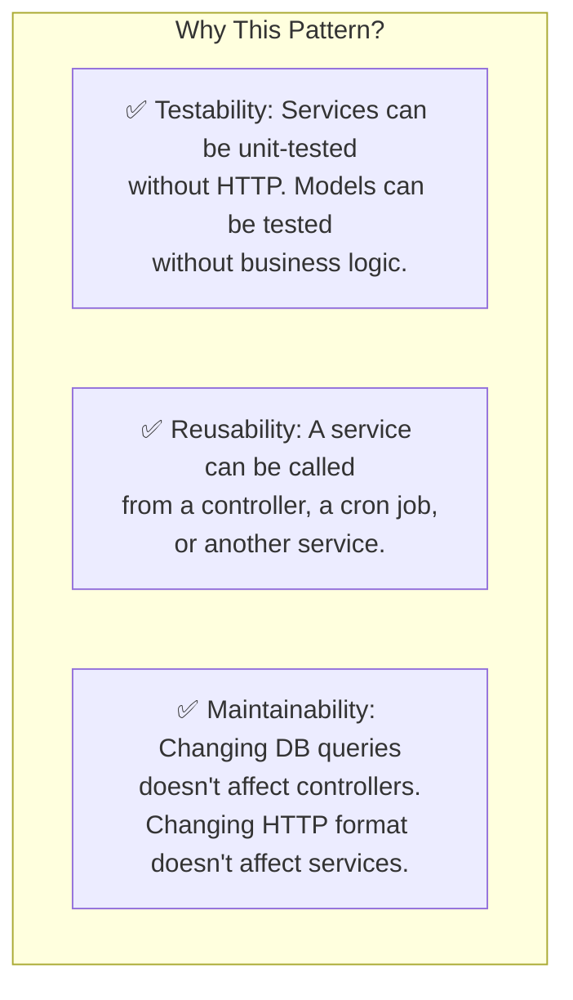

#### Layer Rules

| Layer | Receives | Returns | Can Access | Cannot Access |
|---|---|---|---|---|
| **Controller** | `req`, `res`, `next` | HTTP response | Service layer | Models, database, other controllers |
| **Service** | Plain JavaScript objects | Plain JavaScript objects or throws AppError | Model layer, other services, utilities | `req`, `res`, HTTP concepts |
| **Model** | Query parameters, transaction objects | Raw query results | Knex instance, database | Services, controllers, business logic |

#### Example Flow: Creating an Inventory Item

```javascript
// 1. ROUTE — defines the endpoint and middleware chain
// routes/inventory.routes.js
router.post('/',
  authenticate,                         // Must be logged in
  authorize('admin'),                   // Must be admin
  upload.single('image'),               // Handle file upload
  validate(inventoryValidation.create), // Validate request body
  inventoryController.create            // Handle the request
);

// 2. CONTROLLER — extracts data, calls service, sends response
// controllers/inventory.controller.js
exports.create = catchAsync(async (req, res) => {
  const itemData = req.body;
  const imageFile = req.file;
  const userId = req.user.id;

  const item = await inventoryService.createItem(itemData, imageFile, userId);

  res.status(201).json({
    status: 'success',
    data: { item },
  });
});

// 3. SERVICE — business logic, orchestration
// services/inventory.service.js
exports.createItem = async (itemData, imageFile, userId) => {
  // Process image if provided
  let imageUrl = null;
  if (imageFile) {
    imageUrl = await imageService.processAndSave(imageFile, 'items');
  }

  // Create the item
  const item = await inventoryModel.create({
    ...itemData,
    image_url: imageUrl,
    created_by: userId,
  });

  // Log the action
  await auditService.log({
    userId,
    action: 'item.create',
    entityType: 'inventory_item',
    entityId: item.id,
    details: { name: item.name, quantity: item.quantity },
  });

  return item;
};

// 4. MODEL — Knex query only
// models/inventory.model.js
exports.create = async (data) => {
  const id = uuid.v4();
  await db('inventory_items').insert({ id, ...data });
  return db('inventory_items').where({ id }).first();
};
```

### 5.2 Repository Pattern for Data Access

The Model layer implements the **Repository pattern** — each model file acts as a repository for a single database entity. Models encapsulate all SQL knowledge. The rest of the application never sees Knex queries.

```javascript
// models/inventory.model.js — Repository for inventory_items
const db = require('../config/database');

module.exports = {
  // Find all with availability (uses the v_item_availability view concept)
  findAll: (filters, pagination) => { /* Knex query */ },

  // Find one by ID
  findById: (id) => { /* Knex query */ },

  // Create
  create: (data) => { /* Knex insert + return */ },

  // Update
  update: (id, data) => { /* Knex update */ },

  // Soft delete
  deactivate: (id) => { /* Knex update is_active = false */ },

  // Availability calculation (transactional)
  getAvailability: (itemId, trx) => { /* Subquery with FOR UPDATE */ },
};
```

**Transaction support:** All model functions accept an optional `trx` (transaction) parameter. When provided, the query runs within the transaction. This allows services to compose multiple model calls within a single transaction.

```javascript
// Service orchestrating a transaction
exports.createReservation = async (data, userId) => {
  return db.transaction(async (trx) => {
    // All model calls use the same transaction
    for (const item of data.items) {
      const available = await inventoryModel.getAvailability(item.id, trx);
      if (available < item.quantity) {
        throw new AppError(`Insufficient quantity for ${item.name}`, 409);
      }
    }
    const reservation = await reservationModel.create(data, trx);
    for (const item of data.items) {
      await reservationModel.createLineItem(reservation.id, item, trx);
    }
    await auditModel.create({ /* ... */ }, trx);
    return reservation;
  });
};
```

### 5.3 Middleware Pipeline

Express middleware executes in the order it is registered. The Resource Manager uses a layered middleware strategy:

```mermaid
graph LR
    subgraph "Global Middleware (app.js)"
        A["helmet"] --> B["cors"] --> C["compression"]
        C --> D["express.json"] --> E["express.urlencoded"]
        E --> F["requestLogger"] --> G["globalRateLimiter"]
    end

    subgraph "Route-Level Middleware"
        H["authenticate<br/>(JWT verify)"] --> I["authorize<br/>(role check)"]
        I --> J["upload<br/>(multer)"] --> K["validate<br/>(Joi schema)"]
    end

    subgraph "Controller"
        L["controller.method"]
    end

    subgraph "Error Handling (last)"
        M["notFound<br/>(404)"] --> N["errorHandler<br/>(catch all)"]
    end

    G --> H
    K --> L
    L --> M
```

**Middleware explanations:**

| Middleware | Layer | Purpose |
|---|---|---|
| `helmet` | Global | Sets 11 HTTP security headers. |
| `cors` | Global | Restricts cross-origin access to allowed frontend origin(s). |
| `compression` | Global | Gzip-compresses responses larger than 1 KB. |
| `express.json` | Global | Parses JSON request bodies. Limit: 10 MB. |
| `express.urlencoded` | Global | Parses URL-encoded form bodies. |
| `requestLogger` | Global | Logs every HTTP request (method, URL, status, response time). |
| `globalRateLimiter` | Global | 100 requests per 15 minutes per IP. |
| `authenticate` | Route | Verifies JWT from `Authorization: Bearer <token>`. Attaches `req.user`. Rejects with 401 if invalid/expired. |
| `authorize(role)` | Route | Checks `req.user.role` against the required role. Rejects with 403 if insufficient. |
| `upload` | Route | Multer file upload handler. Only on routes that accept files. |
| `validate(schema)` | Route | Validates `req.body` / `req.params` / `req.query` against a Joi schema. Rejects with 400 if invalid. |
| `notFound` | Error | Catches requests that didn't match any route. Returns 404. |
| `errorHandler` | Error | Catches all thrown/rejected errors. Formats consistent error responses. Logs errors to Winston. |

### 5.4 Error Handling Strategy

The application uses a **centralized error handling** approach:

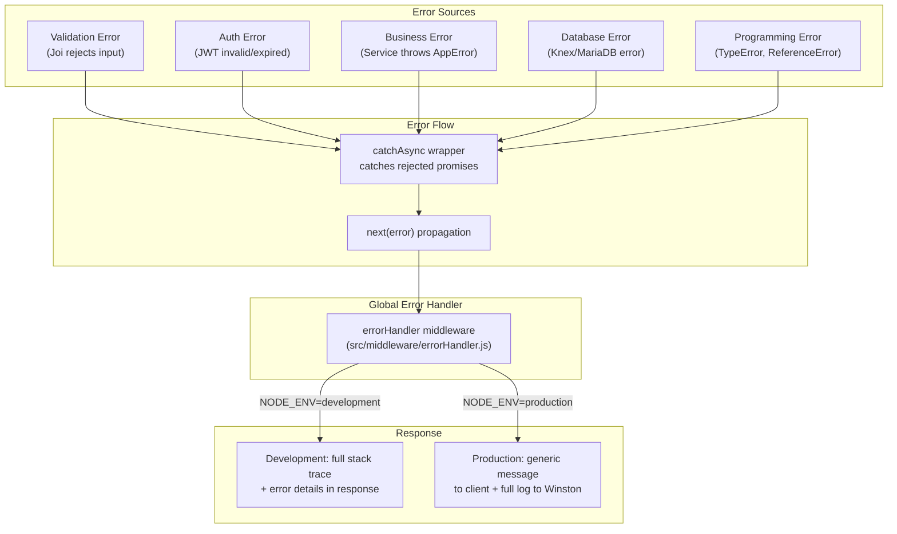

**Error response format (consistent across all errors):**

```json
{
  "status": "fail",
  "message": "Validation error: \"name\" is required",
  "errors": [
    { "field": "name", "message": "\"name\" is required" }
  ]
}
```

**Error types and HTTP status codes:**

| Error Type | Status | Example |
|---|---|---|
| Validation error | 400 | Missing required field, invalid data type |
| Authentication error | 401 | Missing/invalid/expired JWT |
| Authorization error | 403 | Normal user accessing admin endpoint |
| Not found | 404 | Item ID does not exist |
| Conflict | 409 | Insufficient item availability, duplicate email |
| Rate limit exceeded | 429 | Too many requests |
| Internal server error | 500 | Unhandled exception, database connection error |

### 5.5 Logging Strategy

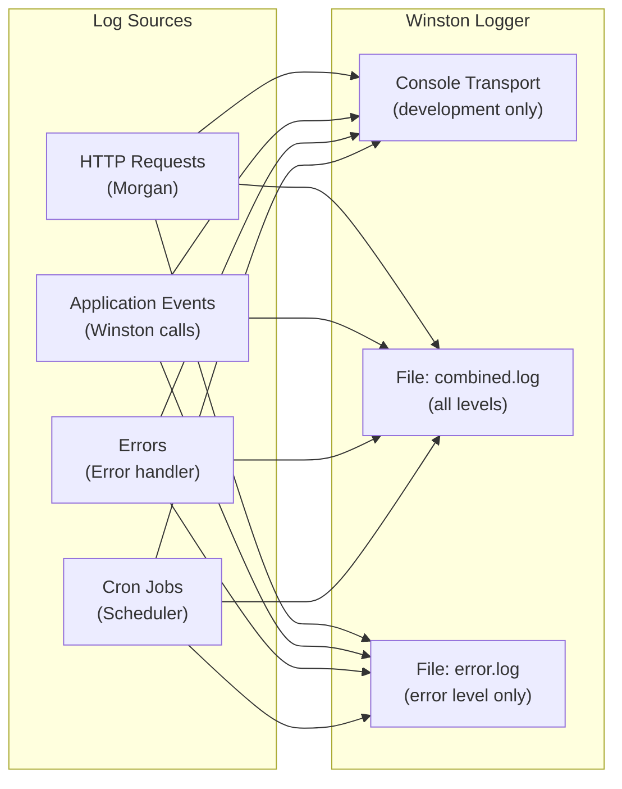

**Log levels (from most to least severe):**

| Level | When Used | Example |
|---|---|---|
| `error` | Application errors, unhandled exceptions, database failures | `Database connection failed`, `JWT verification error` |
| `warn` | Recoverable issues, deprecated usage, security events | `Rate limit exceeded for IP`, `Token reuse detected` |
| `info` | Significant operations, lifecycle events | `Server started on port 3000`, `Reservation reset: 42 reservations returned` |
| `debug` | Detailed diagnostic information | `Query: SELECT * FROM inventory_items WHERE id = ...`, `Image resized to 1200x800` |

**Log format (production — JSON):**

```json
{
  "level": "info",
  "message": "Reservation created",
  "timestamp": "2026-05-29T12:00:00.000Z",
  "service": "resource-manager",
  "reservationId": "abc-123",
  "userId": "user-456",
  "itemCount": 3
}
```

### 5.6 Authentication Flow (JWT + Refresh Token Rotation)

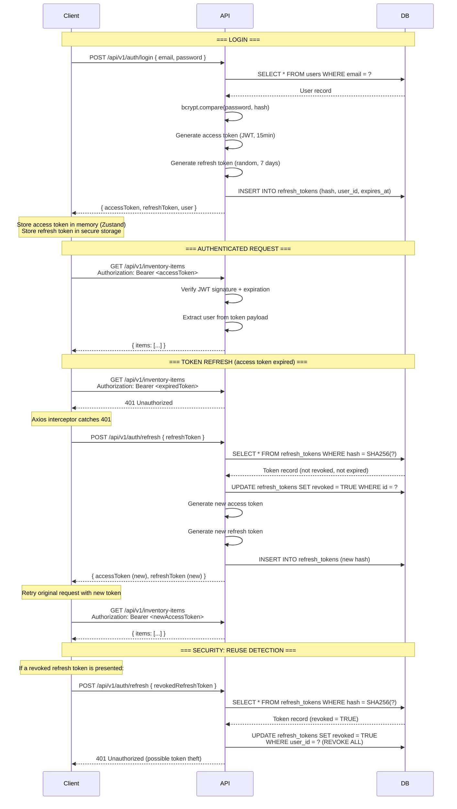

### 5.7 State Management Strategy (Frontend)

```mermaid
graph TB
    subgraph "Server State (TanStack Query)"
        direction TB
        SQ1["Inventory items"]
        SQ2["Packages"]
        SQ3["Reservations"]
        SQ4["Users"]
        SQ5["Entities"]
        SQ6["Dashboard stats"]
        SQ7["Audit log"]
        SQ8["App config"]
    end

    subgraph "Client State (Zustand)"
        direction TB
        CS1["Auth (user, tokens)"]
        CS2["Theme (mode, colors)"]
        CS3["UI (snackbar, loading)"]
    end

    subgraph "Local State (useState)"
        direction TB
        LS1["Form input values"]
        LS2["Modal open/close"]
        LS3["Selected tab"]
        LS4["Search query"]
    end

    SQ1 & SQ2 & SQ3 --- QC["QueryClient<br/>(shared cache)"]
    CS1 & CS2 & CS3 --- ZS["Zustand stores<br/>(persisted)"]
    LS1 & LS2 & LS3 & LS4 --- US["Component state<br/>(ephemeral)"]

    style QC fill:#E3F2FD,stroke:#1565C0
    style ZS fill:#E8F5E9,stroke:#2E7D32
    style US fill:#FFF3E0,stroke:#E65100
```

**Rules for choosing where state lives:**

| If the state... | Use |
|---|---|
| Comes from the server and needs caching/syncing | TanStack Query |
| Is global and persists across screens (auth, theme) | Zustand |
| Is local to a single component and ephemeral | `useState` |

### 5.8 Theming System

The application supports dynamic theming driven by server-side configuration (`app_config.theme_mode_default`, `app_config.theme_primary_color`).

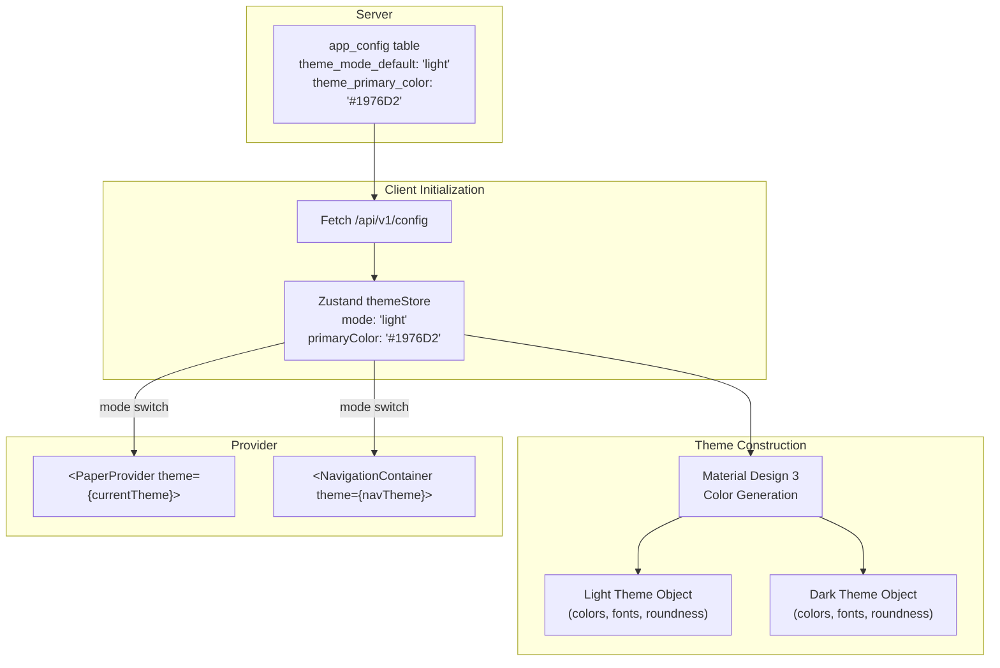

**Theme structure:**

```javascript
// theme/lightTheme.js
export const lightTheme = {
  ...MD3LightTheme,
  colors: {
    ...MD3LightTheme.colors,
    primary: '#1976D2',    // From app_config
    secondary: '#03DAC6',
    background: '#FAFAFA',
    surface: '#FFFFFF',
    error: '#B00020',
    // ... all Material Design 3 color tokens
  },
  roundness: 8,
};
```

### 5.9 Image Handling Pipeline

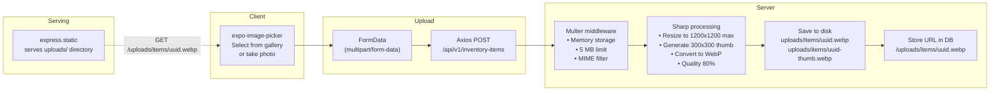

---

## 6. Security Architecture

### 6.1 Authentication

| Aspect | Implementation |
|---|---|
| **Method** | JWT (JSON Web Tokens) with refresh token rotation |
| **Access token lifetime** | 15 minutes |
| **Refresh token lifetime** | 12 days |
| **Token signing algorithm** | HS256 (HMAC-SHA256). RS256 (RSA) is preferred if the system scales to multiple services, but HS256 is sufficient for a single-server deployment. |
| **Access token payload** | `{ userId, email, role, borrowerEntityId, iat, exp }` |
| **Access token storage (client)** | In-memory only (Zustand store). Never written to localStorage or cookies. Lost on page refresh — triggers silent refresh. |
| **Refresh token storage (client)** | `expo-secure-store` (mobile) / `localStorage` (web) |
| **Refresh token storage (server)** | SHA-256 hash stored in `refresh_tokens` table. Plaintext never stored. |
| **Token rotation** | On every refresh, the old token is revoked and a new pair is issued. |
| **Reuse detection** | If a revoked refresh token is presented, **all tokens for that user are revoked** (assumes token theft). |
| **Logout** | Client clears both tokens. Server revokes the refresh token. |

### 6.2 Authorization (Role-Based Access Control)

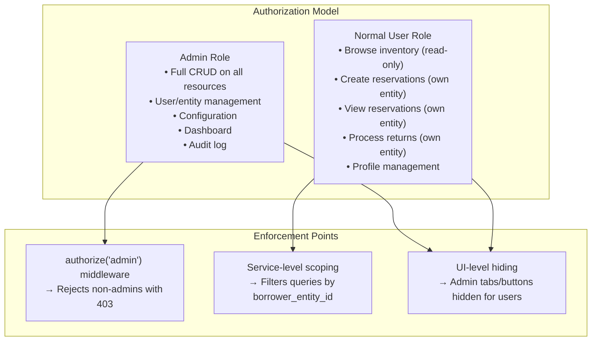

**Authorization rules by endpoint:**

| Endpoint | Admin | User | Notes |
|---|---|---|---|
| `POST /auth/login` | ✅ | ✅ | No auth required |
| `POST /auth/refresh` | ✅ | ✅ | No auth required |
| `GET /inventory-items` | ✅ | ✅ (active only) | Users see only `is_active = true` |
| `POST /inventory-items` | ✅ | ❌ | |
| `PUT /inventory-items/:id` | ✅ | ❌ | |
| `DELETE /inventory-items/:id` | ✅ | ❌ | |
| `GET /reservations` | ✅ (all) | ✅ (own entity) | Service scopes by entity |
| `POST /reservations` | ✅ | ✅ | User's entity auto-set |
| `POST /reservations/:id/return` | ✅ | ✅ (own entity) | |
| `GET /users` | ✅ | ❌ | |
| `POST /users` | ✅ | ❌ | |
| `GET /borrower-entities` | ✅ | ❌ | |
| `GET /config` | ✅ | ✅ (limited) | Users see only theme config |
| `PUT /config` | ✅ | ❌ | |
| `GET /dashboard/*` | ✅ | ❌ | |
| `GET /audit-log` | ✅ | ❌ | |

### 6.3 Password Security

| Aspect | Implementation |
|---|---|
| **Algorithm** | bcrypt |
| **Salt rounds** | 12 (configurable via environment variable) |
| **Why 12** | At 12 rounds, hashing takes ~250ms on modern hardware — slow enough to resist brute-force but fast enough for user login. Each additional round doubles the time. |
| **Password requirements** | Minimum 8 characters. No maximum (bcrypt truncates at 72 bytes — still extremely secure). Enforced by Joi validation. |
| **Password never logged** | Passwords are stripped from request logs before they reach Winston. The `requestLogger` middleware sanitizes `req.body.password`. |

### 6.4 Input Validation & Sanitization

| Layer | Tool | Purpose |
|---|---|---|
| **Client** | React Hook Form + inline validation | Immediate feedback, reduces unnecessary API calls |
| **Server (middleware)** | Joi schemas | Validates request body, params, and query against strict schemas. Rejects malformed requests before they reach controllers. |
| **Database** | Knex parameterized queries | All values are bound as parameters — never concatenated into SQL strings. This makes SQL injection impossible at the query level. |
| **Output** | React's built-in escaping | React automatically escapes interpolated values in JSX, preventing XSS in rendered output. |

**Sanitization checklist:**

| Attack | Prevention |
|---|---|
| **SQL injection** | Knex parameterized queries. **Never** use `knex.raw()` with string concatenation. All raw queries use `?` placeholders. |
| **XSS (Cross-Site Scripting)** | React escapes all rendered strings. Content-Security-Policy header via Helmet blocks inline scripts. API responses are JSON (not HTML). |
| **NoSQL injection** | Not applicable — the application uses a relational database exclusively. |
| **Path traversal** | Image filenames are replaced with UUIDs. User input never determines file paths. |
| **File upload attacks** | Multer validates MIME type (`image/jpeg`, `image/png`, `image/webp`). Sharp re-processes the image — if the file is not a valid image, Sharp throws an error and the upload is rejected. File size limited to 5 MB. |

### 6.5 CORS Policy

```javascript
// config/cors.js
const corsOptions = {
  // Production: only the frontend origin
  origin: process.env.CORS_ORIGIN || 'http://localhost:19006',

  // Allow credentials (cookies, authorization headers)
  credentials: true,

  // Allowed HTTP methods
  methods: ['GET', 'POST', 'PUT', 'PATCH', 'DELETE', 'OPTIONS'],

  // Allowed request headers
  allowedHeaders: ['Content-Type', 'Authorization'],

  // Cache preflight responses for 24 hours
  maxAge: 86400,
};
```

**Rules:**
- **Development:** `http://localhost:19006` (Expo dev server)
- **Production:** The actual frontend domain (e.g., `https://resource-manager.example.com`)
- **Never:** `*` (wildcard) in production
- **Credentials:** `true` — required for sending `Authorization` headers

### 6.6 Rate Limiting

| Scope | Window | Max Requests | Purpose |
|---|---|---|---|
| **Global** | 15 minutes | 100 per IP | General abuse prevention |
| **Auth endpoints** | 15 minutes | 10 per IP | Brute-force login prevention |
| **File uploads** | 15 minutes | 20 per IP | Prevent upload spam |

```javascript
// middleware/rateLimiter.js
const rateLimit = require('express-rate-limit');

const globalLimiter = rateLimit({
  windowMs: 15 * 60 * 1000,
  max: 100,
  standardHeaders: true,
  legacyHeaders: false,
  message: { status: 'fail', message: 'Too many requests, please try again later.' },
});

const authLimiter = rateLimit({
  windowMs: 15 * 60 * 1000,
  max: 10,
  message: { status: 'fail', message: 'Too many login attempts, please try again later.' },
});
```

### 6.7 Helmet Security Headers

Helmet sets the following headers automatically:

| Header | Value | Protection |
|---|---|---|
| `Content-Security-Policy` | Configured per deployment | Prevents XSS by restricting script/style sources |
| `X-Content-Type-Options` | `nosniff` | Prevents MIME-type sniffing |
| `X-Frame-Options` | `DENY` | Prevents clickjacking via iframes |
| `X-XSS-Protection` | `0` | Disables browser's buggy XSS filter (CSP is better) |
| `Strict-Transport-Security` | `max-age=15552000; includeSubDomains` | Enforces HTTPS |
| `Referrer-Policy` | `no-referrer` | Prevents leaking URLs to third parties |
| `X-DNS-Prefetch-Control` | `off` | Prevents DNS prefetching leaks |
| `X-Permitted-Cross-Domain-Policies` | `none` | Restricts Adobe Flash/PDF cross-domain |
| `X-Powered-By` | Removed | Hides Express fingerprint |

### 6.8 Secure Token Storage Strategy

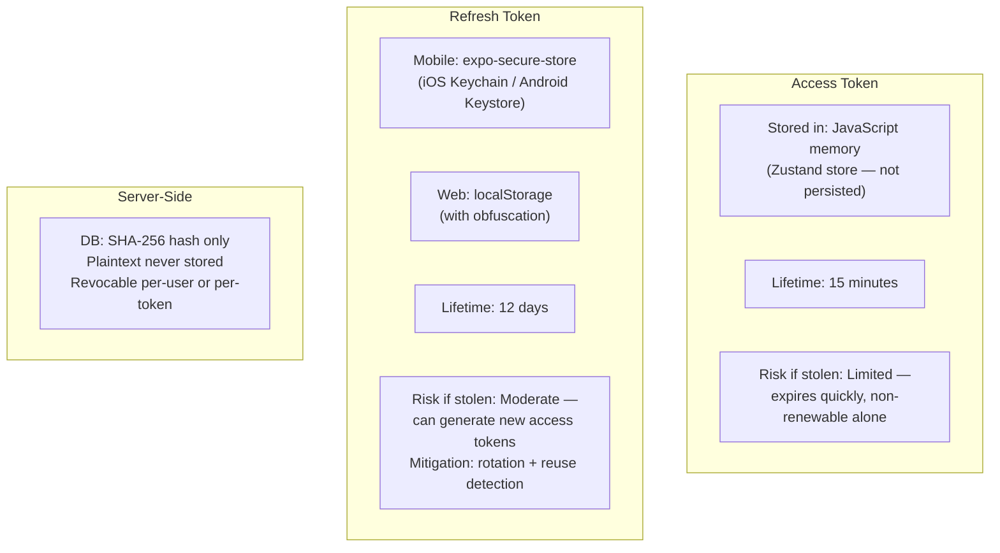

---

## 7. Deployment Architecture

### 7.1 Development Environment Setup

**Prerequisites:**

| Tool | Version | Purpose |
|---|---|---|
| Node.js | 20.x LTS | Runtime |
| npm | 10.x | Package manager |
| MariaDB | 10.11+ | Database |
| Git | 2.x | Version control |

**Setup steps:**

```bash
# 1. Clone the repository
git clone <repo-url> resource-manager
cd resource-manager

# 2. Backend setup
cd server
cp .env.example .env                # Configure database credentials, JWT secret
npm install                         # Install dependencies
npx knex migrate:latest             # Run database migrations
npx knex seed:run                   # Seed initial data (admin user, sample data)
npm run dev                         # Start with nodemon (auto-restart on changes)

# 3. Frontend setup (new terminal)
cd client
npm install                         # Install dependencies
npx expo start --web                # Start Expo dev server (web)
```

**Development scripts (`server/package.json`):**

```json
{
  "scripts": {
    "dev": "nodemon server.js",
    "start": "node server.js",
    "migrate": "knex migrate:latest",
    "migrate:rollback": "knex migrate:rollback",
    "migrate:make": "knex migrate:make",
    "seed": "knex seed:run",
    "test": "jest --runInBand --forceExit",
    "test:watch": "jest --watch --runInBand",
    "test:coverage": "jest --coverage --runInBand --forceExit",
    "lint": "eslint src/",
    "lint:fix": "eslint src/ --fix"
  }
}
```

**Development scripts (`client/package.json`):**

```json
{
  "scripts": {
    "start": "expo start",
    "web": "expo start --web",
    "build:web": "expo export --platform web",
    "test": "jest",
    "test:watch": "jest --watch",
    "lint": "eslint src/",
    "lint:fix": "eslint src/ --fix"
  }
}
```

### 7.2 Environment Variables

#### Backend (`.env.example`)

```bash
# ============================================
# Server
# ============================================
NODE_ENV=development
PORT=3000
API_PREFIX=/api/v1

# ============================================
# Database (MariaDB)
# ============================================
DB_HOST=localhost
DB_PORT=3306
DB_USER=resource_manager
DB_PASSWORD=your_password_here
DB_NAME=resource_manager
DB_POOL_MIN=2
DB_POOL_MAX=10

# ============================================
# Authentication (JWT)
# ============================================
JWT_ACCESS_SECRET=your_access_secret_here_min_32_chars
JWT_REFRESH_SECRET=your_refresh_secret_here_min_32_chars
JWT_ACCESS_EXPIRY=15m
JWT_REFRESH_EXPIRY=7d
BCRYPT_SALT_ROUNDS=12

# ============================================
# CORS
# ============================================
CORS_ORIGIN=http://localhost:19006

# ============================================
# File Uploads
# ============================================
UPLOAD_DIR=./uploads
MAX_FILE_SIZE=5242880
ALLOWED_MIME_TYPES=image/jpeg,image/png,image/webp

# ============================================
# Logging
# ============================================
LOG_LEVEL=debug
LOG_DIR=./logs

# ============================================
# Rate Limiting
# ============================================
RATE_LIMIT_WINDOW_MS=900000
RATE_LIMIT_MAX=100
AUTH_RATE_LIMIT_MAX=10
```

### 7.3 Production Deployment (VPS with PM2)

**Option A: Direct VPS deployment (recommended for simplicity).**

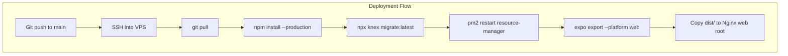

**PM2 configuration (`ecosystem.config.js`):**

```javascript
module.exports = {
  apps: [{
    name: 'resource-manager',
    script: 'server.js',
    cwd: '/var/www/resource-manager/server',
    instances: 2,               // 2 instances (cluster mode)
    exec_mode: 'cluster',
    env_production: {
      NODE_ENV: 'production',
      PORT: 3000,
    },
    // Logging
    error_file: '/var/log/pm2/resource-manager-error.log',
    out_file: '/var/log/pm2/resource-manager-out.log',
    merge_logs: true,
    // Restart policy
    max_restarts: 10,
    min_uptime: '10s',
    max_memory_restart: '500M',
    // Watch (disabled in production)
    watch: false,
  }],
};
```

**Nginx configuration:**

```nginx
server {
    listen 443 ssl http2;
    server_name resource-manager.example.com;

    # TLS (Let's Encrypt)
    ssl_certificate /etc/letsencrypt/live/resource-manager.example.com/fullchain.pem;
    ssl_certificate_key /etc/letsencrypt/live/resource-manager.example.com/privkey.pem;

    # Security headers (supplement Helmet)
    add_header X-Frame-Options "DENY" always;
    add_header X-Content-Type-Options "nosniff" always;

    # Frontend static files
    root /var/www/resource-manager/client/dist;
    index index.html;

    # SPA fallback — all non-API, non-file requests serve index.html
    location / {
        try_files $uri $uri/ /index.html;
    }

    # API reverse proxy
    location /api/ {
        proxy_pass http://localhost:3000;
        proxy_http_version 1.1;
        proxy_set_header Upgrade $http_upgrade;
        proxy_set_header Connection 'upgrade';
        proxy_set_header Host $host;
        proxy_set_header X-Real-IP $remote_addr;
        proxy_set_header X-Forwarded-For $proxy_add_x_forwarded_for;
        proxy_set_header X-Forwarded-Proto $scheme;
        proxy_cache_bypass $http_upgrade;
    }

    # Uploaded images
    location /uploads/ {
        alias /var/www/resource-manager/server/uploads/;
        expires 7d;
        add_header Cache-Control "public, immutable";
    }

    # Swagger docs (accessible in production if desired)
    location /api-docs {
        proxy_pass http://localhost:3000;
    }

    # Gzip
    gzip on;
    gzip_types text/plain text/css application/json application/javascript text/xml;
    gzip_min_length 1000;
}

# HTTP → HTTPS redirect
server {
    listen 80;
    server_name resource-manager.example.com;
    return 301 https://$server_name$request_uri;
}
```

### 7.4 Production Deployment (Docker)

**Option B: Docker deployment (recommended for reproducibility).**

**`server/Dockerfile`:**

```dockerfile
FROM node:20-alpine AS builder
WORKDIR /app
COPY package*.json ./
RUN npm ci --production
COPY . .

FROM node:20-alpine
WORKDIR /app
RUN addgroup -S appgroup && adduser -S appuser -G appgroup
COPY --from=builder /app .
RUN mkdir -p uploads/items uploads/packages logs && \
    chown -R appuser:appgroup uploads logs
USER appuser
EXPOSE 3000
CMD ["node", "server.js"]
```

**`docker-compose.yml`:**

```yaml
version: '3.8'

services:
  api:
    build: ./server
    ports:
      - "3000:3000"
    environment:
      - NODE_ENV=production
      - DB_HOST=db
      - DB_PORT=3306
      - DB_USER=resource_manager
      - DB_PASSWORD=${DB_PASSWORD}
      - DB_NAME=resource_manager
    env_file:
      - ./server/.env
    depends_on:
      db:
        condition: service_healthy
    volumes:
      - uploads:/app/uploads
      - logs:/app/logs
    restart: unless-stopped

  db:
    image: mariadb:10.11
    environment:
      - MYSQL_ROOT_PASSWORD=${MYSQL_ROOT_PASSWORD}
      - MYSQL_DATABASE=resource_manager
      - MYSQL_USER=resource_manager
      - MYSQL_PASSWORD=${DB_PASSWORD}
    volumes:
      - mariadb_data:/var/lib/mysql
    ports:
      - "3306:3306"
    healthcheck:
      test: ["CMD", "healthcheck.sh", "--connect", "--innodb_initialized"]
      interval: 10s
      timeout: 5s
      retries: 5
    restart: unless-stopped

  web:
    image: nginx:alpine
    ports:
      - "80:80"
      - "443:443"
    volumes:
      - ./client/dist:/usr/share/nginx/html:ro
      - ./nginx.conf:/etc/nginx/conf.d/default.conf:ro
      - ./certbot/conf:/etc/letsencrypt:ro
    depends_on:
      - api
    restart: unless-stopped

volumes:
  mariadb_data:
  uploads:
  logs:
```

### 7.5 Database Migration Strategy

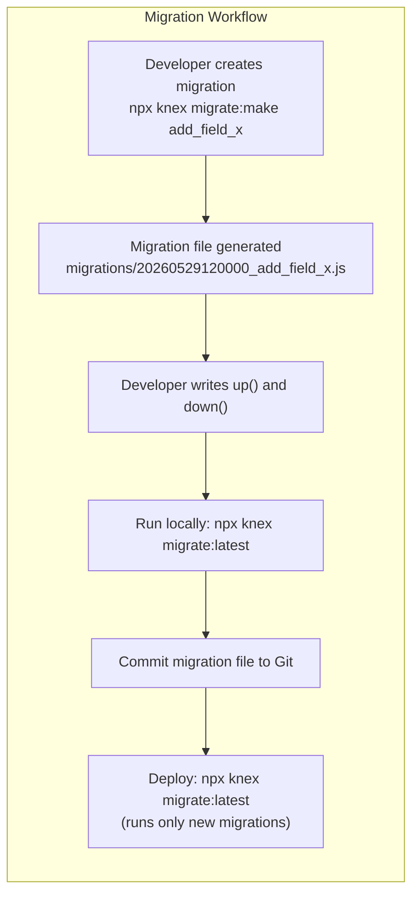

**Migration rules:**

| Rule | Rationale |
|---|---|
| **Migrations are immutable** | Never edit a migration that has been run in production. Create a new migration to modify the schema. |
| **Always include `down()`** | Rollback must be possible. `down()` reverses the `up()` operation. |
| **One concern per migration** | Each migration addresses a single schema change (add table, add column, add index). |
| **Test migrations on a copy** | Before running in production, test against a copy of the production database. |
| **Lock table** | Knex uses a `knex_migrations_lock` table to prevent concurrent migrations. |

**Example migration:**

```javascript
// migrations/20260529000000_baseline.js
exports.up = function(knex) {
  return knex.schema
    .createTable('users', (table) => {
      table.string('id', 36).primary();
      table.string('email', 255).notNullable().unique();
      table.string('password_hash', 255).notNullable();
      table.string('display_name', 100).notNullable();
      table.enu('role', ['admin', 'user']).notNullable().defaultTo('user');
      table.boolean('is_active').notNullable().defaultTo(true);
      table.datetime('last_login').nullable();
      table.datetime('created_at').notNullable().defaultTo(knex.fn.now());
      table.datetime('updated_at').notNullable().defaultTo(knex.fn.now());
      table.index('role', 'idx_users_role');
      table.index('is_active', 'idx_users_is_active');
    })
    // ... other tables
};

exports.down = function(knex) {
  return knex.schema
    // Drop in reverse dependency order
    .dropTableIfExists('refresh_tokens')
    .dropTableIfExists('audit_log')
    .dropTableIfExists('reservation_items')
    .dropTableIfExists('reservations')
    .dropTableIfExists('package_items')
    .dropTableIfExists('packages')
    .dropTableIfExists('inventory_items')
    .dropTableIfExists('user_borrower_entity')
    .dropTableIfExists('borrower_entities')
    .dropTableIfExists('users')
    .dropTableIfExists('app_config');
};
```

### 7.6 Expo Web Build and Serving

**Build process:**

```bash
# In the client/ directory
npx expo export --platform web
```

This produces a `dist/` directory containing:

```
dist/
├── index.html          # Entry point (SPA shell)
├── assets/
│   ├── *.js            # JavaScript bundles (code-split)
│   ├── *.css           # Stylesheets
│   └── *.png / *.jpg   # Static images
├── favicon.ico
└── manifest.json       # Web app manifest
```

**Serving options:**

| Method | When to Use |
|---|---|
| **Nginx (recommended)** | Production. Nginx serves static files with gzip, caching, and TLS. SPA fallback (`try_files $uri /index.html`) handles client-side routing. |
| **Express static** | Simple deployment. Add `express.static('dist')` to the backend. Less optimal but fewer moving parts. |
| **Vercel/Netlify** | If separating frontend hosting from backend. Frontend deployed to CDN, API calls proxied to the VPS. |

### 7.7 Production Checklist

| Category | Item | Status |
|---|---|---|
| **Security** | JWT secrets are strong (≥32 chars, randomly generated) | ☐ |
| **Security** | CORS origin set to production domain only | ☐ |
| **Security** | HTTPS enabled with valid TLS certificate | ☐ |
| **Security** | Rate limiting configured | ☐ |
| **Security** | Database password is strong and not default | ☐ |
| **Security** | `.env` file is gitignored and not in repo | ☐ |
| **Security** | Admin default password changed after first login | ☐ |
| **Database** | Migrations run successfully | ☐ |
| **Database** | Seed data includes admin user (production seeds, not sample data) | ☐ |
| **Database** | Regular backup schedule configured (mysqldump cron) | ☐ |
| **Application** | `NODE_ENV=production` set | ☐ |
| **Application** | PM2 configured with cluster mode | ☐ |
| **Application** | Log rotation configured | ☐ |
| **Application** | Upload directory has correct permissions | ☐ |
| **Frontend** | Expo web build completed (`expo export --platform web`) | ☐ |
| **Frontend** | API base URL points to production server | ☐ |
| **Monitoring** | PM2 monitoring active (`pm2 monit`) | ☐ |
| **Monitoring** | Server health check endpoint (`GET /api/v1/health`) responding | ☐ |
| **Backup** | Database backup tested and restorable | ☐ |
| **Backup** | Upload directory included in backup plan | ☐ |

---

*This document is a living reference for the Resource Manager project. It should be updated as architectural decisions evolve during development.*
