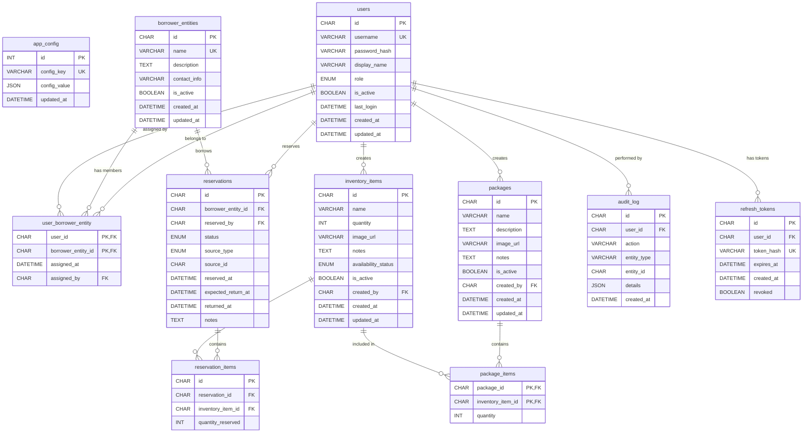
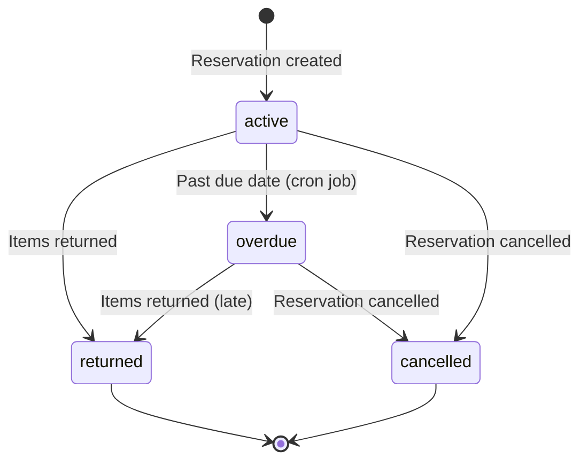
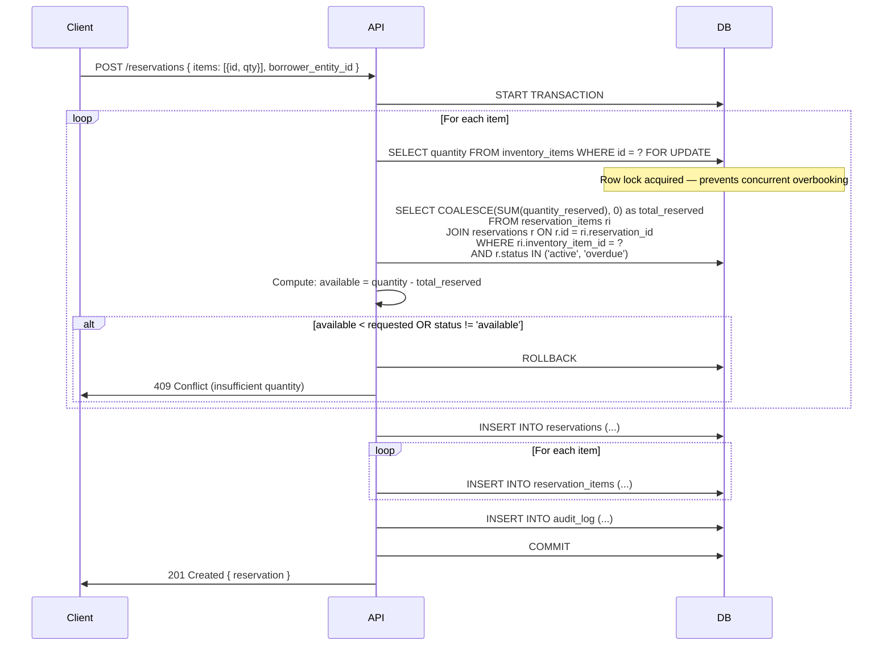
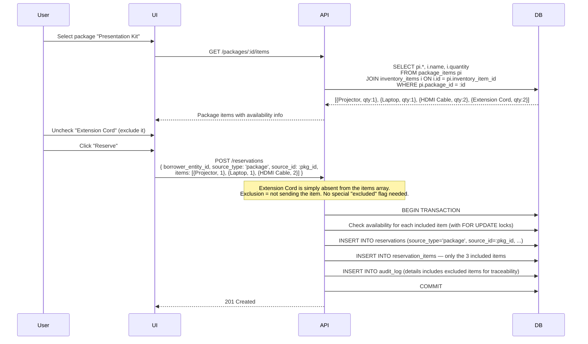

# Resource Manager — MariaDB Database Schema

> **Version:** 1.0.0
> **Last Updated:** 2026-05-29
> **Engine:** MariaDB 10.11+ (InnoDB)
> **Character Set:** utf8mb4 / utf8mb4_unicode_ci

---

## Table of Contents

1. [Design Principles](#design-principles)
2. [ER Diagram](#er-diagram)
3. [Schema Overview](#schema-overview)
4. [Table Definitions](#table-definitions)
   - [app_config](#1-app_config)
   - [users](#2-users)
   - [borrower_entities](#3-borrower_entities)
   - [user_borrower_entity](#4-user_borrower_entity)
   - [inventory_items](#5-inventory_items)
   - [packages](#6-packages)
   - [package_items](#7-package_items)
   - [reservations](#8-reservations)
   - [reservation_items](#9-reservation_items)
   - [audit_log](#10-audit_log)
   - [refresh_tokens](#11-refresh_tokens)
5. [Reservation Flow & Quantity Tracking](#reservation-flow--quantity-tracking)
6. [Package Reservation with Exclusions](#package-reservation-with-exclusions)
7. [Automatic Reset Mechanism](#automatic-reset-mechanism)
8. [Computed Views](#computed-views)
9. [Seed Data](#seed-data)
10. [Migration Baseline](#migration-baseline)

---

## Design Principles

| Principle | Rationale |
|---|---|
| **InnoDB everywhere** | Row-level locking, foreign keys, ACID transactions — essential for concurrent reservation operations. |
| **UUIDs as CHAR(36)** | Globally unique, safe for distributed clients, no auto-increment leakage. Generated application-side with `uuid v4`. |
| **`utf8mb4` charset** | Full Unicode support including emoji — important for user-facing names and notes. |
| **Soft deletes via `is_active`** | Resources are never physically deleted; they are deactivated. This preserves referential integrity for historical reservations and audit trails. |
| **Timestamps as `DATETIME`** | Stored in UTC. The application layer converts to the user's local timezone for display. `DATETIME` is preferred over `TIMESTAMP` because `TIMESTAMP` has a 2038 limit and undergoes implicit timezone conversion. |
| **JSON for flexible fields** | `audit_log.details` and `app_config.value` use JSON to store structured data without schema rigidity. |
| **Computed availability** | `available_quantity` is NOT stored — it is computed at query time as `quantity - SUM(active reservation quantities)`. This eliminates synchronization bugs between a stored counter and the reservation ledger. |
| **Nullable `quantity`** | A `NULL` quantity on `inventory_items` means "unspecified/unlimited" — the item is always considered available regardless of how many are reserved. Useful for consumables or items without strict tracking. |

---

## ER Diagram



---

## Schema Overview

| # | Table | Purpose | Row Growth |
|---|---|---|---|
| 1 | `app_config` | Key-value store for global settings | Static (~10 rows) |
| 2 | `users` | Authentication, profiles, roles | Low |
| 3 | `borrower_entities` | Organizations/groups that borrow resources | Low |
| 4 | `user_borrower_entity` | Many-to-one link: users → borrower entity | Low |
| 5 | `inventory_items` | Physical resources available for borrowing | Low–Medium |
| 6 | `packages` | Named bundles of inventory items | Low |
| 7 | `package_items` | Junction: items in a package + quantity | Low |
| 8 | `reservations` | Core borrowing transactions | High |
| 9 | `reservation_items` | Line items within a reservation | High |
| 10 | `audit_log` | Immutable event log | Very High |
| 11 | `refresh_tokens` | JWT refresh token rotation | Medium |

---

## Table Definitions

### 1. `app_config`

Stores application-level configuration as key-value pairs. Using a key-value design rather than a single-row wide table allows adding new settings without schema migrations.

```sql
CREATE TABLE app_config (
    id              INT UNSIGNED    NOT NULL AUTO_INCREMENT,
    config_key      VARCHAR(100)    NOT NULL,
    config_value    JSON            NOT NULL,
    description     VARCHAR(500)    DEFAULT NULL COMMENT 'Human-readable description of this setting',
    updated_at      DATETIME        NOT NULL DEFAULT CURRENT_TIMESTAMP ON UPDATE CURRENT_TIMESTAMP,

    PRIMARY KEY (id),
    UNIQUE KEY uq_app_config_key (config_key)
) ENGINE=InnoDB
  DEFAULT CHARSET=utf8mb4
  COLLATE=utf8mb4_unicode_ci
  COMMENT='Global application configuration (key-value store)';
```

**Design Decisions:**

| Decision | Rationale |
|---|---|
| `INT AUTO_INCREMENT` PK | Config table is tiny and never referenced by FKs; a simple integer is sufficient. |
| `config_key` as `UNIQUE` | Guarantees one value per setting. Lookups are always by key. |
| `JSON` for `config_value` | A single setting can hold a string, number, boolean, or nested object. The app layer validates the shape. |
| No `created_at` | Config rows are upserted; creation time is irrelevant. |

**Expected Keys:**

| `config_key` | Example `config_value` | Description |
|---|---|---|
| `app_name` | `"Resource Hub"` | Display name of the application |
| `theme_primary_color` | `"#1976D2"` | Primary brand color (hex) |
| `theme_mode_default` | `"light"` | Default theme mode: `"light"` or `"dark"` |
| `reservation_reset_mode` | `"weekly"` | `"weekly"` or `"never"` |
| `reservation_reset_day` | `"sunday"` | Day of week for weekly reset (lowercase English) |
| `reservation_reset_time` | `"03:00"` | Time of day (HH:MM, 24h format, UTC) for reset |
| `default_reservation_duration_hours` | `168` | Default loan duration if not specified (7 days) |
| `max_reservations_per_entity` | `null` | Max concurrent active reservations per borrower entity; `null` = unlimited |

---

### 2. `users`

Authentication, authorization, and profile data. Every human who logs into the system has a row here.

```sql
CREATE TABLE users (
    id              CHAR(36)        NOT NULL COMMENT 'UUIDv4',
    username        VARCHAR(100)    NOT NULL,
    password_hash   VARCHAR(255)    NOT NULL COMMENT 'bcrypt hash',
    display_name    VARCHAR(100)    NOT NULL,
    role            ENUM('admin', 'user')
                                    NOT NULL DEFAULT 'user',
    is_active       BOOLEAN         NOT NULL DEFAULT TRUE,
    last_login      DATETIME        DEFAULT NULL,
    created_at      DATETIME        NOT NULL DEFAULT CURRENT_TIMESTAMP,
    updated_at      DATETIME        NOT NULL DEFAULT CURRENT_TIMESTAMP ON UPDATE CURRENT_TIMESTAMP,

    PRIMARY KEY (id),
    UNIQUE KEY uq_users_username (username),
    KEY idx_users_role (role),
    KEY idx_users_is_active (is_active)
) ENGINE=InnoDB
  DEFAULT CHARSET=utf8mb4
  COLLATE=utf8mb4_unicode_ci
  COMMENT='Application users with authentication credentials';
```

**Design Decisions:**

| Decision | Rationale |
|---|---|
| `CHAR(36)` for UUID | Fixed-length for consistent storage; no `BINARY(16)` optimization needed at this scale. Application generates UUIDs. |
| `username` UNIQUE | Username is the login identifier. Case-insensitive via `utf8mb4_unicode_ci` collation. |
| `password_hash` as `VARCHAR(255)` | bcrypt produces 60-char hashes but future algorithms (argon2) may be longer. |
| `role` as `ENUM` | Only two roles exist. ENUM is storage-efficient (1 byte) and self-documenting. If roles grow beyond 3–4, migrate to a `roles` table. |
| `is_active` instead of `deleted_at` | Simpler queries (`WHERE is_active = TRUE`). Soft-delete preserves FK integrity with reservations and audit log. |
| No FK to `borrower_entities` on this table | The relationship is managed through the `user_borrower_entity` junction table, allowing clean separation and admin users who don't belong to any entity. |
| `last_login` nullable | NULL means "never logged in" — useful for accounts provisioned by an admin but not yet activated by the user. |

---

### 3. `borrower_entities`

Organizations, groups, departments, or any entity that borrows resources. A borrower entity is the "who" in a reservation — not an individual user, but the group they represent.

```sql
CREATE TABLE borrower_entities (
    id              CHAR(36)        NOT NULL COMMENT 'UUIDv4',
    name            VARCHAR(200)    NOT NULL,
    description     TEXT            DEFAULT NULL,
    contact_info    VARCHAR(500)    DEFAULT NULL COMMENT 'Phone, username, address — free-form',
    is_active       BOOLEAN         NOT NULL DEFAULT TRUE,
    created_at      DATETIME        NOT NULL DEFAULT CURRENT_TIMESTAMP,
    updated_at      DATETIME        NOT NULL DEFAULT CURRENT_TIMESTAMP ON UPDATE CURRENT_TIMESTAMP,

    PRIMARY KEY (id),
    UNIQUE KEY uq_borrower_entities_name (name),
    KEY idx_borrower_entities_is_active (is_active)
) ENGINE=InnoDB
  DEFAULT CHARSET=utf8mb4
  COLLATE=utf8mb4_unicode_ci
  COMMENT='Organizations or groups that borrow resources';
```

**Design Decisions:**

| Decision | Rationale |
|---|---|
| `name` UNIQUE | Prevents duplicate entities. Admins should merge rather than create duplicates. |
| `contact_info` as `VARCHAR(500)` | Free-form field for flexibility. Structured contact data (phone, username, address as separate columns) would be premature — this app isn't a CRM. |
| `description` as `TEXT` | Allows longer descriptions without arbitrary length limits. |
| Soft delete via `is_active` | Deactivated entities retain their reservation history. |

---

### 4. `user_borrower_entity`

Junction table linking users to borrower entities. Currently many-to-one (a user belongs to at most one entity), but implemented as a junction table for flexibility.

```sql
CREATE TABLE user_borrower_entity (
    user_id             CHAR(36)    NOT NULL,
    borrower_entity_id  CHAR(36)    NOT NULL,
    assigned_at         DATETIME    NOT NULL DEFAULT CURRENT_TIMESTAMP,
    assigned_by         CHAR(36)    DEFAULT NULL COMMENT 'Admin user who made the assignment',

    PRIMARY KEY (user_id, borrower_entity_id),
    -- If many-to-one is strictly enforced, add this unique constraint:
    UNIQUE KEY uq_user_borrower_entity_user (user_id),

    KEY idx_ube_borrower_entity_id (borrower_entity_id),
    KEY idx_ube_assigned_by (assigned_by),

    CONSTRAINT fk_ube_user
        FOREIGN KEY (user_id)
        REFERENCES users (id)
        ON DELETE CASCADE
        ON UPDATE CASCADE,

    CONSTRAINT fk_ube_borrower_entity
        FOREIGN KEY (borrower_entity_id)
        REFERENCES borrower_entities (id)
        ON DELETE CASCADE
        ON UPDATE CASCADE,

    CONSTRAINT fk_ube_assigned_by
        FOREIGN KEY (assigned_by)
        REFERENCES users (id)
        ON DELETE SET NULL
        ON UPDATE CASCADE
) ENGINE=InnoDB
  DEFAULT CHARSET=utf8mb4
  COLLATE=utf8mb4_unicode_ci
  COMMENT='Links users to borrower entities (many users → one entity)';
```

**Design Decisions:**

| Decision | Rationale |
|---|---|
| Composite PK `(user_id, borrower_entity_id)` | Naturally unique combination. |
| `UNIQUE KEY` on `user_id` alone | Enforces many-to-one: a user can belong to **at most one** borrower entity. Remove this constraint to allow many-to-many in the future. |
| `ON DELETE CASCADE` on both FKs | If a user or entity is hard-deleted, the link should go too. In practice, soft-delete via `is_active` on the parent tables means CASCADE rarely fires. |
| `assigned_by` nullable | System-seeded assignments or self-registration may not have an assigning admin. `ON DELETE SET NULL` preserves the link even if the assigning admin is deleted. |
| Junction table over FK on `users` | Allows tracking *when* and *by whom* the assignment was made. A simple FK column on `users` would lose this metadata. Also makes it trivial to switch to many-to-many later. |

---

### 5. `inventory_items`

The physical resources that can be borrowed. Each row represents a *type* of resource (e.g., "Projector"), not a specific serial-numbered unit.

```sql
CREATE TABLE inventory_items (
    id                  CHAR(36)        NOT NULL COMMENT 'UUIDv4',
    name                VARCHAR(200)    NOT NULL,
    quantity            INT UNSIGNED    DEFAULT NULL COMMENT 'NULL = unlimited/untracked',
    image_url           VARCHAR(2048)   DEFAULT NULL,
    notes               TEXT            DEFAULT NULL,
    availability_status ENUM('available', 'reserved', 'unavailable', 'maintenance', 'retired')
                                        NOT NULL DEFAULT 'available',
    is_active           BOOLEAN         NOT NULL DEFAULT TRUE,
    created_by          CHAR(36)        DEFAULT NULL,
    created_at          DATETIME        NOT NULL DEFAULT CURRENT_TIMESTAMP,
    updated_at          DATETIME        NOT NULL DEFAULT CURRENT_TIMESTAMP ON UPDATE CURRENT_TIMESTAMP,

    PRIMARY KEY (id),
    KEY idx_inventory_items_name (name),
    KEY idx_inventory_items_status (availability_status),
    KEY idx_inventory_items_is_active (is_active),
    KEY idx_inventory_items_created_by (created_by),

    CONSTRAINT fk_inventory_items_created_by
        FOREIGN KEY (created_by)
        REFERENCES users (id)
        ON DELETE SET NULL
        ON UPDATE CASCADE
) ENGINE=InnoDB
  DEFAULT CHARSET=utf8mb4
  COLLATE=utf8mb4_unicode_ci
  COMMENT='Physical resources available for borrowing';
```

**Design Decisions:**

| Decision | Rationale |
|---|---|
| `quantity` nullable | `NULL` = "we don't track quantity for this item" (e.g., a shared room key, consumables). Queries treat `NULL` as always-available. A value of `0` means "none in stock." |
| No `available_quantity` column | **Critical design choice.** Available quantity is computed on-the-fly: `available = quantity - SUM(active reservation quantities)`. Storing it would create a race condition risk where the counter drifts from the reservation ledger. Computed values are always consistent. |
| `availability_status` ENUM | An **administrative override** independent of quantity. An admin can mark an item as `maintenance` or `retired` even if quantity > 0. The reservation logic checks BOTH this status AND computed availability. |
| Status values explained | `available`: normal, can be reserved. `reserved`: ALL quantity is reserved (auto-set by app). `unavailable`: admin-blocked temporarily. `maintenance`: under repair. `retired`: permanently out of service. |
| `image_url` as `VARCHAR(2048)` | URLs can be long. Images are stored externally (S3, filesystem); the DB holds only the URL. |
| `is_active` for soft delete | Keeps item visible in historical reservations. Distinct from `retired` status — `is_active = FALSE` hides it from all UI views. |

**Quantity Tracking — The Availability Formula:**

```
available_quantity(item) =
    CASE
        WHEN item.quantity IS NULL THEN ∞  (always available)
        ELSE item.quantity - COALESCE(
            (SELECT SUM(ri.quantity_reserved)
             FROM reservation_items ri
             JOIN reservations r ON r.id = ri.reservation_id
             WHERE ri.inventory_item_id = item.id
               AND r.status IN ('active', 'overdue')),
            0
        )
    END
```

---

### 6. `packages`

Named bundles of inventory items. A package is a convenience grouping (e.g., "Presentation Kit" = 1 Projector + 1 Laptop + 2 Extension Cords). Reserving a package creates individual `reservation_items` for each component.

```sql
CREATE TABLE packages (
    id              CHAR(36)        NOT NULL COMMENT 'UUIDv4',
    name            VARCHAR(200)    NOT NULL,
    description     TEXT            DEFAULT NULL,
    image_url       VARCHAR(2048)   DEFAULT NULL,
    notes           TEXT            DEFAULT NULL,
    is_active       BOOLEAN         NOT NULL DEFAULT TRUE,
    created_by      CHAR(36)        DEFAULT NULL,
    created_at      DATETIME        NOT NULL DEFAULT CURRENT_TIMESTAMP,
    updated_at      DATETIME        NOT NULL DEFAULT CURRENT_TIMESTAMP ON UPDATE CURRENT_TIMESTAMP,

    PRIMARY KEY (id),
    KEY idx_packages_name (name),
    KEY idx_packages_is_active (is_active),
    KEY idx_packages_created_by (created_by),

    CONSTRAINT fk_packages_created_by
        FOREIGN KEY (created_by)
        REFERENCES users (id)
        ON DELETE SET NULL
        ON UPDATE CASCADE
) ENGINE=InnoDB
  DEFAULT CHARSET=utf8mb4
  COLLATE=utf8mb4_unicode_ci
  COMMENT='Named bundles of inventory items';
```

**Design Decisions:**

| Decision | Rationale |
|---|---|
| Packages don't have `quantity` | A package is a template, not a physical item. Its availability is derived from the availability of its component items. |
| No `availability_status` | A package is available if ALL its component items are available in the required quantities. This is computed at query time. |
| `is_active` for soft delete | Deactivated packages are hidden but historical reservations that referenced them remain valid. |

---

### 7. `package_items`

Junction table defining which inventory items belong to a package and in what quantity.

```sql
CREATE TABLE package_items (
    package_id          CHAR(36)        NOT NULL,
    inventory_item_id   CHAR(36)        NOT NULL,
    quantity            INT UNSIGNED    NOT NULL DEFAULT 1 COMMENT 'How many of this item in the package',

    PRIMARY KEY (package_id, inventory_item_id),

    KEY idx_package_items_item (inventory_item_id),

    CONSTRAINT fk_package_items_package
        FOREIGN KEY (package_id)
        REFERENCES packages (id)
        ON DELETE CASCADE
        ON UPDATE CASCADE,

    CONSTRAINT fk_package_items_item
        FOREIGN KEY (inventory_item_id)
        REFERENCES inventory_items (id)
        ON DELETE CASCADE
        ON UPDATE CASCADE,

    CONSTRAINT chk_package_items_quantity
        CHECK (quantity > 0)
) ENGINE=InnoDB
  DEFAULT CHARSET=utf8mb4
  COLLATE=utf8mb4_unicode_ci
  COMMENT='Items contained in a package with quantities';
```

**Design Decisions:**

| Decision | Rationale |
|---|---|
| Composite PK | An item appears at most once per package; the quantity column handles multiples. |
| `ON DELETE CASCADE` | If a package is deleted, its item list is cleaned up. If an item is deleted, it's removed from all packages. (In practice, soft-delete via `is_active` on parents prevents this.) |
| `CHECK (quantity > 0)` | A package item with quantity 0 is meaningless. The constraint prevents data corruption. |
| No `id` column | The composite PK is the natural key. An artificial `id` adds no value. |

---

### 8. `reservations`

The core borrowing transaction. One reservation = one borrowing event by one borrower entity, made by one user.

```sql
CREATE TABLE reservations (
    id                  CHAR(36)        NOT NULL COMMENT 'UUIDv4',
    borrower_entity_id  CHAR(36)        NOT NULL,
    reserved_by         CHAR(36)        NOT NULL COMMENT 'User who created the reservation',
    status              ENUM('active', 'returned', 'overdue', 'cancelled')
                                        NOT NULL DEFAULT 'active',
    source_type         ENUM('item', 'package')
                                        DEFAULT NULL COMMENT 'Whether this reservation originated from a direct item pick or a package',
    source_id           CHAR(36)        DEFAULT NULL COMMENT 'The inventory_item.id or package.id that originated this reservation',
    reserved_at         DATETIME        NOT NULL DEFAULT CURRENT_TIMESTAMP,
    expected_return_at  DATETIME        DEFAULT NULL COMMENT 'NULL = no due date',
    returned_at         DATETIME        DEFAULT NULL COMMENT 'Set when status changes to returned',
    notes               TEXT            DEFAULT NULL,

    PRIMARY KEY (id),
    KEY idx_reservations_borrower (borrower_entity_id),
    KEY idx_reservations_reserved_by (reserved_by),
    KEY idx_reservations_status (status),
    KEY idx_reservations_reserved_at (reserved_at),
    KEY idx_reservations_source (source_type, source_id),

    -- Composite index for the most common query: "active reservations for an entity"
    KEY idx_reservations_entity_status (borrower_entity_id, status),

    CONSTRAINT fk_reservations_borrower
        FOREIGN KEY (borrower_entity_id)
        REFERENCES borrower_entities (id)
        ON DELETE RESTRICT
        ON UPDATE CASCADE,

    CONSTRAINT fk_reservations_user
        FOREIGN KEY (reserved_by)
        REFERENCES users (id)
        ON DELETE RESTRICT
        ON UPDATE CASCADE
) ENGINE=InnoDB
  DEFAULT CHARSET=utf8mb4
  COLLATE=utf8mb4_unicode_ci
  COMMENT='Borrowing transactions linking entities to reserved items';
```

**Design Decisions:**

| Decision | Rationale |
|---|---|
| `ON DELETE RESTRICT` on both FKs | **You must never delete a borrower entity or user that has reservations.** Deactivate them instead. `RESTRICT` is a safety net. |
| `source_type` + `source_id` (polymorphic reference) | Tracks the *origin* of the reservation — did the user pick items individually or use a package? This is informational only; the actual reserved items live in `reservation_items`. No FK here because it can point to either `inventory_items` or `packages`. |
| `source_type` / `source_id` both nullable | A reservation could theoretically be created without a specific source (admin override). Both are NULL or both have values — enforced in the application layer. |
| `expected_return_at` nullable | Some borrowing is indefinite (e.g., semi-permanent assignments). NULL means "no due date." |
| `returned_at` nullable | Populated only when `status` transitions to `'returned'`. |
| Status lifecycle | `active` → `returned` (items returned) / `cancelled` (reservation voided). `active` → `overdue` (set by cron when `expected_return_at` < NOW()). `overdue` → `returned` / `cancelled`. |
| No FK on `source_id` | Polymorphic FKs are not supported in SQL. The application validates the reference. The `source_type` + `source_id` pair is indexed for efficient lookups. |

**Status Transition Diagram:**



---

### 9. `reservation_items`

Individual line items within a reservation. When a package is reserved, each component item gets its own row here — **minus any items the user explicitly excluded**.

```sql
CREATE TABLE reservation_items (
    id                  CHAR(36)        NOT NULL COMMENT 'UUIDv4',
    reservation_id      CHAR(36)        NOT NULL,
    inventory_item_id   CHAR(36)        NOT NULL,
    quantity_reserved   INT UNSIGNED    NOT NULL DEFAULT 1,

    PRIMARY KEY (id),
    -- Prevent duplicate item entries in the same reservation
    UNIQUE KEY uq_reservation_items_res_item (reservation_id, inventory_item_id),

    KEY idx_reservation_items_item (inventory_item_id),

    CONSTRAINT fk_reservation_items_reservation
        FOREIGN KEY (reservation_id)
        REFERENCES reservations (id)
        ON DELETE CASCADE
        ON UPDATE CASCADE,

    CONSTRAINT fk_reservation_items_item
        FOREIGN KEY (inventory_item_id)
        REFERENCES inventory_items (id)
        ON DELETE RESTRICT
        ON UPDATE CASCADE,

    CONSTRAINT chk_reservation_items_quantity
        CHECK (quantity_reserved > 0)
) ENGINE=InnoDB
  DEFAULT CHARSET=utf8mb4
  COLLATE=utf8mb4_unicode_ci
  COMMENT='Individual items within a reservation, with quantities';
```

**Design Decisions:**

| Decision | Rationale |
|---|---|
| Surrogate `id` (UUID) PK | The composite key `(reservation_id, inventory_item_id)` is already enforced as a UNIQUE constraint. A surrogate PK simplifies API references and ORM usage. |
| `UNIQUE (reservation_id, inventory_item_id)` | An item appears at most once per reservation. To reserve 3 projectors, set `quantity_reserved = 3`, don't create 3 rows. |
| `ON DELETE CASCADE` on reservation FK | If a reservation is hard-deleted, its line items go with it. |
| `ON DELETE RESTRICT` on item FK | You cannot delete an inventory item that is referenced by any reservation (active or historical). Deactivate instead. |
| `CHECK (quantity_reserved > 0)` | Reserving 0 of an item is nonsensical. |
| No per-item status | Item-level return tracking is intentionally omitted for V1. The entire reservation is returned at once. Partial returns can be modeled in V2 by adding a `returned_quantity` column. |

---

### 10. `audit_log`

Immutable event log for accountability. Every create, update, delete, login, and significant action is recorded.

```sql
CREATE TABLE audit_log (
    id              CHAR(36)        NOT NULL COMMENT 'UUIDv4',
    user_id         CHAR(36)        DEFAULT NULL COMMENT 'NULL for system actions',
    action          VARCHAR(100)    NOT NULL COMMENT 'e.g. reservation.create, item.update, user.login',
    entity_type     VARCHAR(50)     DEFAULT NULL COMMENT 'e.g. reservation, inventory_item, user',
    entity_id       CHAR(36)        DEFAULT NULL COMMENT 'ID of the affected entity',
    details         JSON            DEFAULT NULL COMMENT 'Before/after values, metadata',
    ip_address      VARCHAR(45)     DEFAULT NULL COMMENT 'Client IP (IPv4 or IPv6)',
    created_at      DATETIME        NOT NULL DEFAULT CURRENT_TIMESTAMP,

    PRIMARY KEY (id),
    KEY idx_audit_log_user (user_id),
    KEY idx_audit_log_action (action),
    KEY idx_audit_log_entity (entity_type, entity_id),
    KEY idx_audit_log_created_at (created_at),

    CONSTRAINT fk_audit_log_user
        FOREIGN KEY (user_id)
        REFERENCES users (id)
        ON DELETE SET NULL
        ON UPDATE CASCADE
) ENGINE=InnoDB
  DEFAULT CHARSET=utf8mb4
  COLLATE=utf8mb4_unicode_ci
  COMMENT='Immutable audit trail of all significant actions';
```

**Design Decisions:**

| Decision | Rationale |
|---|---|
| Append-only | Rows in this table are **never updated or deleted** (except by a retention policy). Application code should only INSERT. |
| `user_id` nullable | System-triggered actions (cron jobs, automated resets) have no user context. `ON DELETE SET NULL` preserves the log even if the user is deleted. |
| `action` as `VARCHAR(100)` | Dot-notation convention: `entity.verb` (e.g., `reservation.create`, `item.update`, `user.login`, `system.reset`). Not an ENUM because new action types should not require schema changes. |
| `entity_type` + `entity_id` | Polymorphic reference to the affected entity. Not FKed — the referenced entity may be deleted. |
| `details` as `JSON` | Flexible structure for before/after snapshots, error messages, or metadata. Example: `{"before": {"status": "active"}, "after": {"status": "returned"}}`. |
| `ip_address` | Useful for security auditing. `VARCHAR(45)` accommodates IPv6. |
| Index on `created_at` | Supports time-range queries for audit reports. |

**Example `details` Payloads:**

```json
// reservation.create
{
  "reservation_id": "abc-123",
  "borrower_entity": "Youth Group Alpha",
  "items": [
    {"name": "Projector", "quantity": 1},
    {"name": "HDMI Cable", "quantity": 2}
  ],
  "source": {"type": "package", "name": "Presentation Kit"}
}

// item.update
{
  "before": {"quantity": 10, "availability_status": "available"},
  "after": {"quantity": 15, "availability_status": "available"}
}

// system.reset
{
  "mode": "weekly",
  "reservations_returned": 42,
  "triggered_at": "2026-05-31T03:00:00Z"
}
```

---

### 11. `refresh_tokens`

Stores hashed refresh tokens for JWT-based authentication with token rotation.

```sql
CREATE TABLE refresh_tokens (
    id              CHAR(36)        NOT NULL COMMENT 'UUIDv4',
    user_id         CHAR(36)        NOT NULL,
    token_hash      VARCHAR(255)    NOT NULL COMMENT 'SHA-256 hash of the refresh token',
    expires_at      DATETIME        NOT NULL,
    created_at      DATETIME        NOT NULL DEFAULT CURRENT_TIMESTAMP,
    revoked         BOOLEAN         NOT NULL DEFAULT FALSE,

    PRIMARY KEY (id),
    UNIQUE KEY uq_refresh_tokens_hash (token_hash),
    KEY idx_refresh_tokens_user (user_id),
    KEY idx_refresh_tokens_expires (expires_at),

    CONSTRAINT fk_refresh_tokens_user
        FOREIGN KEY (user_id)
        REFERENCES users (id)
        ON DELETE CASCADE
        ON UPDATE CASCADE
) ENGINE=InnoDB
  DEFAULT CHARSET=utf8mb4
  COLLATE=utf8mb4_unicode_ci
  COMMENT='JWT refresh tokens for token rotation';
```

**Design Decisions:**

| Decision | Rationale |
|---|---|
| `token_hash` not plaintext | The actual refresh token is sent to the client. The DB stores only its SHA-256 hash. If the DB is compromised, attackers cannot forge tokens. |
| `token_hash` UNIQUE | Guarantees token uniqueness and enables O(1) lookup during token refresh. |
| `revoked` boolean | When a token is used for rotation, the old token is revoked (set to `TRUE`). If a revoked token is presented, all tokens for that user should be revoked (possible token theft). |
| `ON DELETE CASCADE` | If a user is deleted, all their refresh tokens are cleaned up. |
| No `device_info` column | Omitted for V1 simplicity. Can be added later for "sessions on this device" features. |

**Token Rotation Flow:**

```
1. User logs in → Server creates refresh token, stores SHA-256 hash, returns plaintext token to client
2. Client sends refresh token → Server hashes it, looks up the hash
3. If found AND not revoked AND not expired:
   a. Revoke the old token (SET revoked = TRUE)
   b. Create a new refresh token (new row)
   c. Return new access token + new refresh token to client
4. If found AND revoked → SECURITY ALERT: revoke ALL tokens for that user (token reuse detected)
5. If not found OR expired → Return 401, client must re-login
```

---

## Reservation Flow & Quantity Tracking

### Creating a Reservation

The following sequence ensures transactional consistency when reserving items:



### The Availability Query

To display available quantities in the UI, use this query (or wrap it in a view):

```sql
SELECT
    i.id,
    i.name,
    i.quantity                                          AS total_quantity,
    i.availability_status,
    COALESCE(active_res.total_reserved, 0)              AS currently_reserved,
    CASE
        WHEN i.quantity IS NULL THEN NULL                -- unlimited
        ELSE i.quantity - COALESCE(active_res.total_reserved, 0)
    END                                                 AS available_quantity,
    CASE
        WHEN i.availability_status != 'available' THEN FALSE
        WHEN i.quantity IS NULL THEN TRUE                -- unlimited items are always available
        WHEN i.quantity - COALESCE(active_res.total_reserved, 0) > 0 THEN TRUE
        ELSE FALSE
    END                                                 AS is_available
FROM inventory_items i
LEFT JOIN (
    SELECT
        ri.inventory_item_id,
        SUM(ri.quantity_reserved) AS total_reserved
    FROM reservation_items ri
    INNER JOIN reservations r ON r.id = ri.reservation_id
    WHERE r.status IN ('active', 'overdue')
    GROUP BY ri.inventory_item_id
) active_res ON active_res.inventory_item_id = i.id
WHERE i.is_active = TRUE;
```

### Returning a Reservation

```sql
START TRANSACTION;

UPDATE reservations
SET status = 'returned',
    returned_at = NOW()
WHERE id = :reservation_id
  AND status IN ('active', 'overdue');

-- No need to update inventory_items — available_quantity is computed dynamically.
-- The SUM query will no longer include this reservation's items since status = 'returned'.

INSERT INTO audit_log (id, user_id, action, entity_type, entity_id, details, created_at)
VALUES (UUID(), :user_id, 'reservation.return', 'reservation', :reservation_id, :details_json, NOW());

COMMIT;
```

---

## Package Reservation with Exclusions

When a user selects a package to reserve, the UI shows all component items with checkboxes (all checked by default). The user can **uncheck (exclude)** items they don't need. The API receives only the included items.

### Flow



### Why This Design?

| Alternative | Why Rejected |
|---|---|
| Store exclusions in a separate `reservation_exclusions` table | Over-engineered. The absence of an item in `reservation_items` IS the exclusion. Adding a table for "things that didn't happen" is unnecessary. |
| Store a `package_snapshot` JSON on the reservation | Denormalization adds complexity. The `source_type` + `source_id` reference is sufficient to look up the original package definition if needed. |
| Don't allow exclusions | Reduces flexibility for users. Exclusions are a core UX requirement. |

### Audit Trail for Exclusions

The audit log `details` records what was excluded for full traceability:

```json
{
  "source": {"type": "package", "id": "pkg-abc", "name": "Presentation Kit"},
  "included": [
    {"item_id": "item-1", "name": "Projector", "quantity": 1},
    {"item_id": "item-2", "name": "Laptop", "quantity": 1},
    {"item_id": "item-3", "name": "HDMI Cable", "quantity": 2}
  ],
  "excluded": [
    {"item_id": "item-4", "name": "Extension Cord", "quantity": 2, "reason": "user_excluded"}
  ]
}
```

---

## Automatic Reset Mechanism

The reset mechanism bulk-returns all active/overdue reservations on a schedule. This is useful for organizations that operate on a weekly borrowing cycle (e.g., churches, schools).

### Configuration

Controlled by three `app_config` keys:

| Key | Value | Effect |
|---|---|---|
| `reservation_reset_mode` | `"weekly"` | Enable weekly auto-reset |
| `reservation_reset_mode` | `"never"` | Disable auto-reset |
| `reservation_reset_day` | `"sunday"` | Day of week (lowercase English) |
| `reservation_reset_time` | `"03:00"` | Time in UTC (HH:MM, 24-hour) |

### Implementation: Node.js Cron Job

The backend runs a scheduled job using `node-cron` or `bull` queue:

```
┌─────────────────────────────────────────────────────────┐
│                     Reset Cron Job                      │
│                                                         │
│  Schedule: Derived from app_config at startup           │
│  (e.g., "0 3 * * 0" for Sunday 03:00 UTC)              │
│                                                         │
│  1. Read reset config from app_config                   │
│  2. If mode = 'never', exit                             │
│  3. BEGIN TRANSACTION                                   │
│  4. UPDATE reservations                                 │
│     SET status = 'returned',                            │
│         returned_at = NOW()                             │
│     WHERE status IN ('active', 'overdue')               │
│  5. Record count of affected rows                       │
│  6. INSERT INTO audit_log (                             │
│       action = 'system.reset',                          │
│       details = { mode, count, triggered_at }           │
│     )                                                   │
│  7. COMMIT                                              │
│  8. Log success                                         │
└─────────────────────────────────────────────────────────┘
```

### Reset SQL

```sql
START TRANSACTION;

-- Bulk-return all active and overdue reservations
UPDATE reservations
SET status = 'returned',
    returned_at = NOW()
WHERE status IN ('active', 'overdue');

-- Record the reset in the audit log
INSERT INTO audit_log (id, user_id, action, entity_type, entity_id, details, created_at)
VALUES (
    UUID(),
    NULL,  -- system action
    'system.reset',
    'reservation',
    NULL,  -- affects multiple entities
    JSON_OBJECT(
        'mode', 'weekly',
        'reservations_returned', ROW_COUNT(),
        'triggered_at', NOW()
    ),
    NOW()
);

COMMIT;
```

### Edge Cases

| Scenario | Handling |
|---|---|
| Config changes while cron is running | The cron job reads config at execution time, not at schedule time. Schedule itself is re-computed on config change via API. |
| No active reservations | The UPDATE affects 0 rows. The audit log still records the reset attempt with `reservations_returned: 0`. |
| Server downtime during reset window | Use a "last reset" timestamp in `app_config`. On startup, check if a reset was missed and execute it. |
| Manual reset by admin | Expose a `POST /admin/reset-reservations` endpoint that runs the same logic with `user_id` set in the audit log. |

---

## Computed Views

These views simplify common queries. They are not materialized — they compute on every query.

### `v_item_availability`

```sql
CREATE OR REPLACE VIEW v_item_availability AS
SELECT
    i.id,
    i.name,
    i.quantity                                              AS total_quantity,
    i.availability_status,
    i.is_active,
    COALESCE(ar.total_reserved, 0)                          AS currently_reserved,
    CASE
        WHEN i.quantity IS NULL THEN NULL
        ELSE GREATEST(i.quantity - COALESCE(ar.total_reserved, 0), 0)
    END                                                     AS available_quantity,
    CASE
        WHEN i.availability_status != 'available' THEN FALSE
        WHEN i.quantity IS NULL THEN TRUE
        WHEN i.quantity - COALESCE(ar.total_reserved, 0) > 0 THEN TRUE
        ELSE FALSE
    END                                                     AS is_available
FROM inventory_items i
LEFT JOIN (
    SELECT
        ri.inventory_item_id,
        SUM(ri.quantity_reserved) AS total_reserved
    FROM reservation_items ri
    INNER JOIN reservations r ON r.id = ri.reservation_id
    WHERE r.status IN ('active', 'overdue')
    GROUP BY ri.inventory_item_id
) ar ON ar.inventory_item_id = i.id;
```

### `v_package_availability`

```sql
CREATE OR REPLACE VIEW v_package_availability AS
SELECT
    p.id,
    p.name,
    p.is_active,
    COUNT(pi.inventory_item_id)                             AS total_items,
    SUM(CASE
        WHEN via.is_available = FALSE THEN 1
        WHEN via.available_quantity IS NOT NULL
             AND via.available_quantity < pi.quantity THEN 1
        ELSE 0
    END)                                                    AS unavailable_items,
    CASE
        WHEN SUM(CASE
            WHEN via.is_available = FALSE THEN 1
            WHEN via.available_quantity IS NOT NULL
                 AND via.available_quantity < pi.quantity THEN 1
            ELSE 0
        END) = 0 THEN TRUE
        ELSE FALSE
    END                                                     AS is_fully_available
FROM packages p
INNER JOIN package_items pi ON pi.package_id = p.id
INNER JOIN v_item_availability via ON via.id = pi.inventory_item_id
WHERE p.is_active = TRUE
GROUP BY p.id, p.name, p.is_active;
```

### `v_active_reservations`

```sql
CREATE OR REPLACE VIEW v_active_reservations AS
SELECT
    r.id                    AS reservation_id,
    r.status,
    r.reserved_at,
    r.expected_return_at,
    r.source_type,
    r.source_id,
    r.notes,
    be.id                   AS borrower_entity_id,
    be.name                 AS borrower_entity_name,
    u.id                    AS reserved_by_id,
    u.display_name          AS reserved_by_name,
    COUNT(ri.id)            AS item_count,
    SUM(ri.quantity_reserved) AS total_items_reserved
FROM reservations r
INNER JOIN borrower_entities be ON be.id = r.borrower_entity_id
INNER JOIN users u ON u.id = r.reserved_by
LEFT JOIN reservation_items ri ON ri.reservation_id = r.id
WHERE r.status IN ('active', 'overdue')
GROUP BY r.id, r.status, r.reserved_at, r.expected_return_at,
         r.source_type, r.source_id, r.notes,
         be.id, be.name, u.id, u.display_name;
```

---

## Seed Data

### Initial App Configuration

```sql
INSERT INTO app_config (config_key, config_value, description) VALUES
    ('app_name',                          '"Resource Manager"',        'Application display name'),
    ('theme_primary_color',               '"#1976D2"',                 'Primary brand color (hex)'),
    ('theme_mode_default',                '"light"',                   'Default theme mode: light or dark'),
    ('reservation_reset_mode',            '"weekly"',                  'Reset mode: weekly or never'),
    ('reservation_reset_day',             '"sunday"',                  'Day of week for weekly reset'),
    ('reservation_reset_time',            '"03:00"',                   'Time of day for reset (HH:MM, UTC)'),
    ('default_reservation_duration_hours', '168',                      'Default reservation duration in hours (7 days)'),
    ('max_reservations_per_entity',       'null',                      'Max concurrent reservations per entity; null = unlimited');
```

### Default Admin User

```sql
-- Password: changeme (bcrypt hash)
INSERT INTO users (id, username, password_hash, display_name, role, is_active) VALUES
    ('00000000-0000-0000-0000-000000000001',
     'admin',
     '$2b$12$LJ3m4ys3Lk0TSwHilXRN0Od0MjMGOZuDOsAqR3LVpfEOXJJG/HC2y',
     'System Admin',
     'admin',
     TRUE);
```

### Sample Borrower Entities

```sql
INSERT INTO borrower_entities (id, name, description, contact_info) VALUES
    ('10000000-0000-0000-0000-000000000001',
     'Youth Ministry',
     'Sunday youth group activities',
     'youth@example.org'),
    ('10000000-0000-0000-0000-000000000002',
     'Worship Team',
     'Sunday and Wednesday worship services',
     'worship@example.org'),
    ('10000000-0000-0000-0000-000000000003',
     'Community Outreach',
     'Monthly community events and programs',
     'outreach@example.org');
```

### Sample Inventory Items

```sql
INSERT INTO inventory_items (id, name, quantity, notes, availability_status, created_by) VALUES
    ('20000000-0000-0000-0000-000000000001',
     'Projector',
     3,
     'Epson PowerLite models. Include power cable and remote.',
     'available',
     '00000000-0000-0000-0000-000000000001'),
    ('20000000-0000-0000-0000-000000000002',
     'Laptop',
     5,
     'Dell Latitude 5520. Pre-loaded with presentation software.',
     'available',
     '00000000-0000-0000-0000-000000000001'),
    ('20000000-0000-0000-0000-000000000003',
     'HDMI Cable (6ft)',
     10,
     NULL,
     'available',
     '00000000-0000-0000-0000-000000000001'),
    ('20000000-0000-0000-0000-000000000004',
     'Extension Cord (25ft)',
     8,
     'Orange heavy-duty outdoor rated.',
     'available',
     '00000000-0000-0000-0000-000000000001'),
    ('20000000-0000-0000-0000-000000000005',
     'Folding Table',
     20,
     '6-foot rectangular folding tables.',
     'available',
     '00000000-0000-0000-0000-000000000001'),
    ('20000000-0000-0000-0000-000000000006',
     'PA System',
     NULL,
     'Shared portable PA. Quantity untracked — check physical availability.',
     'available',
     '00000000-0000-0000-0000-000000000001');
```

### Sample Package

```sql
INSERT INTO packages (id, name, description, notes, created_by) VALUES
    ('30000000-0000-0000-0000-000000000001',
     'Presentation Kit',
     'Everything needed for a standard presentation setup.',
     'Includes projector, laptop, HDMI cable, and extension cord.',
     '00000000-0000-0000-0000-000000000001');

INSERT INTO package_items (package_id, inventory_item_id, quantity) VALUES
    ('30000000-0000-0000-0000-000000000001', '20000000-0000-0000-0000-000000000001', 1),  -- 1 Projector
    ('30000000-0000-0000-0000-000000000001', '20000000-0000-0000-0000-000000000002', 1),  -- 1 Laptop
    ('30000000-0000-0000-0000-000000000001', '20000000-0000-0000-0000-000000000003', 2),  -- 2 HDMI Cables
    ('30000000-0000-0000-0000-000000000001', '20000000-0000-0000-0000-000000000004', 2);  -- 2 Extension Cords
```

### Sample Reservation (with package exclusion)

```sql
-- Youth Ministry reserves a Presentation Kit but excludes the Extension Cords
INSERT INTO reservations (id, borrower_entity_id, reserved_by, status, source_type, source_id, notes) VALUES
    ('40000000-0000-0000-0000-000000000001',
     '10000000-0000-0000-0000-000000000001',  -- Youth Ministry
     '00000000-0000-0000-0000-000000000001',  -- Admin user
     'active',
     'package',
     '30000000-0000-0000-0000-000000000001',  -- Presentation Kit
     'For Sunday youth service. Extension cords not needed — room has outlets nearby.');

-- Only 3 of the 4 package items are included (Extension Cord excluded)
INSERT INTO reservation_items (id, reservation_id, inventory_item_id, quantity_reserved) VALUES
    ('50000000-0000-0000-0000-000000000001',
     '40000000-0000-0000-0000-000000000001',
     '20000000-0000-0000-0000-000000000001', 1),  -- 1 Projector
    ('50000000-0000-0000-0000-000000000002',
     '40000000-0000-0000-0000-000000000001',
     '20000000-0000-0000-0000-000000000002', 1),  -- 1 Laptop
    ('50000000-0000-0000-0000-000000000003',
     '40000000-0000-0000-0000-000000000001',
     '20000000-0000-0000-0000-000000000003', 2);  -- 2 HDMI Cables

-- Audit log entry
INSERT INTO audit_log (id, user_id, action, entity_type, entity_id, details, created_at) VALUES
    ('60000000-0000-0000-0000-000000000001',
     '00000000-0000-0000-0000-000000000001',
     'reservation.create',
     'reservation',
     '40000000-0000-0000-0000-000000000001',
     '{"source":{"type":"package","id":"30000000-0000-0000-0000-000000000001","name":"Presentation Kit"},"included":[{"name":"Projector","qty":1},{"name":"Laptop","qty":1},{"name":"HDMI Cable (6ft)","qty":2}],"excluded":[{"name":"Extension Cord (25ft)","qty":2,"reason":"user_excluded"}]}',
     NOW());
```

---

## Migration Baseline

The complete schema creation script in dependency order. Run this as the initial migration.

```sql
-- ============================================================
-- Resource Manager Database Schema — Migration 001 (Baseline)
-- Engine: MariaDB 10.11+ (InnoDB)
-- ============================================================

SET NAMES utf8mb4;
SET FOREIGN_KEY_CHECKS = 0;

-- -----------------------------------------------------------
-- 1. app_config
-- -----------------------------------------------------------
CREATE TABLE IF NOT EXISTS app_config (
    id              INT UNSIGNED    NOT NULL AUTO_INCREMENT,
    config_key      VARCHAR(100)    NOT NULL,
    config_value    JSON            NOT NULL,
    description     VARCHAR(500)    DEFAULT NULL,
    updated_at      DATETIME        NOT NULL DEFAULT CURRENT_TIMESTAMP ON UPDATE CURRENT_TIMESTAMP,
    PRIMARY KEY (id),
    UNIQUE KEY uq_app_config_key (config_key)
) ENGINE=InnoDB DEFAULT CHARSET=utf8mb4 COLLATE=utf8mb4_unicode_ci;

-- -----------------------------------------------------------
-- 2. users
-- -----------------------------------------------------------
CREATE TABLE IF NOT EXISTS users (
    id              CHAR(36)        NOT NULL,
    username        VARCHAR(100)    NOT NULL,
    password_hash   VARCHAR(255)    NOT NULL,
    display_name    VARCHAR(100)    NOT NULL,
    role            ENUM('admin', 'user') NOT NULL DEFAULT 'user',
    is_active       BOOLEAN         NOT NULL DEFAULT TRUE,
    last_login      DATETIME        DEFAULT NULL,
    created_at      DATETIME        NOT NULL DEFAULT CURRENT_TIMESTAMP,
    updated_at      DATETIME        NOT NULL DEFAULT CURRENT_TIMESTAMP ON UPDATE CURRENT_TIMESTAMP,
    PRIMARY KEY (id),
    UNIQUE KEY uq_users_username (username),
    KEY idx_users_role (role),
    KEY idx_users_is_active (is_active)
) ENGINE=InnoDB DEFAULT CHARSET=utf8mb4 COLLATE=utf8mb4_unicode_ci;

-- -----------------------------------------------------------
-- 3. borrower_entities
-- -----------------------------------------------------------
CREATE TABLE IF NOT EXISTS borrower_entities (
    id              CHAR(36)        NOT NULL,
    name            VARCHAR(200)    NOT NULL,
    description     TEXT            DEFAULT NULL,
    contact_info    VARCHAR(500)    DEFAULT NULL,
    is_active       BOOLEAN         NOT NULL DEFAULT TRUE,
    created_at      DATETIME        NOT NULL DEFAULT CURRENT_TIMESTAMP,
    updated_at      DATETIME        NOT NULL DEFAULT CURRENT_TIMESTAMP ON UPDATE CURRENT_TIMESTAMP,
    PRIMARY KEY (id),
    UNIQUE KEY uq_borrower_entities_name (name),
    KEY idx_borrower_entities_is_active (is_active)
) ENGINE=InnoDB DEFAULT CHARSET=utf8mb4 COLLATE=utf8mb4_unicode_ci;

-- -----------------------------------------------------------
-- 4. user_borrower_entity
-- -----------------------------------------------------------
CREATE TABLE IF NOT EXISTS user_borrower_entity (
    user_id             CHAR(36)    NOT NULL,
    borrower_entity_id  CHAR(36)    NOT NULL,
    assigned_at         DATETIME    NOT NULL DEFAULT CURRENT_TIMESTAMP,
    assigned_by         CHAR(36)    DEFAULT NULL,
    PRIMARY KEY (user_id, borrower_entity_id),
    UNIQUE KEY uq_user_borrower_entity_user (user_id),
    KEY idx_ube_borrower_entity_id (borrower_entity_id),
    KEY idx_ube_assigned_by (assigned_by),
    CONSTRAINT fk_ube_user
        FOREIGN KEY (user_id) REFERENCES users (id)
        ON DELETE CASCADE ON UPDATE CASCADE,
    CONSTRAINT fk_ube_borrower_entity
        FOREIGN KEY (borrower_entity_id) REFERENCES borrower_entities (id)
        ON DELETE CASCADE ON UPDATE CASCADE,
    CONSTRAINT fk_ube_assigned_by
        FOREIGN KEY (assigned_by) REFERENCES users (id)
        ON DELETE SET NULL ON UPDATE CASCADE
) ENGINE=InnoDB DEFAULT CHARSET=utf8mb4 COLLATE=utf8mb4_unicode_ci;

-- -----------------------------------------------------------
-- 5. inventory_items
-- -----------------------------------------------------------
CREATE TABLE IF NOT EXISTS inventory_items (
    id                  CHAR(36)        NOT NULL,
    name                VARCHAR(200)    NOT NULL,
    quantity            INT UNSIGNED    DEFAULT NULL,
    image_url           VARCHAR(2048)   DEFAULT NULL,
    notes               TEXT            DEFAULT NULL,
    availability_status ENUM('available', 'reserved', 'unavailable', 'maintenance', 'retired')
                                        NOT NULL DEFAULT 'available',
    is_active           BOOLEAN         NOT NULL DEFAULT TRUE,
    created_by          CHAR(36)        DEFAULT NULL,
    created_at          DATETIME        NOT NULL DEFAULT CURRENT_TIMESTAMP,
    updated_at          DATETIME        NOT NULL DEFAULT CURRENT_TIMESTAMP ON UPDATE CURRENT_TIMESTAMP,
    PRIMARY KEY (id),
    KEY idx_inventory_items_name (name),
    KEY idx_inventory_items_status (availability_status),
    KEY idx_inventory_items_is_active (is_active),
    KEY idx_inventory_items_created_by (created_by),
    CONSTRAINT fk_inventory_items_created_by
        FOREIGN KEY (created_by) REFERENCES users (id)
        ON DELETE SET NULL ON UPDATE CASCADE
) ENGINE=InnoDB DEFAULT CHARSET=utf8mb4 COLLATE=utf8mb4_unicode_ci;

-- -----------------------------------------------------------
-- 6. packages
-- -----------------------------------------------------------
CREATE TABLE IF NOT EXISTS packages (
    id              CHAR(36)        NOT NULL,
    name            VARCHAR(200)    NOT NULL,
    description     TEXT            DEFAULT NULL,
    image_url       VARCHAR(2048)   DEFAULT NULL,
    notes           TEXT            DEFAULT NULL,
    is_active       BOOLEAN         NOT NULL DEFAULT TRUE,
    created_by      CHAR(36)        DEFAULT NULL,
    created_at      DATETIME        NOT NULL DEFAULT CURRENT_TIMESTAMP,
    updated_at      DATETIME        NOT NULL DEFAULT CURRENT_TIMESTAMP ON UPDATE CURRENT_TIMESTAMP,
    PRIMARY KEY (id),
    KEY idx_packages_name (name),
    KEY idx_packages_is_active (is_active),
    KEY idx_packages_created_by (created_by),
    CONSTRAINT fk_packages_created_by
        FOREIGN KEY (created_by) REFERENCES users (id)
        ON DELETE SET NULL ON UPDATE CASCADE
) ENGINE=InnoDB DEFAULT CHARSET=utf8mb4 COLLATE=utf8mb4_unicode_ci;

-- -----------------------------------------------------------
-- 7. package_items
-- -----------------------------------------------------------
CREATE TABLE IF NOT EXISTS package_items (
    package_id          CHAR(36)        NOT NULL,
    inventory_item_id   CHAR(36)        NOT NULL,
    quantity            INT UNSIGNED    NOT NULL DEFAULT 1,
    PRIMARY KEY (package_id, inventory_item_id),
    KEY idx_package_items_item (inventory_item_id),
    CONSTRAINT fk_package_items_package
        FOREIGN KEY (package_id) REFERENCES packages (id)
        ON DELETE CASCADE ON UPDATE CASCADE,
    CONSTRAINT fk_package_items_item
        FOREIGN KEY (inventory_item_id) REFERENCES inventory_items (id)
        ON DELETE CASCADE ON UPDATE CASCADE,
    CONSTRAINT chk_package_items_quantity CHECK (quantity > 0)
) ENGINE=InnoDB DEFAULT CHARSET=utf8mb4 COLLATE=utf8mb4_unicode_ci;

-- -----------------------------------------------------------
-- 8. reservations
-- -----------------------------------------------------------
CREATE TABLE IF NOT EXISTS reservations (
    id                  CHAR(36)        NOT NULL,
    borrower_entity_id  CHAR(36)        NOT NULL,
    reserved_by         CHAR(36)        NOT NULL,
    status              ENUM('active', 'returned', 'overdue', 'cancelled')
                                        NOT NULL DEFAULT 'active',
    source_type         ENUM('item', 'package') DEFAULT NULL,
    source_id           CHAR(36)        DEFAULT NULL,
    reserved_at         DATETIME        NOT NULL DEFAULT CURRENT_TIMESTAMP,
    expected_return_at  DATETIME        DEFAULT NULL,
    returned_at         DATETIME        DEFAULT NULL,
    notes               TEXT            DEFAULT NULL,
    PRIMARY KEY (id),
    KEY idx_reservations_borrower (borrower_entity_id),
    KEY idx_reservations_reserved_by (reserved_by),
    KEY idx_reservations_status (status),
    KEY idx_reservations_reserved_at (reserved_at),
    KEY idx_reservations_source (source_type, source_id),
    KEY idx_reservations_entity_status (borrower_entity_id, status),
    CONSTRAINT fk_reservations_borrower
        FOREIGN KEY (borrower_entity_id) REFERENCES borrower_entities (id)
        ON DELETE RESTRICT ON UPDATE CASCADE,
    CONSTRAINT fk_reservations_user
        FOREIGN KEY (reserved_by) REFERENCES users (id)
        ON DELETE RESTRICT ON UPDATE CASCADE
) ENGINE=InnoDB DEFAULT CHARSET=utf8mb4 COLLATE=utf8mb4_unicode_ci;

-- -----------------------------------------------------------
-- 9. reservation_items
-- -----------------------------------------------------------
CREATE TABLE IF NOT EXISTS reservation_items (
    id                  CHAR(36)        NOT NULL,
    reservation_id      CHAR(36)        NOT NULL,
    inventory_item_id   CHAR(36)        NOT NULL,
    quantity_reserved   INT UNSIGNED    NOT NULL DEFAULT 1,
    PRIMARY KEY (id),
    UNIQUE KEY uq_reservation_items_res_item (reservation_id, inventory_item_id),
    KEY idx_reservation_items_item (inventory_item_id),
    CONSTRAINT fk_reservation_items_reservation
        FOREIGN KEY (reservation_id) REFERENCES reservations (id)
        ON DELETE CASCADE ON UPDATE CASCADE,
    CONSTRAINT fk_reservation_items_item
        FOREIGN KEY (inventory_item_id) REFERENCES inventory_items (id)
        ON DELETE RESTRICT ON UPDATE CASCADE,
    CONSTRAINT chk_reservation_items_quantity CHECK (quantity_reserved > 0)
) ENGINE=InnoDB DEFAULT CHARSET=utf8mb4 COLLATE=utf8mb4_unicode_ci;

-- -----------------------------------------------------------
-- 10. audit_log
-- -----------------------------------------------------------
CREATE TABLE IF NOT EXISTS audit_log (
    id              CHAR(36)        NOT NULL,
    user_id         CHAR(36)        DEFAULT NULL,
    action          VARCHAR(100)    NOT NULL,
    entity_type     VARCHAR(50)     DEFAULT NULL,
    entity_id       CHAR(36)        DEFAULT NULL,
    details         JSON            DEFAULT NULL,
    ip_address      VARCHAR(45)     DEFAULT NULL,
    created_at      DATETIME        NOT NULL DEFAULT CURRENT_TIMESTAMP,
    PRIMARY KEY (id),
    KEY idx_audit_log_user (user_id),
    KEY idx_audit_log_action (action),
    KEY idx_audit_log_entity (entity_type, entity_id),
    KEY idx_audit_log_created_at (created_at),
    CONSTRAINT fk_audit_log_user
        FOREIGN KEY (user_id) REFERENCES users (id)
        ON DELETE SET NULL ON UPDATE CASCADE
) ENGINE=InnoDB DEFAULT CHARSET=utf8mb4 COLLATE=utf8mb4_unicode_ci;

-- -----------------------------------------------------------
-- 11. refresh_tokens
-- -----------------------------------------------------------
CREATE TABLE IF NOT EXISTS refresh_tokens (
    id              CHAR(36)        NOT NULL,
    user_id         CHAR(36)        NOT NULL,
    token_hash      VARCHAR(255)    NOT NULL,
    expires_at      DATETIME        NOT NULL,
    created_at      DATETIME        NOT NULL DEFAULT CURRENT_TIMESTAMP,
    revoked         BOOLEAN         NOT NULL DEFAULT FALSE,
    PRIMARY KEY (id),
    UNIQUE KEY uq_refresh_tokens_hash (token_hash),
    KEY idx_refresh_tokens_user (user_id),
    KEY idx_refresh_tokens_expires (expires_at),
    CONSTRAINT fk_refresh_tokens_user
        FOREIGN KEY (user_id) REFERENCES users (id)
        ON DELETE CASCADE ON UPDATE CASCADE
) ENGINE=InnoDB DEFAULT CHARSET=utf8mb4 COLLATE=utf8mb4_unicode_ci;

-- -----------------------------------------------------------
-- Views
-- -----------------------------------------------------------
CREATE OR REPLACE VIEW v_item_availability AS
SELECT
    i.id,
    i.name,
    i.quantity AS total_quantity,
    i.availability_status,
    i.is_active,
    COALESCE(ar.total_reserved, 0) AS currently_reserved,
    CASE
        WHEN i.quantity IS NULL THEN NULL
        ELSE GREATEST(i.quantity - COALESCE(ar.total_reserved, 0), 0)
    END AS available_quantity,
    CASE
        WHEN i.availability_status != 'available' THEN FALSE
        WHEN i.quantity IS NULL THEN TRUE
        WHEN i.quantity - COALESCE(ar.total_reserved, 0) > 0 THEN TRUE
        ELSE FALSE
    END AS is_available
FROM inventory_items i
LEFT JOIN (
    SELECT ri.inventory_item_id, SUM(ri.quantity_reserved) AS total_reserved
    FROM reservation_items ri
    INNER JOIN reservations r ON r.id = ri.reservation_id
    WHERE r.status IN ('active', 'overdue')
    GROUP BY ri.inventory_item_id
) ar ON ar.inventory_item_id = i.id;

CREATE OR REPLACE VIEW v_package_availability AS
SELECT
    p.id, p.name, p.is_active,
    COUNT(pi.inventory_item_id) AS total_items,
    SUM(CASE
        WHEN via.is_available = FALSE THEN 1
        WHEN via.available_quantity IS NOT NULL AND via.available_quantity < pi.quantity THEN 1
        ELSE 0
    END) AS unavailable_items,
    CASE
        WHEN SUM(CASE
            WHEN via.is_available = FALSE THEN 1
            WHEN via.available_quantity IS NOT NULL AND via.available_quantity < pi.quantity THEN 1
            ELSE 0
        END) = 0 THEN TRUE
        ELSE FALSE
    END AS is_fully_available
FROM packages p
INNER JOIN package_items pi ON pi.package_id = p.id
INNER JOIN v_item_availability via ON via.id = pi.inventory_item_id
WHERE p.is_active = TRUE
GROUP BY p.id, p.name, p.is_active;

CREATE OR REPLACE VIEW v_active_reservations AS
SELECT
    r.id AS reservation_id, r.status, r.reserved_at, r.expected_return_at,
    r.source_type, r.source_id, r.notes,
    be.id AS borrower_entity_id, be.name AS borrower_entity_name,
    u.id AS reserved_by_id, u.display_name AS reserved_by_name,
    COUNT(ri.id) AS item_count,
    SUM(ri.quantity_reserved) AS total_items_reserved
FROM reservations r
INNER JOIN borrower_entities be ON be.id = r.borrower_entity_id
INNER JOIN users u ON u.id = r.reserved_by
LEFT JOIN reservation_items ri ON ri.reservation_id = r.id
WHERE r.status IN ('active', 'overdue')
GROUP BY r.id, r.status, r.reserved_at, r.expected_return_at,
         r.source_type, r.source_id, r.notes,
         be.id, be.name, u.id, u.display_name;

SET FOREIGN_KEY_CHECKS = 1;
```

---

## Appendix: Index Strategy Summary

| Table | Index | Columns | Purpose |
|---|---|---|---|
| `app_config` | `uq_app_config_key` | `config_key` | Unique lookup by key |
| `users` | `uq_users_username` | `username` | Login lookup, uniqueness |
| `users` | `idx_users_role` | `role` | Filter by role |
| `users` | `idx_users_is_active` | `is_active` | Filter active users |
| `borrower_entities` | `uq_borrower_entities_name` | `name` | Uniqueness |
| `borrower_entities` | `idx_borrower_entities_is_active` | `is_active` | Filter active entities |
| `user_borrower_entity` | `uq_user_borrower_entity_user` | `user_id` | Enforce one entity per user |
| `user_borrower_entity` | `idx_ube_borrower_entity_id` | `borrower_entity_id` | Lookup members of an entity |
| `inventory_items` | `idx_inventory_items_name` | `name` | Search by name |
| `inventory_items` | `idx_inventory_items_status` | `availability_status` | Filter by status |
| `reservations` | `idx_reservations_entity_status` | `(borrower_entity_id, status)` | Active reservations for an entity |
| `reservations` | `idx_reservations_status` | `status` | Filter by status (reset cron) |
| `reservation_items` | `uq_reservation_items_res_item` | `(reservation_id, inventory_item_id)` | No duplicate items per reservation |
| `reservation_items` | `idx_reservation_items_item` | `inventory_item_id` | Availability computation join |
| `audit_log` | `idx_audit_log_entity` | `(entity_type, entity_id)` | History for a specific entity |
| `audit_log` | `idx_audit_log_created_at` | `created_at` | Time-range queries |
| `refresh_tokens` | `uq_refresh_tokens_hash` | `token_hash` | Token lookup during refresh |
