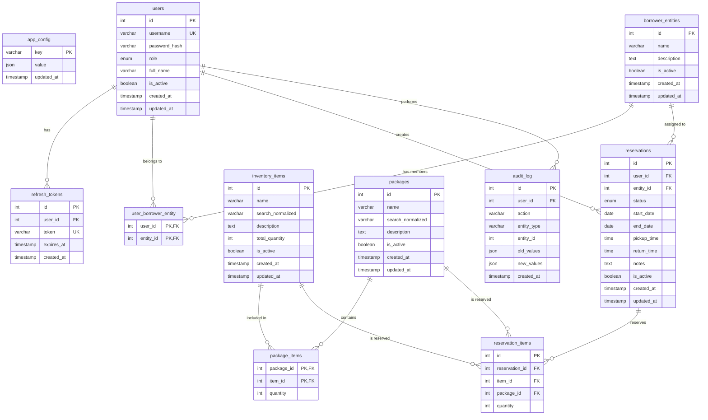
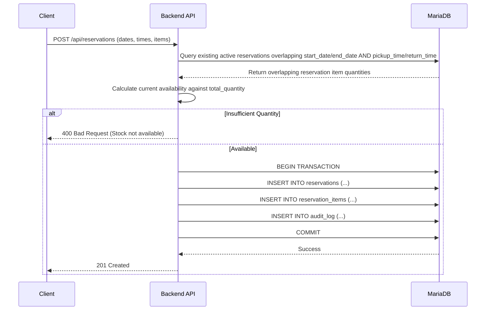
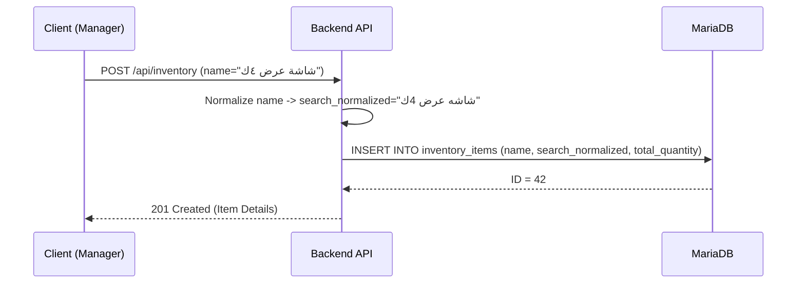

# Resource Manager - Database Schema & Architecture

## Overview
This document details the MariaDB database schema for the Resource Manager application. The database is accessed via raw SQL using the `mysql2` driver in Node.js. No query builders or ORMs (like Knex) are used. All database migrations are managed and executed as raw SQL scripts.

### Key Architectural Decisions
- **Driver:** `mysql2` (Raw SQL)
- **Database:** MariaDB
- **Collation & Character Set:** `utf8mb4` with `utf8mb4_unicode_ci` to support Arabic characters and multi-language data properly.
- **Arabic Search:** Dedicated `search_normalized` columns are used in `inventory_items` and `packages`. The backend application is responsible for stripping Arabic diacritics (tashkeel) and normalizing characters (e.g., converting 'أ', 'إ', 'آ' to 'ا', 'ة' to 'ه') during insert/update operations.
- **Time Windows:** Reservations include `pickup_time` and `return_time` (TIME data type) to support multiple bookings of the same resource on the same date at different times.
- **Soft Deletes:** Tables utilize an `is_active` boolean rather than deletion. 
- **Soft Deletes Cleanup:** A scheduled cron job permanently deletes records where `is_active = FALSE` and `updated_at < NOW() - INTERVAL 1 MONTH`.
- **Cascading Rules:** Foreign keys utilize `ON DELETE CASCADE` or `ON DELETE RESTRICT` where appropriate at the schema level. Some complex cascading rules are deferred to the backend API to maintain explicit control over the deletion flow and audit logging.

## Entity Relationship Diagram



## Schema Definitions (Raw SQL)

All tables use the `utf8mb4_unicode_ci` collation.

### 1. Application Configuration (`app_config`)
Stores global application settings.

```sql
CREATE TABLE app_config (
    `key` VARCHAR(100) NOT NULL,
    `value` JSON NOT NULL,
    `updated_at` TIMESTAMP DEFAULT CURRENT_TIMESTAMP ON UPDATE CURRENT_TIMESTAMP,
    PRIMARY KEY (`key`)
) ENGINE=InnoDB DEFAULT CHARSET=utf8mb4 COLLATE=utf8mb4_unicode_ci;
```

### 2. Users (`users`)
System users. Authentication is based on `username`.

```sql
CREATE TABLE users (
    `id` INT AUTO_INCREMENT PRIMARY KEY,
    `username` VARCHAR(255) NOT NULL,
    `password_hash` VARCHAR(255) NOT NULL,
    `role` ENUM('admin', 'manager', 'borrower') DEFAULT 'borrower',
    `full_name` VARCHAR(255) NOT NULL,
    `is_active` BOOLEAN DEFAULT TRUE,
    `created_at` TIMESTAMP DEFAULT CURRENT_TIMESTAMP,
    `updated_at` TIMESTAMP DEFAULT CURRENT_TIMESTAMP ON UPDATE CURRENT_TIMESTAMP,
    UNIQUE KEY `uk_username` (`username`)
) ENGINE=InnoDB DEFAULT CHARSET=utf8mb4 COLLATE=utf8mb4_unicode_ci;
```

### 3. Refresh Tokens (`refresh_tokens`)
Stores JWT refresh tokens for user sessions.

```sql
CREATE TABLE refresh_tokens (
    `id` INT AUTO_INCREMENT PRIMARY KEY,
    `user_id` INT NOT NULL,
    `token` VARCHAR(512) NOT NULL,
    `expires_at` TIMESTAMP NOT NULL,
    `created_at` TIMESTAMP DEFAULT CURRENT_TIMESTAMP,
    UNIQUE KEY `uk_token` (`token`),
    CONSTRAINT `fk_refresh_tokens_user` FOREIGN KEY (`user_id`) REFERENCES `users` (`id`) ON DELETE CASCADE
) ENGINE=InnoDB DEFAULT CHARSET=utf8mb4 COLLATE=utf8mb4_unicode_ci;
```

### 4. Borrower Entities (`borrower_entities`)
Organizations, departments, or groups that borrow items.

```sql
CREATE TABLE borrower_entities (
    `id` INT AUTO_INCREMENT PRIMARY KEY,
    `name` VARCHAR(255) NOT NULL,
    `description` TEXT,
    `is_active` BOOLEAN DEFAULT TRUE,
    `created_at` TIMESTAMP DEFAULT CURRENT_TIMESTAMP,
    `updated_at` TIMESTAMP DEFAULT CURRENT_TIMESTAMP ON UPDATE CURRENT_TIMESTAMP
) ENGINE=InnoDB DEFAULT CHARSET=utf8mb4 COLLATE=utf8mb4_unicode_ci;
```

### 5. User-Entity Mapping (`user_borrower_entity`)
Many-to-many relationship mapping users to their respective borrower entities.

```sql
CREATE TABLE user_borrower_entity (
    `user_id` INT NOT NULL,
    `entity_id` INT NOT NULL,
    PRIMARY KEY (`user_id`, `entity_id`),
    CONSTRAINT `fk_ube_user` FOREIGN KEY (`user_id`) REFERENCES `users` (`id`) ON DELETE CASCADE,
    CONSTRAINT `fk_ube_entity` FOREIGN KEY (`entity_id`) REFERENCES `borrower_entities` (`id`) ON DELETE CASCADE
) ENGINE=InnoDB DEFAULT CHARSET=utf8mb4 COLLATE=utf8mb4_unicode_ci;
```

### 6. Inventory Items (`inventory_items`)
Individual trackable resources. Includes `search_normalized` for optimized Arabic searching.

```sql
CREATE TABLE inventory_items (
    `id` INT AUTO_INCREMENT PRIMARY KEY,
    `name` VARCHAR(255) NOT NULL,
    `search_normalized` VARCHAR(255) NOT NULL,
    `description` TEXT,
    `total_quantity` INT NOT NULL DEFAULT 0,
    `is_active` BOOLEAN DEFAULT TRUE,
    `created_at` TIMESTAMP DEFAULT CURRENT_TIMESTAMP,
    `updated_at` TIMESTAMP DEFAULT CURRENT_TIMESTAMP ON UPDATE CURRENT_TIMESTAMP,
    FULLTEXT KEY `ft_idx_search_normalized` (`search_normalized`)
) ENGINE=InnoDB DEFAULT CHARSET=utf8mb4 COLLATE=utf8mb4_unicode_ci;
```

### 7. Packages (`packages`)
Logical groupings of items frequently borrowed together.

```sql
CREATE TABLE packages (
    `id` INT AUTO_INCREMENT PRIMARY KEY,
    `name` VARCHAR(255) NOT NULL,
    `search_normalized` VARCHAR(255) NOT NULL,
    `description` TEXT,
    `is_active` BOOLEAN DEFAULT TRUE,
    `created_at` TIMESTAMP DEFAULT CURRENT_TIMESTAMP,
    `updated_at` TIMESTAMP DEFAULT CURRENT_TIMESTAMP ON UPDATE CURRENT_TIMESTAMP,
    FULLTEXT KEY `ft_idx_search_normalized_pkg` (`search_normalized`)
) ENGINE=InnoDB DEFAULT CHARSET=utf8mb4 COLLATE=utf8mb4_unicode_ci;
```

### 8. Package Items (`package_items`)
Many-to-many relationship detailing the quantities of inventory items contained within a package.

```sql
CREATE TABLE package_items (
    `package_id` INT NOT NULL,
    `item_id` INT NOT NULL,
    `quantity` INT NOT NULL DEFAULT 1,
    PRIMARY KEY (`package_id`, `item_id`),
    CONSTRAINT `fk_pi_package` FOREIGN KEY (`package_id`) REFERENCES `packages` (`id`) ON DELETE CASCADE,
    CONSTRAINT `fk_pi_item` FOREIGN KEY (`item_id`) REFERENCES `inventory_items` (`id`) ON DELETE RESTRICT
) ENGINE=InnoDB DEFAULT CHARSET=utf8mb4 COLLATE=utf8mb4_unicode_ci;
```

### 9. Reservations (`reservations`)
The core booking record. Incorporates time windows (`pickup_time` and `return_time`) to allow multiple independent bookings of the same inventory item on the same day if the times don't overlap.

```sql
CREATE TABLE reservations (
    `id` INT AUTO_INCREMENT PRIMARY KEY,
    `user_id` INT NOT NULL,
    `entity_id` INT NOT NULL,
    `status` ENUM('draft', 'pending', 'approved', 'active', 'returned', 'cancelled') DEFAULT 'pending',
    `start_date` DATE NOT NULL,
    `end_date` DATE NOT NULL,
    `pickup_time` TIME NOT NULL,
    `return_time` TIME NOT NULL,
    `notes` TEXT,
    `is_active` BOOLEAN DEFAULT TRUE,
    `created_at` TIMESTAMP DEFAULT CURRENT_TIMESTAMP,
    `updated_at` TIMESTAMP DEFAULT CURRENT_TIMESTAMP ON UPDATE CURRENT_TIMESTAMP,
    CONSTRAINT `fk_res_user` FOREIGN KEY (`user_id`) REFERENCES `users` (`id`) ON DELETE RESTRICT,
    CONSTRAINT `fk_res_entity` FOREIGN KEY (`entity_id`) REFERENCES `borrower_entities` (`id`) ON DELETE RESTRICT
) ENGINE=InnoDB DEFAULT CHARSET=utf8mb4 COLLATE=utf8mb4_unicode_ci;
```

### 10. Reservation Items (`reservation_items`)
Line items for a reservation. Can reference either an individual `inventory_items` record or a `packages` record.

```sql
CREATE TABLE reservation_items (
    `id` INT AUTO_INCREMENT PRIMARY KEY,
    `reservation_id` INT NOT NULL,
    `item_id` INT NULL,
    `package_id` INT NULL,
    `quantity` INT NOT NULL,
    CONSTRAINT `fk_resi_reservation` FOREIGN KEY (`reservation_id`) REFERENCES `reservations` (`id`) ON DELETE CASCADE,
    CONSTRAINT `fk_resi_item` FOREIGN KEY (`item_id`) REFERENCES `inventory_items` (`id`) ON DELETE RESTRICT,
    CONSTRAINT `fk_resi_package` FOREIGN KEY (`package_id`) REFERENCES `packages` (`id`) ON DELETE RESTRICT,
    CONSTRAINT `chk_item_or_package` CHECK (
        (`item_id` IS NOT NULL AND `package_id` IS NULL) OR 
        (`item_id` IS NULL AND `package_id` IS NOT NULL)
    )
) ENGINE=InnoDB DEFAULT CHARSET=utf8mb4 COLLATE=utf8mb4_unicode_ci;
```

### 11. Audit Log (`audit_log`)
Immutable history of system changes.

```sql
CREATE TABLE audit_log (
    `id` INT AUTO_INCREMENT PRIMARY KEY,
    `user_id` INT NULL,
    `action` VARCHAR(50) NOT NULL,
    `entity_type` VARCHAR(50) NOT NULL,
    `entity_id` INT NOT NULL,
    `old_values` JSON NULL,
    `new_values` JSON NULL,
    `created_at` TIMESTAMP DEFAULT CURRENT_TIMESTAMP,
    CONSTRAINT `fk_audit_user` FOREIGN KEY (`user_id`) REFERENCES `users` (`id`) ON DELETE SET NULL
) ENGINE=InnoDB DEFAULT CHARSET=utf8mb4 COLLATE=utf8mb4_unicode_ci;
```


## Arabic Search Implementation & Normalization

To support accurate Arabic searching (ignoring tashkeel, standardizing Alef, Teh Marbuta, etc.), a dedicated `search_normalized` column is provided in both `inventory_items` and `packages`.

1. **Backend Responsibility:** The Node.js API must process the `name` before `INSERT` or `UPDATE` using an Arabic text normalization utility.
2. **Indexing:** A `FULLTEXT` index is applied to the `search_normalized` columns to allow highly efficient, index-backed searching (`MATCH (search_normalized) AGAINST (? IN BOOLEAN MODE)`).

## Soft Deletes & Cleanup Strategy

We implement soft deletes across entities to preserve relationships for historical reservations and audit logs.

### Strategy
1. **Application Logic:** DELETE endpoints perform `UPDATE table SET is_active = FALSE WHERE id = ?`.
2. **Filtering:** All active queries (e.g., listing items) must include `WHERE is_active = TRUE`.
3. **Hard Deletion (Cron Job):** To comply with data minimalism and keep table sizes manageable, a background cron job runs scheduled cleanups to permanently purge logically deleted records.

**Cleanup Query Example:**
```sql
DELETE FROM reservations WHERE is_active = FALSE AND updated_at < NOW() - INTERVAL 1 MONTH;
DELETE FROM inventory_items WHERE is_active = FALSE AND updated_at < NOW() - INTERVAL 1 MONTH;
-- And corresponding logic for packages, entities, etc.
```

*Note: Due to the foreign key constraints (`ON DELETE RESTRICT`), you cannot hard-delete an inventory item if it still has associated historical reservations. The backend cleanup job must execute deletions in the correct dependency order or explicitly handle historical archiving first.*

## Indexing Strategy

Beyond primary and foreign keys, the following indexes optimize query performance:

- **`users.username`**: Unique index for fast authentication lookups.
- **`inventory_items.search_normalized`**: FULLTEXT index for high-performance Arabic searching.
- **`packages.search_normalized`**: FULLTEXT index for high-performance Arabic searching.
- **`reservations(start_date, end_date)`**: Compound index to rapidly find reservations within a date range to check availability.
- **`reservations(pickup_time, return_time)`**: Used in conjunction with dates to calculate exact overlaps for the time window features.

## Workflows and Sequence Diagrams

### 1. Reservation Creation with Time Windows
The implementation of `pickup_time` and `return_time` means availability checks must consider temporal overlaps on the same day.



### 2. Item Insertion with Arabic Normalization



## Database Reset Mechanism

For development and test environments, resetting the database is done by executing a raw SQL script that explicitly drops tables in reverse dependency order and recreates them.

```sql
-- Reset Script Example (reset.sql)
SET FOREIGN_KEY_CHECKS = 0;

DROP TABLE IF EXISTS audit_log;
DROP TABLE IF EXISTS reservation_items;
DROP TABLE IF EXISTS reservations;
DROP TABLE IF EXISTS package_items;
DROP TABLE IF EXISTS packages;
DROP TABLE IF EXISTS inventory_items;
DROP TABLE IF EXISTS user_borrower_entity;
DROP TABLE IF EXISTS borrower_entities;
DROP TABLE IF EXISTS refresh_tokens;
DROP TABLE IF EXISTS users;
DROP TABLE IF EXISTS app_config;

SET FOREIGN_KEY_CHECKS = 1;

-- Proceed to run all CREATE TABLE statements...
```

*Note: Migrations in production should use sequential raw SQL scripts (e.g., `001_initial.sql`, `002_add_index.sql`) applied sequentially via a migration runner.*
