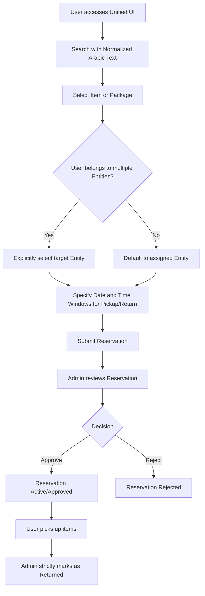
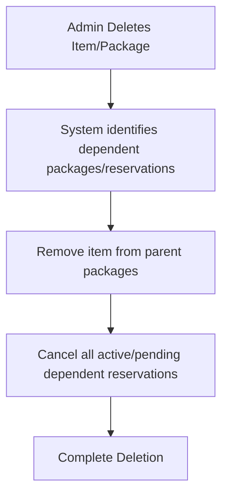
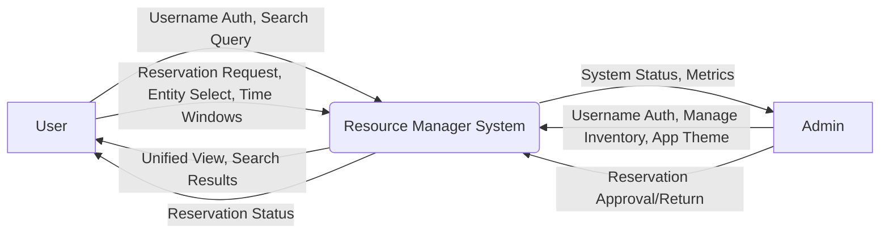
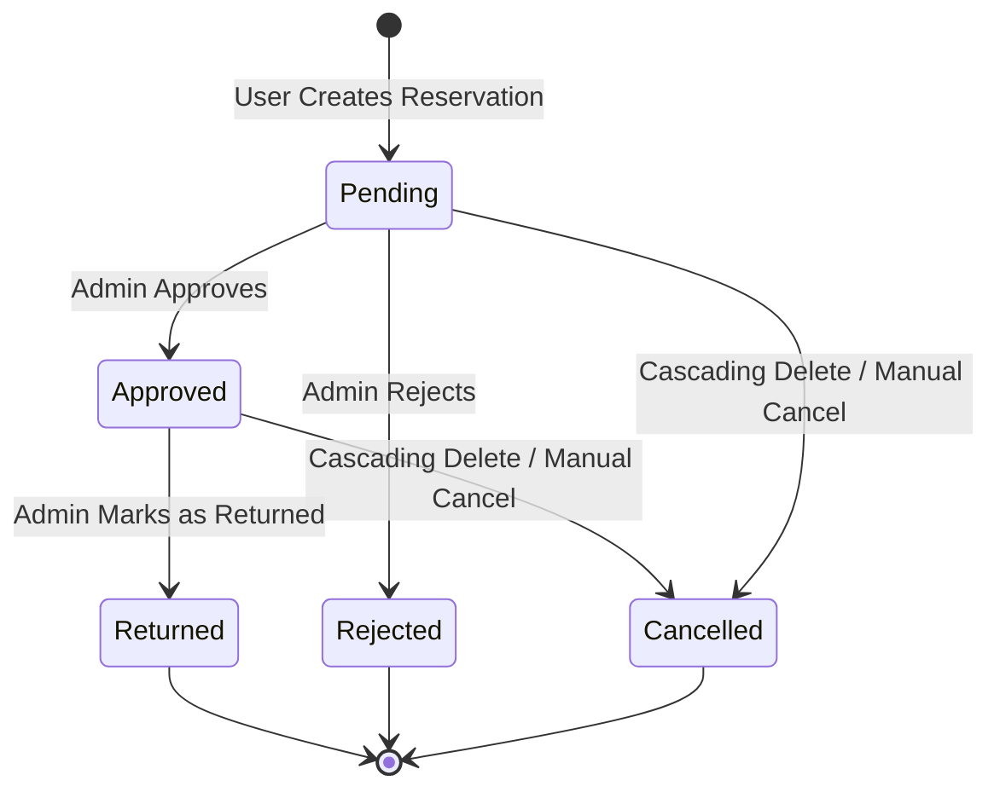

# System Analysis & Design

## 1. Problem Statement
The Resource Manager application aims to provide a centralized platform for managing physical inventory items and packages, and handling reservations. Organizations need a system to track inventory, group items into logical packages, manage reservations with specific time windows, and track the status of physical assets across multiple internal entities. The solution must provide a unified view for items and packages, handle concurrent access, and support normalized Arabic text search. The platform serves administrators managing the inventory/reservations and standard users making reservations on behalf of their assigned entities.

The application targets Android (via React Native) as a native app, and Desktop/iOS via Web.

## 2. Functional & Non-Functional Requirements

### 2.1 Functional Requirements
- **Authentication & Authorization:** Users must authenticate using a **username** and password. The system supports Admin and User roles.
- **Inventory & Packages Management:**
  - Admins can create, read, update, and delete individual items and grouped packages.
  - **Cascading Deletions:** Deleting an item or package automatically cancels dependent pending/approved reservations and removes deleted items from any associated packages.
  - A single unified UI tab displays both inventory items and packages with visual hints distinguishing them.
- **Search:** The system must support robust search functionality, specifically **normalized Arabic text search**, allowing users to find items without strict reliance on diacritics or specific letter forms.
- **Reservation Management:**
  - Users can create reservations for items or packages.
  - **Entity Selection:** Users belonging to multiple entities must explicitly select the target entity when making a reservation. The default is any assigned entity if only one is available.
  - **Time Windows:** Reservation flows must support same-day pickup and returns, requiring specific time windows (e.g., 09:00 AM to 11:00 AM) alongside the date.
  - Admins approve or reject reservations.
  - **Return Endpoint:** Marking a reservation as "Returned" is **strictly an admin feature**.
- **Admin Configuration:**
  - **Global Theme:** The app theme (colors, branding) is strictly global/app-level, controlled by admins, with **no user-level overrides**.

### 2.2 Non-Functional Requirements
- **Platform:** Android Native App (built with React Native), Desktop/iOS access via Web.
- **Performance:** System must handle concurrent reservation requests efficiently.
- **Usability:** The interface must be intuitive, featuring a unified inventory/packages list with clear visual distinctions to prevent clutter.
- **Data Integrity:** Strict enforcement of cascading deletes to prevent orphaned reservation records or packages containing non-existent items.

## 3. Use Case Diagrams

```mermaid
usecaseDiagram
    actor Admin
    actor User

    User --> (Login with Username)
    Admin --> (Login with Username)

    User --> (Browse Unified Inventory & Packages Tab)
    User --> (Search Items/Packages with Normalized Arabic)
    User --> (Create Reservation with Time Windows)
    User --> (Select Entity for Reservation)
    
    Admin --> (Browse Unified Inventory & Packages Tab)
    Admin --> (Manage Items & Packages)
    Admin --> (Approve/Reject Reservations)
    Admin --> (Mark Reservation as Returned)
    Admin --> (Set Global App Theme)
```

## 4. Activity/Flow Diagrams

### 4.1 Reservation Flow



### 4.2 Cascading Deletion Flow



## 5. Data Flow Diagrams (Context Level)



## 6. State Diagrams

### 6.1 Reservation State



## 7. Glossary
- **Username:** The unique identifier used for authentication (replacing email).
- **Entity:** A department or group that a user represents when requesting resources.
- **Package:** A logical grouping of inventory items treated as a single requestable unit.
- **Unified UI Tab:** A single interface view displaying both individual items and packages, distinguished by visual hints.
- **Normalized Arabic Search:** Search functionality that equates varying forms of Arabic characters (e.g., Alif with/without Hamza) to improve match accuracy.
- **Cascading Deletion:** An automated process where deleting a parent or dependent item forces the cancellation or removal of associated data (e.g., reservations, package contents).
- **Time Window:** Specific time periods designated for pickup and return, crucial for same-day operations.
- **Global Theme:** Application-wide styling controlled exclusively by administrators.
