# System Analysis & Design Document

**Project:** Resource Manager
**Version:** 1.0
**Date:** 2026-05-29
**Status:** Planning Phase

---

## Table of Contents

1. [Problem Statement & Business Analysis](#1-problem-statement--business-analysis)
2. [Functional Requirements](#2-functional-requirements)
3. [Non-Functional Requirements](#3-non-functional-requirements)
4. [Use Case Diagrams](#4-use-case-diagrams)
5. [Activity & Flow Diagrams](#5-activity--flow-diagrams)
6. [Data Flow Diagrams](#6-data-flow-diagrams)
7. [State Diagrams](#7-state-diagrams)
8. [Glossary](#8-glossary)

---

## 1. Problem Statement & Business Analysis

### 1.1 Executive Summary

The Resource Manager application is a full-stack system designed to manage the lifecycle of physical resources (equipment, tools, supplies, etc.) that are lent out by an organization to borrower entities and returned after use. The system replaces informal, error-prone tracking methods with a structured digital workflow covering inventory management, reservation tracking, borrower accountability, and automatic reset cycles.

The application is built with a **Node.js/Express** backend, a **MariaDB** relational database, and a **React Native (Expo)** frontend with web support. It is deployed privately and is **not distributed through public app stores**.

### 1.2 Business Problems Addressed

The system targets five core business problems that organizations face when managing shared physical resources:

#### Problem 1: Lack of Inventory Visibility

| Aspect | Detail |
|---|---|
| **Current State** | Organizations maintain inventories using spreadsheets, paper logs, or tribal knowledge. There is no single source of truth for what items exist, how many are available, or what condition they are in. |
| **Consequence** | Staff cannot answer basic questions: "Do we have projectors available this week?" or "How many safety vests are left?" Without visibility, items are over-promised, under-utilized, or lost entirely. |
| **How the App Solves It** | The app provides a centralized, real-time inventory with item names, quantities (finite or unspecified), images, notes, and status flags. Admins maintain the catalog; all users browse the same authoritative list. Availability is calculated automatically as `total quantity − active reservations`. |

#### Problem 2: Untracked Borrowing and Returns

| Aspect | Detail |
|---|---|
| **Current State** | Borrowing is informal — someone takes an item, maybe tells someone, maybe writes it down. Returns are equally ad hoc. There is no reliable record of who has what. |
| **Consequence** | Items go missing. Disputes arise ("I returned that last week"). Admins spend significant time manually chasing down unreturned items. There is no audit trail. |
| **How the App Solves It** | Every borrowing action creates a **reservation record** tied to a specific borrower entity, with timestamps, item quantities, and status tracking. Returns are explicitly recorded. The full lifecycle — reserved → active/borrowed → returned — is tracked with audit logging. |

#### Problem 3: No Accountability Structure for Borrowers

| Aspect | Detail |
|---|---|
| **Current State** | Individual people borrow items, but accountability often belongs to a group (a department, a team, an external organization). There is no formal structure linking individuals to their responsible group. |
| **Consequence** | When items are damaged or not returned, it is unclear who is accountable. Individual users may leave, but their group's obligations persist. Communication about outstanding items has no clear recipient. |
| **How the App Solves It** | The app introduces the concept of **borrower entities** — named groups to which individual users are assigned. Reservations are made against the borrower entity, not the individual. Admins manage entity membership. This creates a clear chain of accountability: User → Borrower Entity → Reservation → Items. |

#### Problem 4: Difficulty Coordinating Bundled Resources

| Aspect | Detail |
|---|---|
| **Current State** | Organizations often lend items in logical groups (e.g., "AV Kit" = projector + cables + remote + screen). These bundles are managed mentally by staff, with no formal definition. Borrowers must request each item individually or rely on staff memory. |
| **Consequence** | Incomplete bundles are lent out. Borrowers forget to request required accessories. Staff must repeatedly explain what goes together. Returns are partial because the bundle composition was never formalized. |
| **How the App Solves It** | **Packages** formalize item bundles. Admins define packages as named groups of items with specific quantities. When a user reserves a package, the system transparently expands it into its constituent items for reservation tracking. Users can optionally **exclude items** they don't need from a package before confirming. Packages and individual items are presented uniformly in the browsing interface. |

#### Problem 5: Manual and Inconsistent Reset Cycles

| Aspect | Detail |
|---|---|
| **Current State** | Many organizations operate on weekly cycles (e.g., equipment is lent Monday–Friday and expected back by end of week). Resetting the system for a new cycle — clearing returned items, flagging overdue items — is done manually or not at all. |
| **Consequence** | Stale data accumulates. Last week's returned items still appear as active. Admins must manually clean up the system at the start of each cycle, which is tedious and error-prone. |
| **How the App Solves It** | The app supports **automatic reservation resets** triggered at the end of a configurable day each week (e.g., every Friday at 23:59). The reset policy is set in app configuration and can also be disabled ("never"). This ensures the system starts each cycle clean without manual intervention. |

### 1.3 Stakeholder Analysis

The system serves two primary stakeholder groups, each with distinct needs, permissions, and interaction patterns.

#### Admins (Workers / Staff)

| Attribute | Detail |
|---|---|
| **Role Description** | Staff members responsible for managing the physical inventory, overseeing reservations, and administering the system. They are the operational backbone. |
| **Primary Goals** | Maintain accurate inventory records. Track who has borrowed what. Ensure items are returned on time and in good condition. Minimize time spent on administrative tracking. |
| **Key Activities** | Create, edit, and retire inventory items. Define packages. Create reservations on behalf of borrowers. Process returns. Manage borrower entities and user accounts. Configure app settings. Monitor the dashboard for actionable insights. |
| **Pain Points Addressed** | Eliminates manual spreadsheet tracking. Provides a dashboard for at-a-glance status. Automates weekly reset cycles. Centralizes all management in one interface. |
| **Access Level** | Full system access — all CRUD operations on all entities, configuration management, user management, and dashboard analytics. |
| **Interaction Frequency** | Daily — admins interact with the system throughout the workday to process reservations, manage inventory, and handle returns. |

#### Normal Users (Borrowers)

| Attribute | Detail |
|---|---|
| **Role Description** | Individuals who belong to a borrower entity and need to reserve, borrow, and return physical resources. They may be employees, members, or external partners. |
| **Primary Goals** | Quickly find available items. Reserve what they need with minimal friction. Track what their entity currently has borrowed. Mark items as returned when done. |
| **Key Activities** | Browse the inventory catalog. Reserve individual items or packages (with optional exclusions). View active reservations for their borrower entity. Mark items as returned. View reservation history. |
| **Pain Points Addressed** | Eliminates guesswork about availability. Provides self-service reservation instead of emailing/calling staff. Gives visibility into their entity's borrowing history. |
| **Access Level** | Read-only access to inventory. Create/view reservations scoped to their own borrower entity. Mark their entity's items as returned. No access to other entities' data, user management, or system configuration. |
| **Interaction Frequency** | Periodic — users interact when they need to borrow or return items, typically a few times per week. |

### 1.4 Pain Point Summary Matrix

| # | Pain Point | Affected Stakeholders | Solution Feature | Priority |
|---|---|---|---|---|
| 1 | No single source of truth for inventory | Admins, Users | Centralized inventory with real-time availability | Critical |
| 2 | Borrowing/returns not tracked | Admins | Reservation lifecycle tracking with audit log | Critical |
| 3 | No accountability for borrowed items | Admins | Borrower entity model with user assignment | High |
| 4 | Bundled items managed informally | Admins, Users | Package definitions with transparent expansion | High |
| 5 | Manual weekly resets | Admins | Configurable automatic reset scheduler | Medium |
| 6 | No mobile access to inventory | Users | React Native mobile app with web fallback | Medium |
| 7 | No historical record of borrowing | Admins, Users | Reservation history with filters | Medium |
| 8 | Items degrade without tracking | Admins | Item status flags and maintenance dashboard | Medium |

---

## 2. Functional Requirements

### 2.1 Admin Features

#### 2.1.1 Inventory Management (CRUD)

| ID | Requirement | Description |
|---|---|---|
| **ADM-INV-001** | Create inventory item | Admin can create a new inventory item with the following fields: **name** (required, string), **quantity** (required — either a finite positive integer or "unspecified" indicating unlimited/uncounted supply), **image** (optional, uploaded file or URL), **notes** (optional, freeform text for special instructions, condition notes, or storage location), **status** (required, enum: `available`, `maintenance`, `retired`). |
| **ADM-INV-002** | Edit inventory item | Admin can modify any field of an existing inventory item. Changes take effect immediately. Reducing quantity below current active reservations must produce a warning but should not be blocked (to handle real-world breakage/loss). |
| **ADM-INV-003** | Delete inventory item | Admin can delete an inventory item. Items with active reservations must display a confirmation warning. Deletion should be a soft-delete (mark as `retired`) to preserve referential integrity with historical reservations. |
| **ADM-INV-004** | View inventory list | Admin can view all inventory items in a list/grid with: name, image thumbnail, total quantity, available quantity (calculated), status badge. The list supports sorting by name and filtering by status. |
| **ADM-INV-005** | Upload item image | Admin can upload an image (JPEG, PNG, WebP; max 5 MB) for an inventory item. The system stores the image and generates a thumbnail for list views. |
| **ADM-INV-006** | Item availability calculation | For items with finite quantity: `available = quantity − SUM(active reservation quantities for this item)`. For items with unspecified quantity: always shown as "Available" (no numeric calculation). |

#### 2.1.2 Package Management (CRUD)

| ID | Requirement | Description |
|---|---|---|
| **ADM-PKG-001** | Create package | Admin can create a package with: **name** (required), **description** (optional), **image** (optional), **constituent items** (required — a list of inventory items, each with a quantity to include in the package). At least one item must be included. |
| **ADM-PKG-002** | Edit package | Admin can modify package name, description, image, and its item composition (add/remove items, change per-item quantities). Changes affect future reservations only; existing reservations retain their original composition. |
| **ADM-PKG-003** | Delete package | Admin can delete a package. This does not affect the underlying inventory items. Active reservations that originated from this package remain valid (they reference the items directly). Soft-delete is preferred. |
| **ADM-PKG-004** | View package list | Admin can view all packages showing: name, image, description, number of constituent items, and an expandable detail view showing the item breakdown. |
| **ADM-PKG-005** | Transparent reservation expansion | When a package is reserved, the system creates individual reservation line items for each constituent item in the package. The reservation record references the source package for traceability, but availability is tracked at the individual item level. |

#### 2.1.3 Reservation Management

| ID | Requirement | Description |
|---|---|---|
| **ADM-RES-001** | Create reservation | Admin can create a reservation specifying: **borrower entity** (required, selected from existing entities), **items** (one or more inventory items with quantities), **notes** (optional). The system validates availability before confirming. |
| **ADM-RES-002** | Edit reservation | Admin can modify an existing reservation: change item quantities, add/remove items, update notes. The system re-validates availability for any increases. |
| **ADM-RES-003** | Delete reservation | Admin can cancel/delete a reservation. This immediately releases the reserved quantities back to availability. A confirmation dialog is required. |
| **ADM-RES-004** | View all reservations | Admin can view all reservations across all borrower entities in a unified list. Each entry shows: borrower entity name, items with quantities, reservation date, status, and any notes. |
| **ADM-RES-005** | Filter reservations | Admin can filter the reservation list by: **status** (active, returned, cancelled, overdue), **borrower entity**, **date range**, and **specific item**. Filters can be combined. |
| **ADM-RES-006** | Process return | Admin can mark individual items or an entire reservation as returned. Partial returns are supported (e.g., 3 of 5 items returned). Returned quantities are immediately reflected in availability. |

#### 2.1.4 Borrower Entity Management

| ID | Requirement | Description |
|---|---|---|
| **ADM-ENT-001** | Create borrower entity | Admin can create a borrower entity with: **name** (required, unique). |
| **ADM-ENT-002** | Edit borrower entity | Admin can rename a borrower entity. |
| **ADM-ENT-003** | Delete borrower entity | Admin can delete a borrower entity only if it has no active reservations. Entities with historical reservations are soft-deleted. |
| **ADM-ENT-004** | View borrower entities | Admin can view a list of all borrower entities showing: name, number of assigned users, and count of active reservations. |

#### 2.1.5 User Management

| ID | Requirement | Description |
|---|---|---|
| **ADM-USR-001** | Create user account | Admin can create a user account with: **username** (required, unique), **password** (required, hashed), **role** (required: `admin` or `normal`), **borrower entity assignment** (optional for admin, required for normal users). |
| **ADM-USR-002** | Edit user account | Admin can modify user details: username, password (reset), role, and borrower entity assignment. |
| **ADM-USR-003** | Delete user account | Admin can deactivate or delete a user account. Deactivation is preferred to preserve audit trail integrity. |
| **ADM-USR-004** | Assign user to borrower entity | Admin can assign a normal user to a borrower entity. A user belongs to exactly one borrower entity at a time. Changing assignment is allowed. |
| **ADM-USR-005** | Unassign user from borrower entity | Admin can remove a user's borrower entity assignment. A normal user without an assignment cannot create reservations. |
| **ADM-USR-006** | View user list | Admin can view all user accounts showing: username, role, assigned borrower entity (if any), and account status (active/inactive). |

#### 2.1.6 App Configuration

| ID | Requirement | Description |
|---|---|---|
| **ADM-CFG-001** | Set app name | Admin can configure the application display name, which appears in the header/title bar across all screens. |
| **ADM-CFG-002** | Set theme | Admin can configure a light/dark theme preference that applies application-wide. |
| **ADM-CFG-003** | Configure reset trigger | Admin can configure the automatic reservation reset schedule. Options: **Weekly** (select the day of week; reset triggers at end of that day, e.g., Friday 23:59) or **Never** (no automatic reset). |
| **ADM-CFG-004** | Manual reset trigger | Admin can manually trigger a reservation reset at any time, independent of the schedule. A confirmation dialog explains the consequences. |

#### 2.1.7 Dashboard

| ID | Requirement | Description |
|---|---|---|
| **ADM-DSH-001** | Inventory overview | Dashboard displays summary statistics: total number of unique items, total items currently available, total items currently reserved, total items in maintenance. |
| **ADM-DSH-002** | Active reservations summary | Dashboard shows a list/count of currently active reservations, optionally grouped by borrower entity. Quick-access links to view or process each. |
| **ADM-DSH-003** | Maintenance alerts | Dashboard highlights inventory items with status `maintenance`, showing item name, how long it has been in maintenance, and any admin notes. |
| **ADM-DSH-004** | Low-stock warnings | Dashboard flags items where available quantity is at or below a configurable threshold (e.g., ≤ 1 remaining). |

### 2.2 Normal User Features

#### 2.2.1 Inventory Browsing

| ID | Requirement | Description |
|---|---|---|
| **USR-BRW-001** | Browse inventory | Normal users can view all available inventory items and packages in a unified catalog view. Items and packages are visually distinguished (e.g., a badge or icon) but presented in the same list. |
| **USR-BRW-002** | View item details | Users can view full details of an item: name, image, description/notes, total quantity, available quantity, and status. |
| **USR-BRW-003** | View package details | Users can view full details of a package: name, image, description, and a list of all constituent items with their quantities. Availability is shown per-item within the package. |
| **USR-BRW-004** | Search and filter | Users can search the catalog by item/package name. Users can filter by availability status (available/unavailable). |

#### 2.2.2 Reservation Creation

| ID | Requirement | Description |
|---|---|---|
| **USR-RSV-001** | Reserve individual item | Users can reserve one or more individual items by selecting the item and specifying a quantity (up to available). The reservation is automatically associated with the user's borrower entity. |
| **USR-RSV-002** | Reserve package | Users can reserve a package. The system shows the package contents and allows the user to **exclude specific items** they do not need before confirming. Excluded items are not reserved and their availability is not affected. |
| **USR-RSV-003** | Reservation confirmation | Before finalizing, the system shows a summary of all items being reserved (with quantities), the borrower entity it will be charged to, and any items excluded from packages. The user must explicitly confirm. |
| **USR-RSV-004** | Availability validation | The system validates that all requested quantities are available at the time of confirmation. If availability has changed since browsing (race condition), the user is notified and asked to adjust. |

#### 2.2.3 Reservation Viewing

| ID | Requirement | Description |
|---|---|---|
| **USR-VW-001** | View active reservations | Users can view all currently active reservations belonging to their borrower entity. Each reservation shows: items with quantities, date reserved, status, and any notes. |
| **USR-VW-002** | View reservation history | Users can view past (returned/cancelled/reset) reservations for their borrower entity, providing a complete historical record. |

#### 2.2.4 Return Items

| ID | Requirement | Description |
|---|---|---|
| **USR-RET-001** | Mark items as returned | Users can mark items from their borrower entity's active reservations as returned. Partial returns are supported. |
| **USR-RET-002** | Return confirmation | The system confirms the return action and updates availability immediately. |

### 2.3 System Features

#### 2.3.1 Authentication & Authorization

| ID | Requirement | Description |
|---|---|---|
| **SYS-AUTH-001** | User login | Users authenticate with username and password. The system returns a JWT access token and a refresh token. |
| **SYS-AUTH-002** | JWT access token | Short-lived token (e.g., 15 minutes) included in the `Authorization` header of all API requests. Contains user ID, role, and borrower entity ID. |
| **SYS-AUTH-003** | Refresh token | Long-lived token (e.g., 7 days) used to obtain a new access token without re-entering credentials. Stored securely (HTTP-only cookie or secure storage). Revocable by admin. |
| **SYS-AUTH-004** | Role-based access control | Every API endpoint enforces role checks. Admin endpoints reject normal users with 403 Forbidden. Normal user endpoints scope data to the user's borrower entity. |
| **SYS-AUTH-005** | Logout | Logout invalidates the refresh token server-side and clears local storage/cookies. |

#### 2.3.2 Automatic Reservation Reset

| ID | Requirement | Description |
|---|---|---|
| **SYS-RST-001** | Scheduled reset | If configured, the system automatically runs a reset process at the end of the configured day each week (e.g., Friday 23:59 server time). |
| **SYS-RST-002** | Reset behavior | The reset transitions all `active` reservations to `reset` status. This releases all reserved quantities back to availability. Items are considered returned by policy, not by physical return. |
| **SYS-RST-003** | Reset logging | Each reset event is logged with: timestamp, number of reservations affected, and the items/quantities released. |
| **SYS-RST-004** | Reset configuration | Reset can be set to a specific day of the week or disabled entirely ("never"). Configuration changes take effect at the next scheduled trigger. |

#### 2.3.3 Real-Time Availability Tracking

| ID | Requirement | Description |
|---|---|---|
| **SYS-AVL-001** | Dynamic availability | Item availability is computed dynamically: `available = total_quantity − SUM(quantity in active reservations)`. This is not a stored field but calculated on read. |
| **SYS-AVL-002** | Concurrency handling | When multiple users attempt to reserve the same item simultaneously, the system uses database-level transactions to prevent overbooking. The first confirmed reservation wins; subsequent attempts receive an availability error. |

#### 2.3.4 Audit Logging

| ID | Requirement | Description |
|---|---|---|
| **SYS-AUD-001** | Action logging | The system logs all state-changing operations: item create/edit/delete, reservation create/edit/delete/return/reset, user create/edit/delete, entity create/edit/delete, and configuration changes. |
| **SYS-AUD-002** | Log entry structure | Each log entry contains: **timestamp**, **user ID** (who performed the action), **action type** (enum), **target entity type and ID**, **before state** (for edits), **after state** (for edits), and **metadata** (IP address, etc.). |
| **SYS-AUD-003** | Log retention | Audit logs are retained indefinitely. They are append-only and cannot be modified or deleted through the application interface. |

---

## 3. Non-Functional Requirements

### 3.1 Performance

| ID | Requirement | Target |
|---|---|---|
| **NFR-PERF-001** | API response time | 95th percentile ≤ 300ms for read operations, ≤ 500ms for write operations under normal load. |
| **NFR-PERF-002** | Page load time | Initial app load ≤ 3 seconds on 4G mobile connection. Subsequent navigation ≤ 1 second. |
| **NFR-PERF-003** | Concurrent users | System supports at least 50 concurrent users without degradation. |
| **NFR-PERF-004** | Database query optimization | All list endpoints support pagination (default 20 items/page). Complex queries use indexed columns. |
| **NFR-PERF-005** | Image optimization | Uploaded images are compressed and thumbnails are generated server-side to minimize transfer size. |

### 3.2 Security

| ID | Requirement | Detail |
|---|---|---|
| **NFR-SEC-001** | Password storage | Passwords are hashed using bcrypt with a cost factor ≥ 12. Plaintext passwords are never stored or logged. |
| **NFR-SEC-002** | Transport security | All communication uses HTTPS/TLS in production. HTTP is acceptable only in local development. |
| **NFR-SEC-003** | Input validation | All user inputs are validated on both client and server. SQL queries use parameterized statements exclusively — no string concatenation. |
| **NFR-SEC-004** | CORS policy | CORS is configured to allow only known frontend origins. Wildcard origins are prohibited in production. |
| **NFR-SEC-005** | Rate limiting | Authentication endpoints are rate-limited (e.g., 10 attempts per minute per IP) to mitigate brute-force attacks. |
| **NFR-SEC-006** | Token security | JWT tokens use strong signing keys (HS256 minimum, RS256 preferred). Refresh tokens are stored server-side with revocation capability. |
| **NFR-SEC-007** | File upload security | Uploaded files are validated for MIME type, file extension, and file size. Files are stored outside the web root. Filenames are sanitized/randomized. |

### 3.3 Scalability

| ID | Requirement | Detail |
|---|---|---|
| **NFR-SCL-001** | Horizontal scalability | The application is designed as a stateless API server. Multiple instances can run behind a load balancer. Session state (refresh tokens) is stored in the database, not in-memory. |
| **NFR-SCL-002** | Database scalability | MariaDB supports read replicas if read load increases. Schema is normalized to 3NF to minimize storage overhead. |
| **NFR-SCL-003** | Inventory scale | The system is designed to handle up to 10,000 unique inventory items and 100,000 historical reservations without architectural changes. |

### 3.4 Usability

| ID | Requirement | Detail |
|---|---|---|
| **NFR-USB-001** | Mobile-first design | All interfaces are designed mobile-first, then adapted for larger screens. Touch targets ≥ 44×44 px. |
| **NFR-USB-002** | Responsive layout | The app renders correctly on screens from 320px (small phones) to 1920px+ (desktop). Layout adapts using responsive breakpoints. |
| **NFR-USB-003** | Intuitive navigation | Key actions (browse, reserve, view reservations, return) are accessible within 2 taps from the home screen. |
| **NFR-USB-004** | Feedback and confirmation | All destructive actions require confirmation. All state changes provide visible feedback (success/error toasts). Loading states are shown for async operations. |
| **NFR-USB-005** | Error messaging | Error messages are user-friendly and actionable. Technical details are logged server-side, not shown to users. |

### 3.5 Accessibility

| ID | Requirement | Detail |
|---|---|---|
| **NFR-ACC-001** | Semantic markup | UI components use proper semantic roles and labels for screen reader compatibility. |
| **NFR-ACC-002** | Color contrast | Text and interactive elements meet WCAG 2.1 AA contrast ratios (4.5:1 for normal text, 3:1 for large text). |
| **NFR-ACC-003** | Keyboard navigation | All interactive elements are reachable and operable via keyboard (web platform). Focus indicators are visible. |
| **NFR-ACC-004** | Text scaling | The interface remains functional when system font size is increased up to 200%. |

### 3.6 Offline Considerations

| ID | Requirement | Detail |
|---|---|---|
| **NFR-OFF-001** | Graceful degradation | When offline, the app displays a clear "No connection" indicator. Cached data (last-fetched inventory) may be displayed as read-only with a stale-data warning. |
| **NFR-OFF-002** | No offline writes | Reservation creation, returns, and all write operations require an active network connection. Offline queuing is out of scope for v1. |
| **NFR-OFF-003** | Reconnection handling | Upon reconnection, the app automatically refreshes stale data. No manual refresh should be required. |

---

## 4. Use Case Diagrams

### 4.1 Admin Use Cases

```mermaid
graph TB
    Admin(("👤 Admin"))

    subgraph Inventory Management
        UC1["Create Inventory Item"]
        UC2["Edit Inventory Item"]
        UC3["Delete Inventory Item"]
        UC4["View Inventory List"]
        UC5["Upload Item Image"]
    end

    subgraph Package Management
        UC6["Create Package"]
        UC7["Edit Package"]
        UC8["Delete Package"]
        UC9["View Package List"]
    end

    subgraph Reservation Management
        UC10["Create Reservation"]
        UC11["Edit Reservation"]
        UC12["Delete Reservation"]
        UC13["View All Reservations"]
        UC14["Filter Reservations"]
        UC15["Process Return"]
    end

    subgraph Borrower Entity Management
        UC16["Create Borrower Entity"]
        UC17["Edit Borrower Entity"]
        UC18["Delete Borrower Entity"]
        UC19["View Borrower Entities"]
    end

    subgraph User Management
        UC20["Create User Account"]
        UC21["Edit User Account"]
        UC22["Delete User Account"]
        UC23["Assign User to Entity"]
        UC24["Unassign User from Entity"]
        UC25["View User List"]
    end

    subgraph App Configuration
        UC26["Set App Name"]
        UC27["Set Theme"]
        UC28["Configure Reset Trigger"]
        UC29["Manual Reset Trigger"]
    end

    subgraph Dashboard
        UC30["View Inventory Overview"]
        UC31["View Active Reservations"]
        UC32["View Maintenance Alerts"]
        UC33["View Low-Stock Warnings"]
    end

    Admin --> UC1 & UC2 & UC3 & UC4 & UC5
    Admin --> UC6 & UC7 & UC8 & UC9
    Admin --> UC10 & UC11 & UC12 & UC13 & UC14 & UC15
    Admin --> UC16 & UC17 & UC18 & UC19
    Admin --> UC20 & UC21 & UC22 & UC23 & UC24 & UC25
    Admin --> UC26 & UC27 & UC28 & UC29
    Admin --> UC30 & UC31 & UC32 & UC33
```

### 4.2 Normal User Use Cases

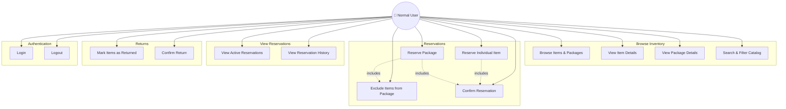

### 4.3 System Actor Use Cases

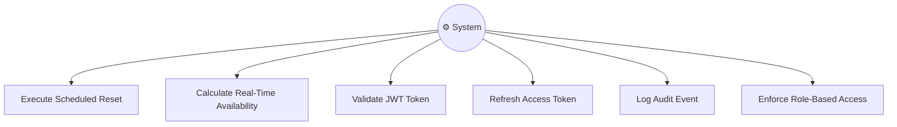

---

## 5. Activity & Flow Diagrams

### 5.1 Reservation Flow — Individual Item

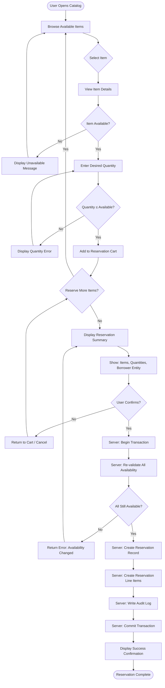

### 5.2 Reservation Flow — Package with Exclusions

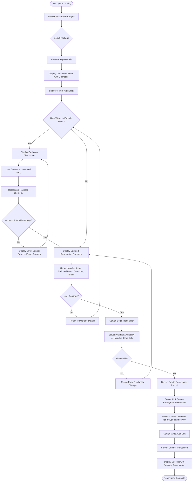

### 5.3 Return Flow

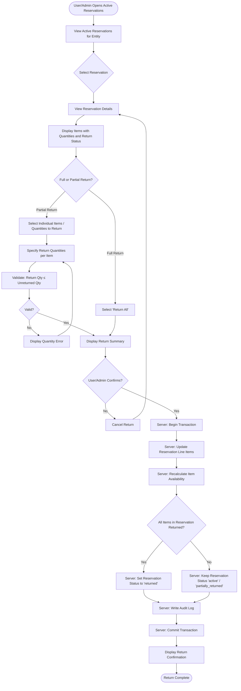

### 5.4 Automatic Reset Flow

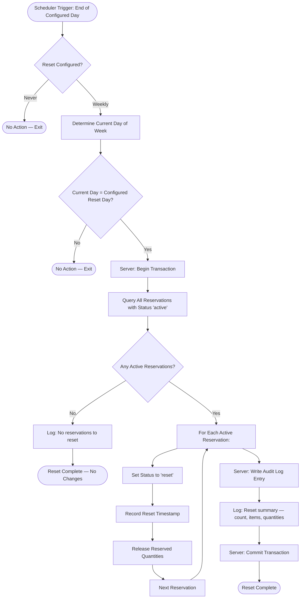

### 5.5 User Authentication Flow

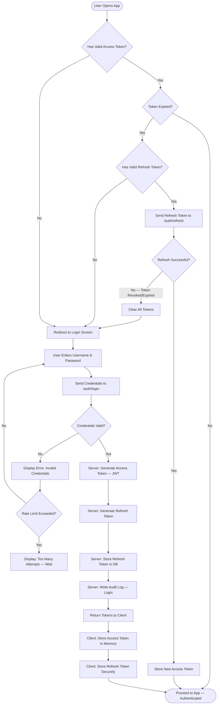

---

## 6. Data Flow Diagrams

### 6.1 Level 0 — Context Diagram

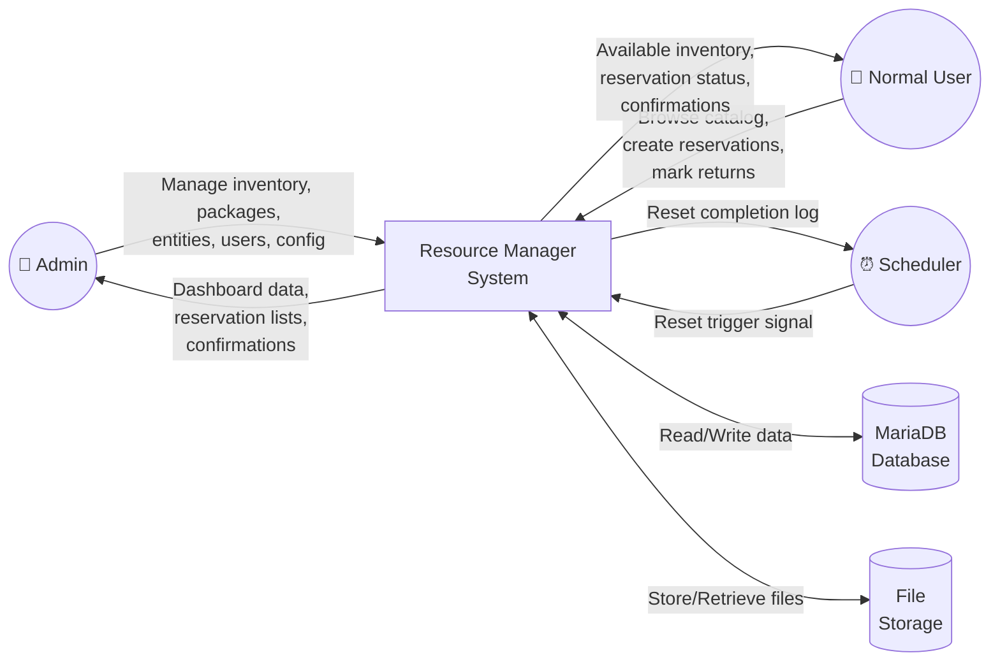

### 6.2 Level 1 — Major Processes

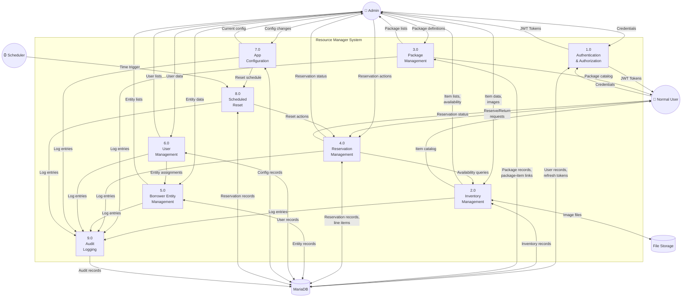

---

## 7. State Diagrams

### 7.1 Inventory Item States

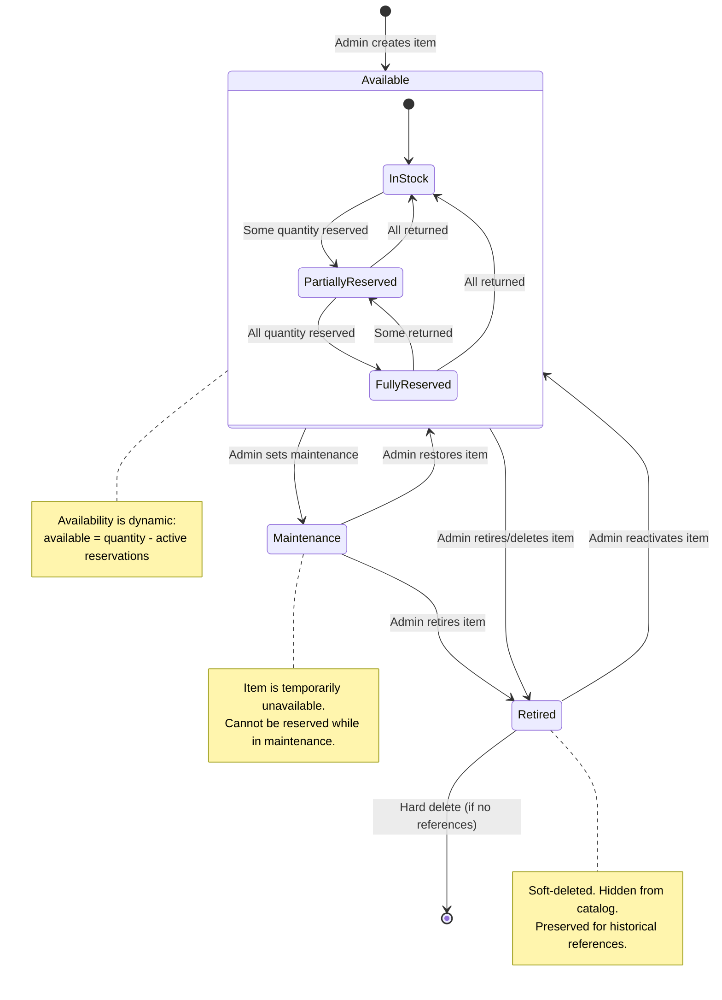

### 7.2 Reservation States

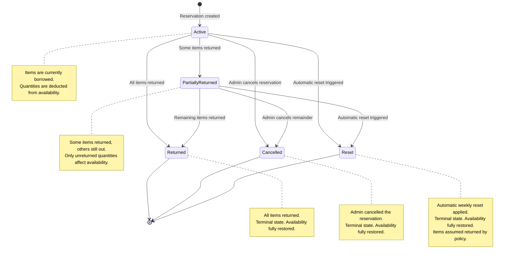

### 7.3 User Account States

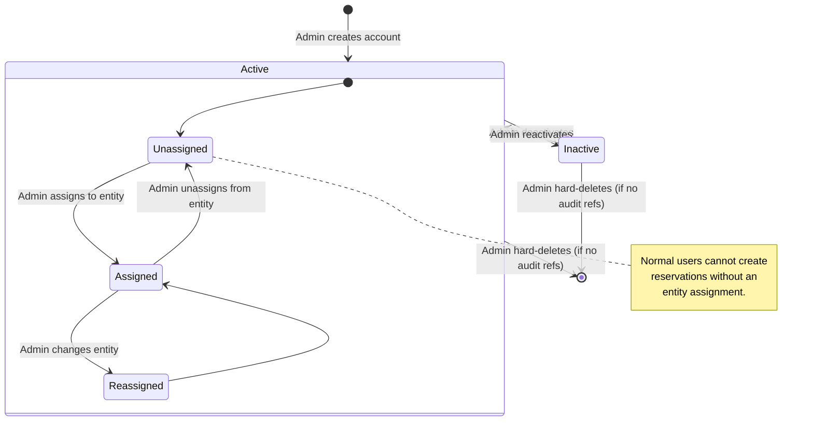

---

## 8. Glossary

| Term | Definition |
|---|---|
| **Inventory Item** | A physical resource tracked by the system. Each item has a name, quantity (finite or unspecified), optional image, notes, and a status. Examples: projector, safety vest, extension cord, whiteboard marker set. |
| **Quantity (Finite)** | A specific, countable number of units of an inventory item that the organization owns. Used to calculate availability. Example: "10 projectors." |
| **Quantity (Unspecified)** | Indicates that the inventory item's supply is not tracked numerically. The item is always shown as "available" regardless of reservations. Useful for consumable or abundant items. Example: "whiteboard markers — unspecified." |
| **Available Quantity** | The number of units of a finite-quantity item that are currently not reserved. Calculated as: `total quantity − SUM(active reservation quantities)`. |
| **Item Status** | The operational state of an inventory item. Values: `available` (can be reserved), `maintenance` (temporarily unavailable, cannot be reserved), `retired` (soft-deleted, hidden from catalog). |
| **Package** | A named, predefined grouping of inventory items with specified quantities for each item. Packages simplify reserving commonly-borrowed item bundles. Example: "AV Kit" = 1 projector + 2 HDMI cables + 1 remote + 1 screen. |
| **Package Expansion** | The process by which a package reservation is decomposed into individual item-level reservation line items. This ensures availability is tracked at the item level, not the package level. |
| **Item Exclusion** | The ability for a user to remove specific items from a package before confirming a reservation. Excluded items are not reserved and their availability is unaffected. |
| **Borrower Entity** | A named organizational unit (team, department, external group) that borrows resources. All reservations are associated with a borrower entity, not individual users. Provides accountability for borrowed items. |
| **Normal User** | An authenticated user with the `normal` role. Assigned to exactly one borrower entity. Can browse inventory, create reservations for their entity, view their entity's reservations, and mark items as returned. Cannot manage inventory, users, or configuration. |
| **Admin (Worker)** | An authenticated user with the `admin` role. Has full system access: inventory management, package management, reservation management for all entities, user management, entity management, app configuration, and dashboard access. |
| **Reservation** | A record that a borrower entity has borrowed one or more inventory items. Contains: borrower entity reference, list of items with quantities (line items), creation timestamp, status, and optional notes. |
| **Reservation Line Item** | A single entry within a reservation representing one inventory item and its borrowed quantity. Also tracks the returned quantity for partial returns. |
| **Reservation Status** | The lifecycle state of a reservation. Values: `active` (items currently borrowed), `partially_returned` (some items returned), `returned` (all items returned), `cancelled` (admin cancelled), `reset` (automatically closed by scheduled reset). |
| **Active Reservation** | A reservation with status `active` or `partially_returned`. These reservations reduce item availability. |
| **Reservation Reset** | A system-initiated process that transitions all active reservations to `reset` status, restoring item availability. Configured to run weekly at the end of a specified day, or disabled. |
| **Reset Trigger** | The configurable schedule for automatic reservation resets. Options: a specific day of the week (Monday–Sunday, triggers at 23:59 server time) or "never" (disabled). |
| **JWT (JSON Web Token)** | A compact, signed token used for authentication. The access token is short-lived and included in API request headers. Contains the user's ID, role, and borrower entity ID. |
| **Refresh Token** | A long-lived token used to obtain a new access token without re-authenticating. Stored server-side (in the database) and client-side (in secure storage). Revocable by admins. |
| **Role-Based Access Control (RBAC)** | The authorization model where API endpoints and UI features are restricted based on the user's role (`admin` or `normal`). |
| **Audit Log** | An append-only record of all state-changing operations in the system. Each entry captures who did what, when, and the before/after state of the affected entity. |
| **Soft Delete** | A deletion strategy where the record is marked as inactive/retired rather than physically removed from the database. Preserves referential integrity with historical data. |
| **Dashboard** | The admin-only landing page that displays summary metrics: inventory overview (total/available/reserved/maintenance counts), active reservations, items needing maintenance, and low-stock warnings. |
| **Transparent Reservation** | The design principle that package reservations are "transparent" — the system shows the individual constituent items on the reservation, not just the package name. This ensures borrowers and admins see exactly what is borrowed. |
| **Concurrency Control** | The use of database transactions to prevent race conditions when multiple users attempt to reserve the same item simultaneously. Ensures that availability cannot go negative. |
| **Partial Return** | Returning some, but not all, items from a reservation. The reservation transitions to `partially_returned` status. Only unreturned quantities continue to affect availability. |

---

*Document prepared for the Resource Manager project. This is a living document and will be updated as requirements are refined during development.*
